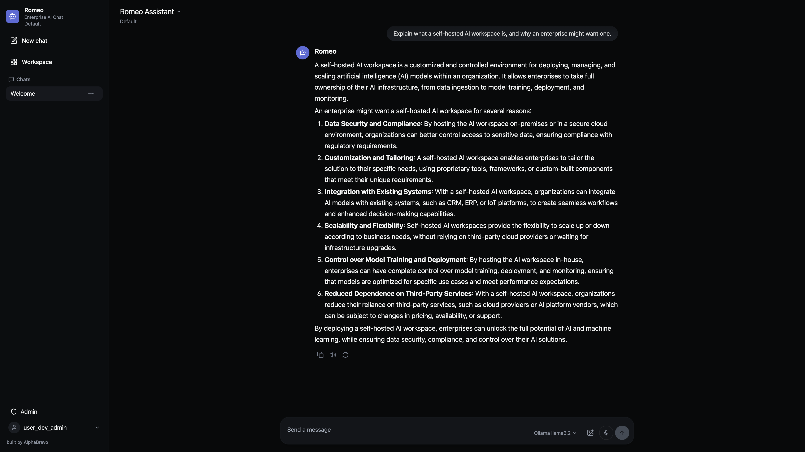

<div align="center">


# Romeo

### Enterprise AI Chat

A self-hosted AI workspace that treats identity, tenancy, and governance as
first-class — not as a plugin you bolt on later. Bring your own models, keep
your data on your own infrastructure.

[](https://github.com/alphabravo-oss/romeo/actions/workflows/ci.yml)
[](LICENSE)
[](https://github.com/alphabravo-oss/romeo)

**Built by [AlphaBravo](https://alphabravo.io)**

</div>

---

> **Alpha software.** Romeo is under active development. The `/api/v1` surface,
> Helm chart values, and UI are subject to change without notice, and it is
> **not yet recommended for production use**. Feedback and issues are very welcome.



## Quick start

You need [Node.js](https://nodejs.org) 22+ and pnpm 11.7.0.

```bash
git clone https://github.com/alphabravo-oss/romeo.git
cd romeo
pnpm install
pnpm dev
```

Open the URL it prints (usually http://localhost:3000). You're signed in as a
seeded local admin with an in-memory store — no database, no config, nothing
else to install. Good for a look around; **not** for anything you care about
keeping.

<details>
<summary><code>pnpm</code> fails with "Failed to switch pnpm to v11.7.0 … ENOENT"?</summary>

The standalone pnpm installer can't self-install pnpm 11.x. Activate the
pinned version once with corepack:

```bash
corepack enable && corepack prepare pnpm@11.7.0 --activate
```

Make sure your Node `bin` directory comes before `~/Library/pnpm` on `PATH`
(`which -a pnpm`). Otherwise, prefix any command with `npx --yes pnpm@11.7.0`.

</details>

### Connect a model

Romeo talks to any **OpenAI-compatible** endpoint and to **Ollama**. To run
fully local, point it at Ollama:

```bash
ollama serve
ollama pull llama3.2
```

Then add the provider under **Admin → Providers** and pick a model for your
assistant in **Workspace → Agents**. The composer also has a model picker: it
names the model that will answer, and choosing a different one overrides the
assistant's model for the rest of the conversation — no need to edit the
assistant. Switching assistants resets it to that assistant's own model.

### Run the full stack

```bash
cp deploy/compose/.env.example deploy/compose/.env   # set your secrets
docker compose -f deploy/compose/compose.yml up
```

That brings up the app with Postgres, Valkey, and S3-compatible object
storage, and runs migrations first. For Kubernetes, a Helm chart lives in
`deploy/helm` (external Postgres or CloudNativePG, HPA, NetworkPolicies,
backup CronJob).

---

## What you get

**Chat that works the way you expect.** Real token streaming over SSE, stop
mid-response, markdown with syntax-highlighted code and one-click copy, image
attachments, voice input, and read-aloud.

**Assistants, not just models.** Build agents with their own system prompt,
model, parameters, tools, and knowledge — versioned, diffable, and testable in
a built-in console before you ship them.

**Knowledge that respects boundaries.** Upload documents into knowledge bases
with pgvector or Qdrant behind them, hybrid retrieval, and per-tier retrieval
policy (private / workspace / org / shared) enforced at the service layer.

**Tools with a leash.** Connect MCP servers, OpenAPI specs, or webhooks.
Network policy, per-operation enablement, and an approval step before a tool
does anything consequential.

**Identity you already run.** Local accounts with TOTP, OIDC, OAuth2, LDAP,
**SAML**, and **SCIM** provisioning — plus service accounts, API keys, and
device authorization for native clients.

**Multi-tenancy that isn't an afterthought.** Organizations and workspaces run
through the whole model, with roles, permissions, group membership, and
resource-level grants checked on every path.

**Governance for people who get audited.** Immutable audit log, retention
policies, legal hold, data export and deletion, access review, usage metering
and quotas, and billing.

**An API, not just a UI.** Every capability is a documented `/api/v1` endpoint
with an OpenAPI spec, a TypeScript SDK, a dependency-free Python SDK, and a
`romeo` CLI.

### Not here yet

Being straight with you, so you don't find out the hard way:

- No image generation
- No web search
- English only — no localization yet
- No code execution / artifact sandbox
- One assistant per conversation — you can switch the model per message, but not
  run two side by side to compare them

---

## Development

```bash
pnpm dev        # dev server, in-memory store, seeded login
pnpm verify     # tests + typecheck + production build across the workspace
pnpm test       # tests only
```

`pnpm verify` is the gate — it must exit 0 before anything merges.

### Layout

| Path | What lives there |
|---|---|
| `apps/app` | TanStack Start + React frontend, and the server entry that mounts the API |
| `packages/core` | Domain, services, and the Hono `/api/v1` surface |
| `packages/db` | Drizzle schema and the Postgres repository |
| `packages/providers` | Model adapters (OpenAI-compatible, Ollama) |
| `packages/ai-runtime` | Run executor and SSE event stream |
| `packages/cli` | The `romeo` CLI |
| `sdks/python` | Python SDK (standard library only) |
| `deploy/` | Docker Compose, Helm, CloudNativePG, monitoring |

`packages/core` defines a `RomeoRepository` contract and deliberately does not
depend on `packages/db`; the app composes the driver at the edge. Keep it that
way.

Schema changes are forward-only. The greenfield baseline is locked at
`packages/db/migrations/0000_greenfield_baseline.sql`.

---

## Contributing

Issues and pull requests are welcome. Run `pnpm verify` before opening a PR —
if it isn't green, CI won't be either.

## License

[Apache 2.0](./LICENSE) © AlphaBravo

Romeo is an independent, greenfield implementation.
[Open WebUI](https://github.com/open-webui/open-webui) was a product and UX
reference only — Romeo is not a fork and contains no Open WebUI code.
