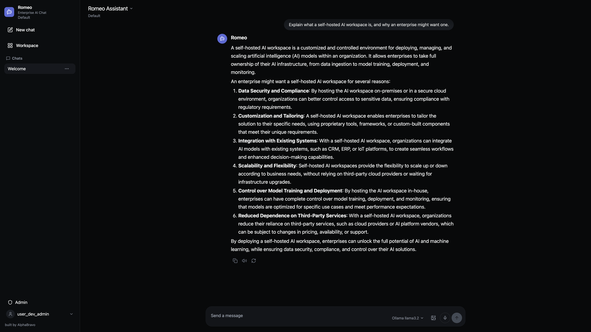

<div align="center">


# Romeo

### Enterprise AI Chat

A self-hosted AI workspace that treats identity, tenancy, and governance as
first-class — not as a plugin you bolt on later. Bring your own models, keep
your data on your own infrastructure.

[](https://github.com/alphabravo-oss/romeo/actions/workflows/ci.yml)
[](LICENSE)
[](https://github.com/alphabravo-oss/romeo)

**Built by [AlphaBravo](https://alphabravo.io)**

</div>

---

> **Alpha software.** Romeo is under active development. The `/api/v1` surface,
> Helm chart values, and UI are subject to change without notice, and it is
> **not yet recommended for production use**. Feedback and issues are very welcome.



## Quick start

You need [Node.js](https://nodejs.org) 22+ and pnpm 11.7.0.

```bash
git clone https://github.com/alphabravo-oss/romeo.git
cd romeo
pnpm install
pnpm dev
```

Open the URL it prints (usually http://localhost:3000). You're signed in as a
seeded local admin with an in-memory store — no database, no config, nothing
else to install. Good for a look around; **not** for anything you care about
keeping.

<details>
<summary><code>pnpm</code> fails with "Failed to switch pnpm to v11.7.0 … ENOENT"?</summary>

The standalone pnpm installer can't self-install pnpm 11.x. Activate the
pinned version once with corepack:

```bash
corepack enable && corepack prepare pnpm@11.7.0 --activate
```

Make sure your Node `bin` directory comes before `~/Library/pnpm` on `PATH`
(`which -a pnpm`). Otherwise, prefix any command with `npx --yes pnpm@11.7.0`.

</details>

### Connect a model

Romeo talks to the native **Anthropic Messages API**, **OpenAI Chat
Completions-compatible** and **OpenAI Responses-compatible** endpoints, and
**Ollama**. To run fully local, point it at Ollama:

```bash
ollama serve
ollama pull llama3.2
```

Then add the provider under **Admin → Providers**, verify it, sync its models,
and choose which models users may access. Provider presets cover Anthropic,
OpenAI, OpenRouter, Ollama, and vLLM-compatible deployments. The composer's
model selection is stored with the chat and model pins are stored with the
user, so both survive browser and device changes.

### Run the full stack

```bash
cp deploy/compose/.env.example deploy/compose/.env   # set your secrets
docker compose -f deploy/compose/compose.yml up
```

That brings up the app with Postgres, Valkey, and S3-compatible object
storage, and runs migrations first. For Kubernetes, a Helm chart lives in
`deploy/helm` (external Postgres or CloudNativePG, HPA, NetworkPolicies,
backup CronJob).

---

## What you get

**Chat that works the way you expect.** Real token streaming over SSE, stop
mid-response, full Markdown and math rendering, syntax-highlighted code,
governed document and image attachments, voice input, and read-aloud. Files
can remain in later-turn context or be explicitly removed from it, and a
context inspector shows the exact message sections and token budget before a
request is sent.

**Context that users can see and control.** Personal and workspace memory,
notes, reusable files, prompt templates, governed web search, and explicit URL
ingestion all feed the same context pipeline. Users can inspect retained
history, memory, files, knowledge hits, citations, and the estimated token
budget before sending.

**Chats that survive real work.** Streaming runs can be reattached after a
refresh, drafts persist in the browser, queued turns persist on the server,
and chats support
full-text search, internal sharing, portable import/export, and expiring
temporary sessions. Generated images are stored as governed reusable files.

**Assistants, not just models.** Build agents with their own system prompt,
model, parameters, tools, and knowledge — versioned, diffable, and testable in
a built-in console before you ship them.

**Knowledge that respects boundaries.** Upload documents into knowledge bases
with pgvector or Qdrant behind them, hybrid retrieval, and per-tier retrieval
policy (private / workspace / org / shared) enforced at the service layer.

**Tools with a leash.** Connect MCP servers, OpenAPI specs, or webhooks.
Network policy, per-operation enablement, and an approval step before a tool
does anything consequential.

**Identity you already run.** Local accounts with TOTP, OIDC, OAuth2, LDAP,
**SAML**, and **SCIM** provisioning — plus service accounts, API keys, and
device authorization for native clients.

**Multi-tenancy that isn't an afterthought.** Organizations and workspaces run
through the whole model, with roles, permissions, group membership, and
resource-level grants checked on every path.

**Governance for people who get audited.** Immutable audit log, retention
policies, legal hold, data export and deletion, access review, usage metering
and quotas, and billing.

**An API, not just a UI.** Every capability is a documented `/api/v1` endpoint
with an OpenAPI spec, a TypeScript SDK, a dependency-free Python SDK, and a
`romeo` CLI.

### Current integration boundaries

- Web search uses administrator-configured SearXNG, Brave, or Tavily endpoints;
  direct URL ingestion remains subject to network and domain policy.
- Image generation uses an administrator-approved OpenAI-compatible image
  endpoint and stores returned images in Romeo's governed object store.
- OCR is disabled by default. `FILE_OCR_DRIVER=local-tesseract` enables bounded
  image and scanned-PDF extraction when the deployment image provides the
  configured `tesseract` and `pdftoppm` binaries. Romeo invokes fixed argument
  lists without a shell, caps bytes/pages/time, deletes temporary files, and
  persists method, provider, page-count, confidence, and failure provenance.
- English, Spanish, and French are available for the core chat controls. The
  remaining administration surfaces continue to use English while their
  translations are completed.
- Local Ollama text streaming is covered by live acceptance evidence. Live
  OpenAI-compatible and Anthropic acceptance is reported as `not_configured`
  until deployment credentials are supplied; adapter tests are not presented
  as live-provider proof.
- Multi-replica PostgreSQL/object-storage recovery, browser-engine coverage,
  load/soak thresholds, and production bundle budgets have repeatable passing
  acceptance evidence. Credentialed target-provider checks, deployment egress
  enforcement, and immutable-backup-platform expiry remain release gates. Track
  the exact evidence status in
  [`docs/plans/2026-07-16-openwebui-core-production-readiness.md`](docs/plans/2026-07-16-openwebui-core-production-readiness.md).

### Credentialed provider acceptance

These commands exercise the selected external endpoint and write metadata-only
evidence under `dist/evidence/`. Missing configuration produces
`not_configured`, never a false pass. Set secrets in the process environment;
the evidence does not include endpoints, credentials, prompts, response text,
image bodies, tool arguments, or raw provider payloads.

OpenAI-compatible image generation:

```bash
ROMEO_LIVE_IMAGE_BASE_URL=https://provider.example/v1 \
ROMEO_LIVE_IMAGE_MODEL=image-model \
ROMEO_LIVE_IMAGE_API_KEY=... \
pnpm evidence:image:credentialed-live
```

Anthropic Messages API, including streaming text/usage, vision, tool use, and
tool-result continuation:

```bash
ROMEO_LIVE_ANTHROPIC_MODEL=claude-model \
ANTHROPIC_API_KEY=... \
pnpm evidence:anthropic:credentialed-live
```

Use `ROMEO_LIVE_ANTHROPIC_BASE_URL` to target an Anthropic-compatible endpoint.

Deployment-selected web search:

```bash
ROMEO_LIVE_WEB_SEARCH_PROVIDER=brave \
BRAVE_SEARCH_API_KEY=... \
pnpm evidence:web-search:deployment-live
```

Valid providers are `brave`, `tavily`, and `searxng`. Tavily accepts
`TAVILY_API_KEY`; SearXNG requires `ROMEO_LIVE_WEB_SEARCH_ENDPOINT` and can run
without a credential. `ROMEO_LIVE_WEB_SEARCH_API_KEY` overrides the provider-
specific key. Runtime governed-search requests use `WEB_SEARCH_TIMEOUT_MS`
(default `12000`) and the acceptance collector has its own
`ROMEO_LIVE_WEB_SEARCH_TIMEOUT_MS` bound.

### Intentional product non-goals

These are Romeo product boundaries, not backlog items. Do not add them for
Open WebUI parity or treat their absence as a feature gap:

- **Code execution:** Romeo does not execute model-generated code or provide an
  arbitrary code interpreter, terminal, notebook, or artifact execution sandbox.
  Syntax highlighting and sandboxed, scriptless rendering previews are display
  features only.
- **Multi-model comparison:** Romeo runs one assistant response at a time. Users
  may select the model used for a message, but Romeo does not run multiple models
  side by side or provide comparison-arena workflows.

---

## Development

```bash
pnpm dev        # dev server, in-memory store, seeded login
pnpm verify     # tests + typecheck + production build across the workspace
pnpm test       # tests only
```

`pnpm verify` is the gate — it must exit 0 before anything merges.

### Layout

| Path                  | What lives there                                                                   |
| --------------------- | ---------------------------------------------------------------------------------- |
| `apps/app`            | TanStack Start + React frontend, and the server entry that mounts the API          |
| `packages/core`       | Domain, services, and the Hono `/api/v1` surface                                   |
| `packages/db`         | Drizzle schema and the Postgres repository                                         |
| `packages/providers`  | Model adapters (Anthropic, OpenAI-compatible, OpenAI Responses-compatible, Ollama) |
| `packages/ai-runtime` | Run executor and SSE event stream                                                  |
| `packages/cli`        | The `romeo` CLI                                                                    |
| `sdks/python`         | Python SDK (standard library only)                                                 |
| `deploy/`             | Docker Compose, Helm, CloudNativePG, monitoring                                    |

`packages/core` defines a `RomeoRepository` contract and deliberately does not
depend on `packages/db`; the app composes the driver at the edge. Keep it that
way.

Schema changes are forward-only. The greenfield baseline is locked at
`packages/db/migrations/0000_greenfield_baseline.sql`.

---

## Contributing

Issues and pull requests are welcome. Run `pnpm verify` before opening a PR —
if it isn't green, CI won't be either.

## License

[Apache 2.0](./LICENSE) © AlphaBravo

Romeo is an independent, greenfield implementation.
[Open WebUI](https://github.com/open-webui/open-webui) was a product and UX
reference only — Romeo is not a fork and contains no Open WebUI code.
