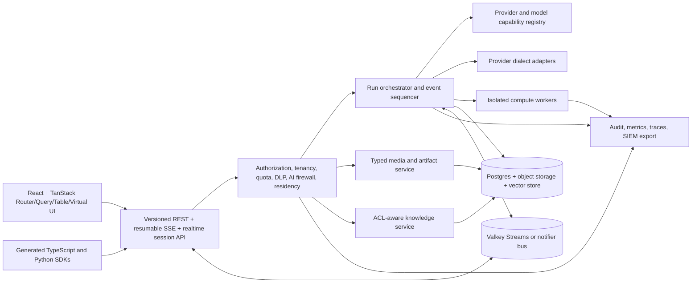

# Romeo enterprise AI chat enhancement roadmap

**Status:** implementation plan; no work in this document is implicitly complete  
**Prepared:** 2026-08-13  
**Scope:** product, API, backend, data, UI, security, operations, SDKs, deployment, tests, and release validation  
**Companion audit:** `docs/audits/2026-08-13-enterprise-deep-audit.md`  
**Planning rule:** every capability described here must be usable through a documented API and the Romeo UI, enforce the same authorization and policy in both paths, appear in generated SDKs where appropriate, and ship with operational evidence.

## 1. Executive decision

Romeo should become the provider-neutral, self-hosted AI work environment in which every model, source, tool, output, and administrative decision is governed inside the customer's security boundary.

The product already has a substantial base: resumable Server-Sent Events (SSE), text chat, model and provider administration, tool calling, web research, RAG, connectors, evals, DLP, audit, RBAC, SSO/MFA/SCIM/LDAP, TTS, STT, image input, image generation, branching, OpenWebUI compatibility, quotas, and cost-aware routing. The next stage is not a rewrite. It is a set of coordinated vertical slices that make the existing breadth predictable at enterprise scale and complete the gaps users will notice when comparing Romeo with ChatGPT, Claude, OpenWebUI, and modern model-native consoles.

The highest-value work is:

1. replace run-stream database polling with event-driven resumable SSE;
2. complete TanStack Router, Query, Table, and Virtual integration as one data architecture;
3. make model support capability-driven and add first-class provider dialect adapters;
4. add safe, explicit reasoning controls and summaries;
5. introduce typed multimodal messages and finish image/audio/video/document flows;
6. add realtime, interruptible enterprise voice;
7. make long conversations fast through cursor paging, virtualization, incremental indexes, and compaction;
8. add secure compute and editable artifacts;
9. add multi-model compare, consensus, evaluation, and promotion;
10. add an AI-specific security firewall across prompt, retrieval, tools, and streamed output;
11. preserve source ACLs throughout enterprise knowledge ingestion and retrieval;
12. add tenant BYOK encryption, cryptographic deletion, tamper-evident audit, and SIEM/compliance interfaces;
13. standardize large administrative datasets on server-side filtering, sorting, pagination, selection, and export.

These are integrated workstreams, not independent UI features. For example, multi-model comparison depends on the provider capability registry, multiplexed event streaming, long-transcript rendering, cost accounting, and output policy. Realtime voice depends on typed audio parts, realtime transport, provider capabilities, DLP, retention, and permission-aware UI.

## 2. Outcomes and non-negotiable principles

### 2.1 Product outcomes

- A user can confidently choose any authorized model without learning provider-specific failure modes.
- An operator can see exactly where data may flow, which capability is native or emulated, what it costs, and which policy allowed it.
- A ten-message chat and a ten-thousand-message regulated investigation both remain responsive and recoverable.
- Text, images, audio, documents, tool results, and artifacts are represented by one versioned content model.
- Voice can be private and self-hosted, with realtime turn taking, visible recording state, interruption, and explicit retention.
- Enterprise knowledge returns only content the requesting principal can still access at the source.
- Every external side effect is authorized, policy-checked, idempotent where applicable, auditable, observable, and bounded.
- Every new capability works through UI, REST/event APIs, generated TypeScript client, and Python SDK unless deliberately documented as browser-only.

### 2.2 Engineering principles

- **One policy boundary.** UI affordances improve usability but never replace API authorization, tenancy, DLP, egress, quota, or retention enforcement.
- **Capability truth, not provider guessing.** Keep detected, administrator-overridden, probed, and effective model capabilities separate.
- **Secure by default.** New network, compute, media-retention, raw-reasoning, and external-provider behaviors begin disabled or constrained in production.
- **Progressive delivery.** Every workstream has an organization feature flag, kill switch, migration/rollback plan, and measurable acceptance gate.
- **Generated contracts.** Zod/OpenAPI contracts remain canonical; regenerate and drift-check SDKs after every API change.
- **Cursor-based scale.** Unbounded list endpoints, offset pagination for mutable high-volume data, and full-history refreshes are prohibited on enterprise paths.
- **No raw upstream errors.** Public APIs and UI use stable codes, localized safe messages, and validated request IDs; raw provider material goes only to redacted internal telemetry.
- **No secret or private chain-of-thought retention.** Store provider-safe reasoning summaries and structured metadata only unless an administrator explicitly enables a separately governed raw trace and the provider permits it.
- **Accessible by construction.** Keyboard, screen-reader, reduced-motion, focus, touch, zoom, contrast, localization, and responsive behavior are acceptance criteria, not post-release cleanup.
- **Air-gap is a first-class topology.** Every cloud-backed capability declares whether it has a local alternative and how the UI behaves when external egress is prohibited.

## 3. Current capability baseline

| Area              | Current Romeo state                                                                                                                                                                                                           | Decision / gap to close                                                                                                                                                                                                    |
| ----------------- | ----------------------------------------------------------------------------------------------------------------------------------------------------------------------------------------------------------------------------- | -------------------------------------------------------------------------------------------------------------------------------------------------------------------------------------------------------------------------- |
| Text streaming    | Yes. `GET /api/v1/runs/{runId}/events` provides durable resumable SSE with cursor reads, notifier wakeups/fallback, heartbeat, bounded delivery, revocation checks, and operational metrics. Chat/channel streams also exist. | Keep SSE for server-to-browser durable text/events; complete live ingress/CDN/HTTP2 and target-capacity evidence, then reuse the event infrastructure for compare/export/workflow streams where semantics match.           |
| TanStack Table    | Strong shared `DataTable` in `packages/ui/src/advanced-data-table.tsx`; sorting, filtering, pagination, saved views, CSV, selection, bulk actions, and optional virtualization exist.                                         | Standardize high-volume datasets on a server-driven query contract. Client-side mode remains valid for small bounded lists.                                                                                                |
| TanStack Query    | Broad adoption, shared cache profiles/cancellation/diagnostics, request-scoped SSR hydration, and a complete typed application key registry; no handwritten production keys remain.                                           | Finish shared query-option and mutation-policy adoption; load all critical route data coherently and eliminate remaining invalidation drift.                                                                               |
| TanStack Router   | File routes, search validation, SSR, preloading, scroll restoration, error and not-found boundaries exist.                                                                                                                    | Add authenticated router context, loaders, route-level dependency declarations, deferred data, and loader/query cache convergence.                                                                                         |
| Long chat         | Delta output is isolated to one message-scoped cache row, completed Markdown blocks are memoized, and an authorized signed older-branch page API exists. The UI still initially loads/renders the complete transcript.        | Integrate branch pages; add windowed rendering, incremental topology, visibility controls, server search, and durable context compaction.                                                                                  |
| Speech to text    | Yes. Browser `MediaRecorder` uploads bounded audio to the voice transcription API.                                                                                                                                            | Add streaming partial transcripts, VAD, device controls, local provider choices, and no-retention policy.                                                                                                                  |
| Text to speech    | Yes. Voice profiles, preview, per-message speech generation, persisted artifacts, access control, and deletion exist.                                                                                                         | Add streaming playback, sentence/chunk synthesis, interruption, automatic read-aloud, and lifecycle controls.                                                                                                              |
| Realtime voice    | No. Current flow is record, upload, transcribe, then separately synthesize.                                                                                                                                                   | Use WebRTC for audio and a bounded control channel; retain SSE for ordinary chat.                                                                                                                                          |
| Image input       | Yes. Runs accept up to four PNG/JPEG/GIF/WebP inputs, and supported adapters map them to native provider formats.                                                                                                             | Move from inline base64 request bodies to typed, object-backed content references; add provider-aware limits and image privacy controls.                                                                                   |
| Image output      | Yes, through an OpenAI-compatible generation path with three sizes and file-backed artifacts.                                                                                                                                 | Add edits, masks/inpainting, variations, more provider adapters, provenance, safety review, and native inline chat image events.                                                                                           |
| Documents         | PDF, office formats, text, Markdown, CSV, JSON, HTML, knowledge ingestion, and retrieval are present.                                                                                                                         | Make documents typed message parts, add page/range selection and artifact round trips, and preserve source ACLs.                                                                                                           |
| Audio model input | Advertised in capability types, but chat messages carry text and images only.                                                                                                                                                 | Add typed audio parts and provider-native audio input while retaining STT normalization as a policy-selectable fallback.                                                                                                   |
| Video             | Not a first-class chat modality.                                                                                                                                                                                              | Add bounded, policy-gated video references only after typed multimodal storage; begin with keyframes/transcript fallback.                                                                                                  |
| Reasoning         | Partial. UI reasoning panel and OpenAI-compatible/Responses reasoning events exist.                                                                                                                                           | Add effort/budget/summary controls, provider mappings, safe persistence, usage/cost, Anthropic/Gemini-style adapter support, and explicit unsupported states.                                                              |
| Providers/models  | Four provider kinds: Anthropic, OpenAI-compatible, Responses-compatible, and Ollama. OpenAI compatibility covers many endpoints.                                                                                              | Add a dialect/plugin architecture and first-class adapters for materially different authentication, discovery, media, reasoning, tools, caching, and regional semantics. Never promise identical features for every model. |
| Knowledge         | RAG, agentic retrieval, connectors, governance, DLP, citations, and quality tools exist.                                                                                                                                      | Preserve source ACLs and group memberships at ingestion and retrieval; add freshness/tombstone evidence and access explanations.                                                                                           |
| Tools/compute     | Tool connectors, MCP-style operations, approvals, browser automation, workflows, and egress controls exist.                                                                                                                   | Add a separately isolated code/data compute plane and editable artifact workspace.                                                                                                                                         |
| Governance        | RBAC, SSO/MFA/SCIM/LDAP, audit, retention, legal holds, DLP, quotas, deployment controls, and security gates are broad.                                                                                                       | Add AI-specific taint/prompt-injection controls, tenant BYOK encryption, crypto-shred, tamper-evident audit, SIEM, and residency attestations.                                                                             |

## 4. Target architecture

### 4.0 Measured/source evidence snapshot

The plan starts from these observed source facts and should refresh them in Phase 0 rather than treating them as permanent:

- Run SSE is registered in `packages/core/src/http/routes/runs.ts`, replayed by bounded `listRunEventsAfter` cursor reads, woken through memory/Valkey notifier implementations with no-lost-wakeup fallback, consumed by `apps/app/src/features/runs/stream.ts`, and applied by the run registry. Atomic database sequences, cancellation, retention, heartbeat/backpressure, live authorization rechecks, browser proxy acceptance, and process metrics are implemented; live customer ingress/CDN/HTTP2 evidence remains external.
- Chat/workspace events already demonstrate heartbeat, `Last-Event-ID`, `X-Accel-Buffering: no`, and Valkey-backed distribution in the chat event path. Reuse proven semantics instead of creating another event format.
- Shared `DataTable` is in `packages/ui/src/advanced-data-table.tsx`. The audited app had 67 `DataTable` call sites across 49 files and no raw application `<table>` replacement. Only a small minority used server pagination/virtualization, which is why EP-03 is adoption and contract work rather than a table rewrite.
- The app began with roughly 381 handwritten TanStack `queryKey` declarations and no application use of generated option factories. Typed app keys, generated/shared options, request-scoped Router/Query SSR, cache profiles, cancellation, diagnostics, and folder batching eliminated direct handwritten production declarations. Mutation-policy migration remains open.
- `useWorkspaceData` uses an infinite chat catalog and transcript reconciliation. The new branch-page API avoids full-history backend reads, but the UI still calls the legacy full `listMessages` route until EP-04 integration/windowing lands.
- Streaming deltas are cadence-batched into one exact active-row query with zero transcript writes before settlement. Segmented Markdown, virtual history, and incremental branch indexes remain the next UI hot paths.
- Provider capability contracts live in `packages/contracts/src/provider-capability-schemas.ts` and `packages/providers/src/types.ts`; canonical chat provider messages still model text plus optional images.
- Batch TTS/STT are implemented through `packages/core/src/services/voice-service.ts` and UI voice controls. Realtime duplex media is not implemented.
- Current run contracts accept bounded inline images and file IDs. Image generation exists through a separate service; edits/masks/variations are not a complete native workflow.
- Current content policy governs many inputs and terminal assistant persistence, but provider deltas can be persisted/streamed before complete-output policy. EP-12 moves the first output gate earlier.
- Knowledge services enforce Romeo tenancy/grants and vector namespace controls, but source-system ACL bindings/freshness are not yet a normalized cross-connector contract.



### 4.1 Transport decisions

- Use REST for commands, queries, uploads, policy administration, and durable resources.
- Use SSE for resumable server-to-client run, chat, channel, workflow, export, and compare-session events.
- Use WebRTC for low-latency duplex audio. Use a WebSocket or WebRTC data channel only for realtime session control where bidirectional timing is required.
- Do not replace ordinary chat SSE with WebSockets. SSE is simpler through enterprise proxies, naturally ordered, and sufficient when the browser sends commands through REST.
- Store durable events before publishing them. The event bus is a wakeup/distribution layer, not the system of record.

### 4.2 Canonical vertical-slice order

For every feature:

1. define threat model, authorization matrix, retention, and tenancy rules;
2. define versioned domain and OpenAPI contracts;
3. add repository methods and additive migrations;
4. implement service logic with idempotency, quotas, timeouts, and audit;
5. register routes and regenerate SDKs;
6. add query options/key factories and route data dependencies;
7. build accessible UI and empty/loading/error/unsupported states;
8. add observability and operator controls;
9. run unit, contract, integration, browser, performance, security, migration, and rollback validation;
10. ship disabled, canary by organization, then expand against explicit success/error budgets.

## 5. Program foundation — EP-00

### Reasoning

The roadmap changes shared message, event, provider, media, and data-query contracts. Without compatibility rules and a common rollout mechanism, teams will create parallel abstractions and the product will become less clean while gaining features.

### Tasks

- [x] **EP-00-01 — Architecture decision records.** The accepted [Romeo architecture decision set](../architecture/decisions/README.md) defines transport selection, typed content parts, provider dialect plugins, reasoning privacy, knowledge ACL semantics, compute isolation, and tenant encryption, including invariants, consequences, validation, and reconsideration criteria.
- [x] **EP-00-02 — Capability flags.** The organization backend/data/API/UI foundation in the [organization capability flag plane](../architecture/organization-capability-flags.md) provides immutable organization-scoped `disabled`/`preview`/`enabled` revisions, exact bounded user/service-account preview allowlists, server-side effective resolution, optimistic concurrency plus same-state idempotency, tenant purge, privacy-safe audit and process/fleet metrics, additive OpenAPI routes, generated TypeScript/Python clients, and a localized accessible admin inventory with exact invalidation and lazy history. The API/UI distinguish mapped platform ceilings and actively enforced consumers from rollout reservations, so a saved unwired flag never falsely claims product effect. Deployment kill switches deny absolutely; `image_jobs_v2` is enforced through the existing image capability before quota, provider, or storage side effects, and `provider_capabilities_v2` resolves under the absolute external-provider platform kill. Disposable PostgreSQL 16/pgvector conformance proved tenant/history/idempotency parity and exactly one winner for concurrent revision replacement. Enforced consumers now include image jobs, content firewall, knowledge ACL, realtime voice, compute artifacts, compare, trust plane, reasoning policy, and multimodal parts. Upgrade/backup/restore and mixed-fleet evidence remain environment-gated.
- [x] **EP-00-03 — Kill switches.** Add runtime operator switches for realtime voice, external provider kinds, compute execution, image generation/editing, multi-model fan-out, and streamed-output policy mode. `CAPABILITY_PLATFORM_DISABLED_IDS` is strictly parsed against those seven high-risk classes, fails startup on malformed or unknown values, supplies production-safe defaults for unimplemented classes, and has absolute `platform_disabled` precedence that tenant assignments cannot override. Image generation is the first enforced side-effect path and denies before quota, provider, or storage work; readiness and support evidence expose only sanitized counts/decisions.
- [x] **EP-00-04 — API evolution policy.** The accepted [v1 evolution policy](../api/evolution-policy.md) requires additive changes, explicit OpenAPI deprecation metadata/headers and a durable ledger, generated-client compatibility gates, a minimum notice and zero-usage window, bounded sunset telemetry, and reviewed evidence before removal. `check:api-evolution-policy` includes adversarial self-tests and is release-blocking in quality and CI alongside `oasdiff`, route coverage, and TypeScript/Python SDK drift.
- [x] **EP-00-05 — Database evolution policy.** The accepted [database evolution policy](../database/evolution-policy.md) requires expand/backfill/read-both/write-new/contract sequencing, mixed-version compatibility, restartable bounded backfills, tenant purge/data-rights coverage, and honest rollback or forward repair. The machine-readable [migration ledger](../database/migration-ledger.json) locks every released migration digest; `check:database-evolution-policy` checks file/journal parity and applies strict evidence plus destructive-SQL rules to every migration after the accepted `0019` baseline. The gate includes adversarial digest, destructive-expand, and missing-evidence self-tests and is release-blocking in quality and CI. Target-volume upgrade, interruption, backup/restore, and mixed-fleet evidence remains a deployment acceptance requirement for each applicable migration.
- [x] **EP-00-06 — Common idempotency.** The backend/API/data foundation in [common command idempotency](../architecture/common-idempotency.md) provides organization + actor/credential + operation scoped durable receipts, hashed keys and canonical request hashes, exact replay versus shape conflict, one bounded lease owner with takeover, terminal receipts, TTL cleanup, tenant purge, privacy-safe audit/metrics, standard response metadata, and additive OpenAPI/SDK support. Run start and image generation accept the standard header while preserving their legacy body keys; normal completed-call duplicates cannot repeat run/message/provider/storage/file effects, and the image adapter receives only the opaque receipt ID for upstream idempotency. `recoverIdempotentCheckpoint` covers crash-before-receipt for run start, image generate, exports, compare, compute, and media jobs. Live-PostgreSQL kill/recovery, mixed-fleet, and production alert evidence remain environment-gated.
- [x] **EP-00-07 — Public error registry.** The typed [public error registry](../api/public-error-registry.md) now allocates every current HTTP `ApiError` and direct stable error-envelope code to canonical/accepted status, retryability, safe localization intent and a real EN/ES/FR intent copy key, and bounded operator remediation. `ApiError` enforces the code union and code/status pair at compile time and runtime; `check:public-api-errors` rejects unregistered literals, duplicate allocations, status drift, and locale-key drift in quality and CI. Five pre-existing multi-status compatibility exceptions remain explicit debt and require API-evolution migrations rather than silent status changes. Non-HTTP workflow/tool/SSE diagnostic codes remain separate domain contracts and are not represented as HTTP errors.
- [x] **EP-00-08 — Audit taxonomy.** The typed [audit taxonomy](../security/audit-taxonomy.md) registers 267 exact actions with category, resource semantics, required context, sensitivity/redaction posture, and per-action metadata value classes across starts, policy decisions, provider routing, media, compute/tools, ACL filtering, comparison, and encryption. All production writes use the canonical writer, dynamic action choices are finite typed mappings, and action-generic metadata builders preserve per-action key constraints. Runtime validation is enforced again at both in-memory and PostgreSQL repository boundaries. The TypeScript-aware `check:audit-taxonomy` gate reports zero direct bypasses, zero open-ended actions, and zero open-ended metadata sites; privacy sentinels and repository conformance prove rejection before persistence without exposing action names or raw values. Local in-memory and PostgreSQL-adapter boundary tests are green; live-PostgreSQL execution remains an environment-gated release validation rather than claimed local evidence.
- [x] **EP-00-09 — Usage and cost taxonomy.** The canonical [usage and cost taxonomy](../architecture/usage-cost-taxonomy.md) defines 48 versioned metrics covering estimated/reported input and output tokens, cached and reasoning components, images and integer micro-USD cost, audio duration with bounded fallbacks, video duration, compute CPU/memory time, retrieval units, storage, activity, latency, and SSE operations. Metric/unit/source combinations and discrete-versus-fractional quantities are enforced by types, the canonical writer, and both repository boundaries; a shared recursive privacy validator rejects payload, credential, raw-error, oversized, and unsafe metadata before persistence, including during legacy-row cleanup. OpenAI-compatible and Anthropic provider usage preserves cached/reasoning details through runtime chunk merging, while run, image, voice, retrieval, tool, feedback, storage, and observability writers use the registry. Cost rollups deterministically prefer reported over estimated token observations, collapse retry duplicates, and prefer explicit image micro-USD over compatibility metadata so summaries, analytics, and additive CSV reconciliation columns never double charge. Authenticated `usage:read` callers can discover exact semantics through `GET /api/v1/usage/taxonomy`; generated TypeScript/Python clients and the lazy, localized, accessible admin metric catalog consume the same contract. `check:usage-taxonomy` blocks contract/registry drift, missing enterprise classes, unregistered literals, unexpected dynamic sites, deprecated units, and direct repository bypasses in quality and CI. Core 930/930, DB 160/160 with 8 live-gated skips, contracts 42/42, focused cost/privacy tests, app 588/588, typechecks, lint, architecture, build, and bundle budgets are green; live PostgreSQL conformance remains a release-environment gate.
- [x] **EP-00-10 — SDK policy.** The accepted [SDK policy](../api/sdk-policy.md) requires generated TypeScript/Python REST and durable-SSE surfaces, separates browser-only realtime media helpers, and makes OpenAPI lint/breaking/route coverage plus both SDK drift checks release-blocking in quality and CI.
- [x] **EP-00-11 — Test fixtures.** The versioned [enterprise AI fixture corpus](../testing/enterprise-fixtures.md) supplies synthetic model capability, exact bounded image/audio/document payload, direct/group/cross-tenant ACL, resumable terminal stream, segmented DLP, and network-disabled compute cases to both the core in-memory and repository-conformance suites. `check:enterprise-test-fixtures` validates identifiers, media signatures/checksums, complete negative ACL coverage, ordered cursor replay, detector coverage, secret/endpoint privacy, and hard compute limits with adversarial self-tests; quality and CI enforce it. The PostgreSQL conformance command includes the same corpus, and a fresh migrated pgvector/PostgreSQL 16 run passed both memory and live database variants.
- [x] **EP-00-12 — Evidence manifest.** The machine-readable [program evidence requirements](../release/evidence-requirements.json) now enumerate capability/platform posture, migration level, provider probes, load/soak results, the Chromium/Firefox/WebKit browser matrix, security scans, and rollback/restore rehearsals with their commands, schemas, GA gates, and metadata-only privacy posture. `check:program-evidence-manifest` validates complete category coverage, real package commands and GA gate IDs, safe artifact paths, schemas, duplicates, and privacy invariants with adversarial self-tests. The signed GA evidence bundle hash-inventories this requirements file and records category IDs without embedding evidence bodies; the GA checklist now makes the three-engine accessibility/hydration matrix a non-exceptable security-critical gate. Manifest/checklist contract smoke, quality, and CI enforce drift, while credentialed target evidence remains mandatory for final promotion rather than fabricated by pull-request CI.

### Acceptance

- All later epics reference the same feature-flag, error, audit, usage, migration, and idempotency standards.
- No new route returns a raw provider or infrastructure error.
- No feature is declared generally available without UI, API, SDK, operational, security, and rollback evidence.

### 5.1 Layered capability administration

The initial plan requires global kill switches, organization-scoped feature flags, workspace policy, agent defaults, and per-run controls. This section makes the hierarchy normative. A feature must not implement its own interpretation of “enabled.”

#### Separate concepts that must not be collapsed into one boolean

For every governed capability, Romeo resolves six independent questions:

1. **Installed:** Does this deployment contain and configure the required service, adapter, worker, storage, or network path?
2. **Entitled:** Does the installation/license and organization subscription permit the capability and its limits?
3. **Available:** Has the platform operator released it for this instance/organization/cohort, and is it operationally healthy?
4. **Allowed:** Do organization/workspace security, privacy, residency, retention, role, and resource policies permit this subject and data?
5. **Capable:** Can the selected provider/model/tool/runner perform the requested operation with the required modalities and constraints?
6. **Selected:** Did an authorized administrator, agent author, user, chat, or turn actually choose the capability or a valid default?

The UI may show a feature only after evaluating the sanitized effective result, but the API recomputes all six dimensions for every action. Entitlement and UI visibility are never authorization.

#### Control layers

| Layer             | Owner                                     | Purpose                                                                                                   | May loosen a parent?                                                                         | Typical examples                                                                            |
| ----------------- | ----------------------------------------- | --------------------------------------------------------------------------------------------------------- | -------------------------------------------------------------------------------------------- | ------------------------------------------------------------------------------------------- |
| Build/deployment  | Release engineer / operator               | Determines installed code, adapters, workers, local services, and topology                                | No runtime child can add an uninstalled capability                                           | Realtime gateway, compute runner, local STT/TTS, image backend, KMS integration             |
| Platform/instance | Platform operator or global administrator | Emergency kill, preview cohort, supported provider kinds, hard resource ceilings, external egress classes | This is the top runtime ceiling                                                              | Disable all compute; allow only local providers; cap compare fan-out at five                |
| Entitlement       | Platform billing/license service          | Product edition and purchased capacity                                                                    | Cannot override security or availability                                                     | Voice seats, compute minutes, provider count, storage quota                                 |
| Organization      | Organization security/admin               | Organization-wide enablement, mandatory policy, data destinations, keys, retention, default posture       | May tighten platform; may loosen only organization defaults explicitly delegated by platform | Allow image generation; prohibit external models; require output buffering; configure BYOK  |
| Workspace         | Workspace owner/admin                     | Workspace-specific approved providers/models/data/tools and stricter policy/defaults                      | May tighten organization; cannot weaken organization mandatory policy                        | Legal workspace local-only; disable voice; allow two knowledge bases                        |
| Resource          | Resource owner plus grants                | Access to a provider, model, agent, knowledge base, source, tool, voice, artifact, or connector           | Never broadens the enclosing policy                                                          | `use`, `read`, `edit`, `manage`, `approve`, `export` grants                                 |
| Agent/version     | Agent author/publisher                    | Published feature defaults and allowlists for one immutable agent version                                 | May choose only within workspace/resource limits                                             | Default model, reasoning effort, tools, knowledge, voice, response format                   |
| Role/group/user   | Identity and access administrator         | Delegated feature access and per-subject ceilings/preferences                                             | May restrict or grant within organization/workspace ceiling; never bypass resource grants    | Compare beta group; voice permitted role; user cost ceiling                                 |
| Chat/session      | Authorized user within chat ACL           | Durable conversation-specific choices and stricter privacy                                                | May only select permitted options or become stricter                                         | Temporary chat, local-only chat, selected model, transcript retention choice                |
| Turn/action       | Authorized user or approved workflow      | One-request choice                                                                                        | Lowest precedence; never weakens any upper layer                                             | Reasoning effort, web search, RAG, compare models, output format, attachment transformation |
| Effective runtime | Server policy/capability resolver         | Combines all layers with health, quota, and current grants                                                | Not administratively editable                                                                | Final allow/deny/downgrade plus reason codes and effective parameters                       |

“Global administrator” controls the instance but does not automatically gain plaintext access to every tenant's chats, files, keys, or prompts. Operational control and tenant data access remain separate scopes, with break-glass handled by EP-14.

#### Resolution rules

1. Installed/deployment and platform emergency denies are absolute.
2. Entitlement may remove availability or lower limits but never grants security access.
3. Organization mandatory policy is the highest tenant policy. A workspace, agent, user, chat, or turn can make it stricter but cannot weaken it.
4. Organization/workspace defaults are inheritable; an administrator may delegate specific override dimensions without delegating the entire policy.
5. Resource grants and current subject state are evaluated at use time, including SSE subscription, file access, retrieval, tool approval, export, and artifact download.
6. Provider/model/runner capability and health can only remove or safely downgrade an option. They cannot authorize it.
7. Quota, budget, concurrency, and rate limits are evaluated after authorization but before durable work or external side effects.
8. A per-turn value wins only among values still inside the effective envelope. Unsupported values fail with a stable explanation unless the applicable policy explicitly permits a visible downgrade.
9. Denials identify the controlling layer through a safe reason code such as `platform_disabled`, `not_entitled`, `organization_policy`, `workspace_policy`, `missing_grant`, `model_unsupported`, `quota_exceeded`, or `dependency_unhealthy`.
10. Policy/config changes publish a versioned invalidation event so API nodes and browsers converge without restart. Long-lived sessions re-evaluate critical transitions.

#### Feature-by-layer matrix

Legend: **K** = platform kill/ceiling, **E** = may enable within parent, **R** = may restrict/configure, **D** = may set a default, **S** = may select per chat/turn, **G** = resource grant required, **—** = not controlled at that layer.

| Capability                          | Platform          | Organization | Workspace    | Resource/agent    | Role/user       | Chat/turn       | Notes                                                                                                                |
| ----------------------------------- | ----------------- | ------------ | ------------ | ----------------- | --------------- | --------------- | -------------------------------------------------------------------------------------------------------------------- |
| Event-driven SSE                    | K                 | R            | —            | —                 | —               | —               | Transport is operator-owned. Organizations may set retention/strict output policy, not select polling versus SSE.    |
| Router/Query/Table architecture     | K                 | —            | —            | —                 | —               | —               | Internal implementation flags only; no tenant-facing semantic toggle. Rollout cohorts may be org-scoped temporarily. |
| External provider use               | K                 | E/R          | R            | G/D               | G               | S               | Org defines allowed vendors/regions/data classes; workspace narrows; user selects only granted models.               |
| Local provider use                  | K                 | E/R          | R            | G/D               | G               | S               | Air-gap platform can prohibit all external providers and expose local options only.                                  |
| Individual provider connection      | K                 | E/R          | R            | G                 | G               | S               | Credential/config is org-scoped unless an explicitly designed workspace connection exists.                           |
| Individual model                    | K                 | E/R          | E/R          | G/D               | G               | S               | Model capability and operational health remain server-derived; admins control enablement/overrides.                  |
| Economy/fallback routing            | K                 | E/R          | R            | D/R               | R               | S               | Never crosses provider/residency boundary silently; org can prohibit fallback.                                       |
| Reasoning                           | K                 | E/R          | R            | D/R               | R/D             | S               | Org/workspace cap effort, budget, retention; agent/user set allowed default; turn selects.                           |
| Reasoning summary retention/export  | K                 | E/R          | R            | D/R               | R               | S only stricter | A user may exclude or avoid retention, never force retention against policy.                                         |
| Image input                         | K                 | E/R          | R            | G/D               | G               | S               | Media types, count, pixels, storage, and external destinations are policy/capability constrained.                    |
| Image generation                    | K                 | E/R          | R            | G/D               | G/R             | S               | Separate from image analysis because cost, safety, and providers differ.                                             |
| Image edit/variation                | K                 | E/R          | R            | G/D               | G/R             | S               | Separate permission/capability from generation and source image read access.                                         |
| Document input/extraction           | K                 | E/R          | R            | G/D               | G               | S               | Malware/OCR/extraction and data class may differ by workspace/source.                                                |
| Native audio input                  | K                 | E/R          | R            | G/D               | G               | S               | Distinct from STT fallback; destination and raw-audio policy are explicit.                                           |
| Batch STT                           | K                 | E/R          | R            | G/D               | G/R             | S               | Local/hosted backend, language, duration, and retention are governed.                                                |
| Batch TTS                           | K                 | E/R          | R            | G/D               | G/R             | S               | Voice profile grant and provider destination are independently checked.                                              |
| Realtime voice                      | K                 | E/R          | E/R          | G/D               | G/R             | S               | Requires installed gateway; org/workspace enablement; user can choose no-retention or stricter settings.             |
| Video input                         | K                 | E/R          | R            | G/D               | G               | S               | Starts preview/disabled; strong size/duration/extraction limits.                                                     |
| Web search/deep research            | K                 | E/R          | E/R          | G/D               | G/R             | S               | Destination/domain policy and source trust apply. Agent may default, turn may opt in/out within policy.              |
| Knowledge/RAG                       | K                 | E/R          | E/R          | G/D               | G               | S               | Knowledge-base and source grants plus source ACLs are mandatory.                                                     |
| Memory/personalization              | K                 | E/R          | E/R          | D/R               | R/S             | S               | Org/workspace define allowed memory classes and retention; user may disable/clear own memory.                        |
| Tools/MCP/connectors                | K                 | E/R          | E/R          | G/D               | G               | S/approval      | Tool enablement, connector credential, action scope, egress, and approval are independent controls.                  |
| Browser automation                  | K                 | E/R          | E/R          | G/D               | G/R             | S/approval      | High-risk tool class; runner/egress policy and approvals remain authoritative.                                       |
| Secure compute                      | K                 | E/R          | E/R          | G/D               | G/R             | S/approval      | Installed sandbox, runtime/image, network policy, resource budget, and artifact permissions all apply.               |
| Durable artifacts                   | K                 | E/R          | E/R          | G                 | G               | S               | Creation, execution, view, edit, share, export, and delete are separate actions/grants.                              |
| Multi-model compare                 | K                 | E/R          | E/R          | G/D               | G/R             | S               | Model count/provider/data/cost ceilings are min-combined across layers.                                              |
| Consensus/judge synthesis           | K                 | E/R          | E/R          | G/D               | G/R             | S               | Separate from compare; judge model/provider must also pass policy and grants.                                        |
| AI firewall/DLP                     | K mandatory floor | E/R          | R stricter   | R stricter        | —               | S only stricter | Lower layers cannot disable platform/org mandatory rules. High-risk policy changes use dual approval.                |
| Strict buffered output              | K                 | E/R          | E/R          | D/R               | R               | S only stricter | Organization may require it by classification; a user may request stricter buffering.                                |
| Source ACL enforcement              | K mandatory       | E/R          | R stricter   | G                 | —               | —               | Cannot be disabled for ACL-bearing enterprise sources. Unsupported connectors are ineligible.                        |
| Retention/legal hold                | K floor           | E/R          | R stricter   | R by class        | S only stricter | S only stricter | Legal hold overrides deletion; users may choose shorter/temporary retention only when permitted.                     |
| BYOK/customer KMS                   | K installed       | E/R          | R assignment | —                 | —               | —               | Org owns keys; workspace may bind a permitted key/policy but not import arbitrary keys.                              |
| Audit/SIEM/WORM export              | K                 | E/R          | R scope      | G for read/export | G               | —               | Audit generation is mandatory; destination/export access is configurable and separately authorized.                  |
| Sharing/export                      | K                 | E/R          | E/R          | G                 | G/R             | S               | Data class, recipient, expiry, watermark, reasoning/artifact inclusion, and DLP are checked at action time.          |
| OpenWebUI compatibility/API aliases | K                 | E/R          | R            | G                 | G               | S               | Operator may disable compatibility surfaces; they must enforce the same effective policy as canonical APIs.          |

#### Administrative surfaces and authoring rules

The control hierarchy must be visible in the product as distinct administrative
surfaces. Romeo must not place every setting in one global feature-flag screen or
present a lower-layer choice that can never take effect.

| Administrative surface                  | Authorized owner                                  | Controls shown                                                                                                                                                       | Controls deliberately not shown                                                                                                   |
| --------------------------------------- | ------------------------------------------------- | -------------------------------------------------------------------------------------------------------------------------------------------------------------------- | --------------------------------------------------------------------------------------------------------------------------------- |
| Deployment configuration and operations | Self-hosted operator / release engineer           | Installed services, instance kill switches, external-egress classes, supported provider dialects, hard ceilings, rollout cohorts, dependency health                  | Tenant content, tenant keys, prompt/file access, and organization policy weakening                                                |
| Global administration                   | Global administrator with explicit platform scope | Safe runtime switches, capability availability, production readiness, license/entitlement status, organization rollout assignment, emergency disable and restore     | Direct tenant-data access, organization secrets, or a bypass around mandatory tenant policy                                       |
| Organization security and AI policy     | Organization owner/security administrator         | Organization enablement, mandatory floors, allowed providers/regions/data classes, BYOK, retention, DLP, export, feature limits, delegated workspace override fields | Platform-disabled or uninstalled capabilities; disabling mandatory audit, tenant isolation, source ACL enforcement, or legal hold |
| Workspace AI settings                   | Workspace owner/administrator                     | A stricter subset of organization policy, approved models/tools/knowledge, workspace defaults, budgets, local-only posture, delegated feature settings               | Weakening an organization mandatory rule, creating unapproved provider credentials, or widening organization allowlists           |
| Provider/model/resource administration  | Scoped resource manager plus required grants      | Connection/model enablement, model capability override with provenance/expiry, tool/source/voice/artifact grants, health/probe evidence                              | Treating provider claims or model capability overrides as authorization; bypassing enclosing organization/workspace policy        |
| Agent/version builder                   | Agent author/publisher                            | Defaults and allowlists for model, tools, knowledge, reasoning, voice, response format, and permitted per-turn choices                                               | Expanding provider/model/tool access, exceeding limits, or weakening policy; published versions remain immutable                  |
| Identity access administration          | Identity/role/group administrator                 | Role/group/user eligibility, grants, per-subject ceilings, preview cohorts, approval roles                                                                           | Direct policy weakening, resource access without grants, or hidden elevation through a feature assignment                         |
| Chat settings and composer              | Authorized chat participant                       | Only effective choices: model, reasoning effort, web/RAG/tool use, compare, voice, temporary retention, output format, and stricter privacy selections               | Administrative toggles, unavailable options without an explanation, or any selection outside the resolved envelope                |

Every editable capability control follows these rules:

1. Use `inherit | enabled | disabled | required` where the capability supports
   those states. A plain boolean is allowed only when inheritance and mandatory
   policy genuinely do not apply.
2. Display the parent/effective state beside the editor. A disabled editor states
   the controlling layer and a safe remediation path instead of silently ignoring
   the administrator's input.
3. Separate feature availability, policy configuration, resource grants, defaults,
   and per-action selection. Saving one must never imply the others.
4. Only delegated fields are editable below their parent. Undelegated fields are
   read-only even if another field on the same capability is delegated.
5. High-risk weakening—external egress, compute, retention, export, key handling,
   mandatory DLP, or approval reduction—uses preview/impact analysis and the EP-14
   approval workflow before publication.
6. Changes are versioned, reasoned, attributable, optionally expiring, auditable,
   reversible, and propagated through cache invalidation without process restart.
7. UI hiding is presentation only. Canonical APIs, compatibility APIs, SDK calls,
   workers, queues, retries, and resumed streams all recompute the same effective
   decision immediately before protected work.
8. Mandatory security controls appear as locked requirements, not disableable
   toggles. This includes authentication, tenant isolation, audit generation,
   applicable source ACLs, legal hold, and platform/organization mandatory floors.

For rollout features, `disabled`, `preview`, and `enabled` are release states and
remain separate from policy assignment. A preview allowlist can make a capability
available to a bounded cohort, but the subject must still pass entitlement, policy,
resource grants, provider capability, health, quota, and action-time authorization.

#### Limit and default merge semantics

- Boolean permission uses deny dominance unless a policy field is explicitly documented as an inheritable default.
- Maximums use the minimum applicable limit: tokens, bytes, duration, model count, compare fan-out, compute CPU/memory/time, retention maximum, and cost.
- Minimum security requirements use the maximum applicable strength: authentication assurance, approval count, scan policy, output buffering, audit durability, and encryption class.
- Allowlists intersect across layers. Denylists union across layers.
- Default values use nearest delegated child value; selection still passes every ceiling and capability check.
- Retention requires a purpose-specific rule: legal hold dominates deletion; otherwise the effective duration follows organization policy and any allowed stricter workspace/user temporary choice.
- Provider/model capability descriptors are not policy and are not editable through the generic feature-policy endpoint. Administrator overrides remain a separately audited capability-provenance operation.

#### API and data tasks

- [x] **EP-00-13 — Capability definition registry.** Define a typed registry for every governed feature: ID, lifecycle state, controlling layers, default, allowed overrides, merge operator, required scopes/grants, dependencies, entitlement key, kill switch, and UI copy key. `cap-registry-v3` now registers image generation, reasoning, voice, web retrieval, content firewall, knowledge ACL, realtime voice, image editing, secure compute, compare, tenant encryption, and data export with deny-dominant merge, locale copy keys, and fail-closed consumers. Security-mandatory rows do not expose `disabled`.
- [x] **EP-00-14 — Versioned assignments.** Organization/workspace/agent/group/user assignments now share immutable optimistic revisions, strict bounded configuration, actor/reason/effective/expiry metadata, transactional audit, tenant purge, and in-memory/PostgreSQL parity. Resolution derives user/group identity from the authenticated subject, requires exact authorized workspace context for identity previews, and applies deny-dominant restrictive merging. Agent publication privately snapshots mutable agent policy with its source version and expiry; persisted snapshots are size-bounded and fail closed on unknown, duplicate, malformed, or invalid configuration, while public version/explain surfaces expose only safe provenance. The localized admin UI exposes all five scopes with an explicit workspace selector for group/user evaluation. See [versioned capability assignments](../architecture/versioned-capability-assignments.md).
- [x] **EP-00-15 — Effective resolver.** Build one server service that accepts subject, org/workspace/resource, capability, action, data classification, requested values, and dependency health; returns effective status/config/limits and sanitized reasons. `CapabilityService.resolve` is the one facade: generic capabilities go through `resolveGenericCapability`, image generation through `resolveImageCapability`. A required parent stays `required`/`allowed=yes` when a child is `disabled`. Table-driven tests and `capability-truth.test.ts` drive the shipped functions.
- [x] **EP-00-16 — Explain endpoint.** Add an authorized endpoint for effective capability explanation. User responses identify controlling layers safely; admin responses may include assignment IDs/versions but never secrets or protected content. The generated admin/user capability APIs expose sanitized effective dimensions, assignment versions, and explanations without policy payloads or content.
- [x] **EP-00-17 — Preview/impact.** Let administrators validate a proposed change against representative roles, workspaces, agents, models, and data classes before publish. Return counts/reasons, not user content. `CapabilityService.previewImpact` resolves the current effective decision, previews the proposed assignment, and returns `summarizeCapabilityImpact` counts/reason tallies with no user content.
- [x] **EP-00-18 — Change workflow.** Low-risk changes publish directly with audit; high-risk changes (mandatory policy weakening, external egress, compute, key, retention, export) require the EP-14 approval workflow. `CapabilityService.updateAssignment` / `publishAssignment` go through `PolicyBundleService`: high-risk changes return `policy_bundle_approval_required` with a `bundleId`; a distinct `capabilities:approve` actor must approve before the assignment is written. Self-approval is forbidden. Child writes cannot weaken a required parent.
- [x] **EP-00-19 — Cache/invalidation.** Cache effective decisions only with org/workspace/subject/grant/policy/capability/health versions. Publish invalidations and fail according to feature risk if resolution is stale/unavailable. `CapabilityService.resolve` reads/writes that cache, skips it for assignment previews, invalidates the org on assignment write and publication approval, and fail-closes stale high-risk/critical reads with `capability_resolution_stale`.
- [x] **EP-00-20 — Entitlement separation.** Keep licensing/billing entitlement in its own input to the resolver. API and UI must distinguish `not_entitled` from `not_allowed` and `not_configured`. The resolver, contracts, localized UI, and image-generation enforcement keep these statuses distinct.
- [x] **EP-00-21 — Generated contracts.** Add strict schemas and generated SDK operations for definitions, assignments, effective capabilities, explanation, preview, and change publication. Impact, publish, and approve-publication operations are in the exported OpenAPI and both generated TypeScript/Python clients.

Implementation note (2026-08-14): the enforced policy plane now covers `image_generation`, organization-wide `web_retrieval`, and organization-wide `voice_processing`; see the [consumer matrix and security boundaries](../architecture/capability-policy-consumers.md). Web retrieval clamps search results and rejects oversized URL batches before quota, credentials, DNS/egress checks, or network fetch. Voice policy denies catalog, transcription, and synthesis before provider or storage effects. Existing configuration, ACL, abuse, quota, content, provider, and network controls remain mandatory floors, and generic provider health is reported as unknown rather than inferred. The versioned assignment schema already supports these bounded definitions, so no data migration was needed. `CapabilityService` is now the single resolver/write facade: required parents dominate child disables, high-risk writes require a distinct approver before they persist, impact preview compares current resolve against the proposed assignment, and versioned resolution cache hits are invalidated on assignment publish/approve.

Current control coverage must remain visible while the generic resolver is expanded:

| Control boundary          | Implemented now                                                                                                                                                                      | Required before the capability program is complete                                                                             |
| ------------------------- | ------------------------------------------------------------------------------------------------------------------------------------------------------------------------------------ | ------------------------------------------------------------------------------------------------------------------------------ |
| Deployment/platform       | Strict high-risk kill switches plus a global-admin-only, read-only platform posture generated from the same registered definitions and action-time deployment policy                 | Installed-service discovery, preview cohorts, and registered per-capability hard ceilings for every remaining governed feature |
| Entitlement               | A distinct resolver dimension and safe `not_entitled` result                                                                                                                         | Durable product/seat/capacity inputs for every licensed capability and limit                                                   |
| Organization/workspace    | Versioned, expiring, audited assignments: organization/workspace `image_generation`; organization-only `web_retrieval` and `voice_processing`; bounded per-feature configuration     | Register and enforce every matrix capability; delegated fields, preview, approval, rollback, and invalidation                  |
| Resource/provider/model   | Image generation checks grants/provider/model truth; web and voice preserve their service-specific provider, network, ACL, quota, abuse, and content-policy gates                    | Apply the same resolver to all remaining model, media, tool, knowledge, compute, compare, export, and compatibility actions    |
| Agent/group/user          | Versioned generic assignments, immutable expiring agent-version defaults, authenticated subject/group resolution, exact-workspace identity previews, and localized identity-admin UI | Register and enforce the remaining matrix capabilities; add impact-count preview and dual-approval publication where required  |
| Chat/turn/action          | Image generation, web retrieval, and voice processing are recomputed at action time; other features retain feature-specific request policy                                           | Sanitized effective snapshots for every chat/composer control and server recomputation for every remaining action              |
| Mandatory security floors | Tenant isolation, authentication/authorization, ACL enforcement, audit generation, and applicable mandatory policy remain authoritative outside optional feature toggles             | Represent safe explanation/health without ever exposing a disable action at a child layer                                      |

This table is an implementation-coverage statement, not a second policy source. The
definition registry and effective resolver remain authoritative as each row is completed.

Suggested contract shape:

```json
{
  "capabilityId": "realtime_voice",
  "status": "enabled",
  "effective": {
    "maxSessionSeconds": 1800,
    "rawAudioRetention": "none",
    "allowedProviderIds": ["provider_local_voice"]
  },
  "requestedChanges": [],
  "reasons": [
    {
      "code": "organization_policy",
      "layer": "organization",
      "effect": "raw_audio_retention_forced_none"
    }
  ],
  "policyVersion": "cap_policy_42",
  "expiresAt": null
}
```

#### Administration UI tasks

- [x] Add platform, organization, and workspace capability pages using the same definition registry and effective resolver. The capability administration route now combines a global-admin-only [read-only platform ceiling](../architecture/platform-capability-posture.md), organization rollout controls, and versioned organization/workspace policy assignments. The platform view is generated from the same registry and enforced deployment policy, exposes only bounded state/reason metadata, and has no tenant write operation; organization/workspace controls can tighten but never override it.
- [x] Show **Configured**, **Entitled**, **Available/healthy**, **Allowed**, and **Effective** separately. Do not render one ambiguous toggle.
- [x] A control displays inherited state, effective value, controlling layer, dependency/setup status, limit, and whether the current administrator may override it.
- [x] Use `Inherit`, `Enable`, `Disable`, and `Require` only when those states are valid for the capability. Security-mandatory controls do not expose a disable action.
- [x] Provide search/filter by category, risk, preview/GA state, external egress, data class, and changed-from-default.
- [x] Include change reason, impact preview, diff, approval status, scheduled activation/expiry, audit link, rollback, and affected scope.
- [x] Workspace and agent editors show why an inherited setting is locked and link authorized admins to the controlling policy.
- [x] User/chat/composer controls receive an `EffectiveCapability` view and show safe disabled/normalized reasons. They never download the full administrative policy graph.
- [x] Accessibility: semantic form controls, fieldset/legend hierarchy, keyboard diff/approval flow, `aria-describedby` for inheritance/impact, alert/status semantics, focus on first invalid field, and no color-only state.
- [x] Localization: capability names, descriptions, risks, layer names, reason codes, dependency setup, and remediation are typed in all supported locales.

#### Authorization model

- Platform capability administration: a dedicated platform scope, separate from tenant content access.
- Organization assignments: organization admin/security roles with capability-specific manage scopes.
- Workspace assignments: workspace admin plus delegated capability scope; cannot modify locked organization fields.
- Agent defaults: agent edit/publish permission; publishing freezes the effective default/config snapshot needed for reproducibility.
- Group/user assignment: identity/access administration, not ordinary workspace membership management unless delegated.
- High-risk approval: distinct proposer/approver subjects where policy requires separation of duties.
- Effective read: a user may read the sanitized capabilities needed to operate the UI; detailed policy explanation requires additional scope.

#### Tests and validation

- Table-driven resolver tests cover every merge operator and layer combination, including platform kill, missing entitlement, organization require/deny, workspace tightening, resource grant loss, agent default, user restriction, per-turn selection, model unsupported, quota, and unhealthy dependency.
- Property tests prove a child cannot weaken a mandatory parent, maximums never increase down the hierarchy, allowlists only shrink, denylists only grow, and security minimums never decrease.
- Authorization tests cover platform versus tenant admin separation, delegated workspace control, agent publication, group/user assignment, proposer/approver separation, and cross-tenant IDs.
- Cache tests change policy/grant/health mid-session and prove API, SSE, file, retrieval, tool, voice, compare, and compute actions converge without restart.
- API/UI parity tests submit disabled/normalized controls directly to the API and receive the same decision/reason as the UI preview.
- Browser tests cover inherited/locked controls, change preview, approval, rollback, expiry, dependency unhealthy, not-entitled versus not-allowed, mobile/zoom, keyboard, screen reader, and all locales.
- Audit/privacy tests prove assignment changes and decisions contain capability IDs, layers, versions, limits, actor/action, and reason—but no prompt, output, secret, policy match, or protected resource content.
- Load tests exercise effective resolution at request/SSE scale with bounded cache cardinality and no per-token policy lookup.

## 6. Event-driven resumable streaming — EP-01

### Why this matters

SSE is already the correct transport for Romeo's text and event streams. The scale problem is the implementation behind the run stream: `packages/core/src/services/run-events.ts` repeatedly calls `listRunEvents(runId)`, filters the full history, and sleeps 50 ms. The Postgres repository currently returns the whole event list. This produces approximately twenty database reads per second per active run and a cost that grows with every emitted token/event.

### Target behavior

- A run event is committed once, publishes a wakeup, and is read after the subscriber's cursor.
- A reconnect using `Last-Event-ID` or `after` receives exactly the missing durable events in sequence.
- Heartbeats keep proxies and the browser idle watchdog alive without becoming durable run events.
- Slow or disconnected clients do not hold provider execution, leases, memory, or database transactions.
- One active stream performs no periodic full-history queries.

### API and event contract

- Preserve `GET /api/v1/runs/{runId}/events` and the `after` compatibility query.
- Prefer `Last-Event-ID`; if both are supplied, reject conflicting values or define the higher cursor as authoritative and contract-test it.
- Add `Cache-Control: no-store, no-transform`, `X-Accel-Buffering: no`, `Connection: keep-alive`, and a documented proxy configuration.
- Version the SSE envelope. Required fields: `id`, `runId`, `sequence`, `type`, `schemaVersion`, `createdAt`, `data`.
- Add non-durable `heartbeat` comments or events at a configured interval shorter than the client idle timeout.
- Include a stable `retry:` hint. Client retry still uses bounded exponential backoff with jitter and terminal-state checks.
- Add optional multiplex identifiers (`legId`, `channel`) now or through a compatible extension so compare sessions and realtime artifacts do not invent a second event model.

### Backend and data tasks

- [x] **EP-01-01 — Cursor repository method.** Add `listRunEventsAfter(runId, sequence, limit)` ordered by sequence with a covering `(run_id, sequence)` index and a hard limit.
- [x] **EP-01-02 — Atomic append.** Guarantee unique `(run_id, sequence)` and commit the event before notification. Preserve recovery behavior if notification fails.
- [x] **EP-01-03 — Notifier interface.** Introduce `RunEventNotifier.publish(runId, sequence)` and `subscribe(runId, signal)` so memory, Valkey, and Postgres implementations share semantics.
- [x] **EP-01-04 — Production bus.** Select Valkey Streams/pub-sub plus durable Postgres replay, or Postgres `LISTEN/NOTIFY` plus replay. Prefer Streams if multi-region replay/consumer observability is required. Document why.
- [x] **EP-01-05 — No lost-wakeup loop.** Read after cursor, subscribe, read again, then await notification. This closes the commit-between-read-and-subscribe race.
- [x] **EP-01-06 — Bounded delivery.** Batch event reads, cap per-client buffered bytes/events, and terminate slow consumers with a safe retryable code.
- [x] **EP-01-07 — Cancellation.** Propagate request abort to subscription and database operations. Verify no listener, timer, or lease remains. Run-event replay now carries the request `AbortSignal` through the repository boundary; the in-memory repository fails fast, and the PostgreSQL implementation uses postgres.js protocol-level `cancel()` rather than merely abandoning the response. Service tests cover abort during an in-flight cursor read and notifier cleanup, adapter tests cover cancellation races/abort reasons, and an opt-in live-PostgreSQL test cancels `pg_sleep` and proves the pool remains usable.
- [x] **EP-01-08 — Terminal behavior.** End after committed terminal/suspended states. A reconnect to a completed run replays the tail and closes immediately.
- [x] **EP-01-09 — Retention.** Define event retention/compaction separately from chat messages. Do not delete events needed for recovery before terminal materialization is durable.
- [x] **EP-01-10 — Other streams.** Reuse the same infrastructure for channel, chat, workflow, export, and compare events where their ordering and tenancy requirements match. `durableEventUsesRunSequencer` binds run, workflow, export, compare, compute, and image-job owners to the existing sequencer; compare events multiplex with `legId`.
- [x] **EP-01-11 — Metrics.** Export active streams, reconnects, replay count, notification lag, cursor query rows, buffered bytes, slow-client drops, heartbeat failures, and terminal close latency.

### UI tasks

- [x] **EP-01-12 — Stream state machine.** Make `connecting`, `live`, `reconnecting`, `caught_up`, `suspended`, `completed`, `cancelled`, and `failed` explicit states in the run registry.
- [x] **EP-01-13 — Cursor durability.** Track the highest fully applied sequence, never only the last received sequence. Deduplicate replayed events by sequence and event ID.
- [x] **EP-01-14 — Connection UX.** Show a non-blocking localized reconnect state; preserve already-rendered content; expose retry/cancel only when actionable.
- [x] **EP-01-15 — Backpressure rendering.** Continue animation-frame/cadence batching. Separate stable transcript topology from the active message buffer.
- [x] **EP-01-16 — Cross-tab ownership.** Decide whether each tab streams independently or one BroadcastChannel leader fans out events. If leader election is used, handle tab death and account/logout boundaries.
- [ ] **EP-01-17 — Proxy/browser compatibility.** Validate native fetch SSE parsing across Chromium, Firefox, WebKit, ingress, compression, HTTP/2, and idle load balancers.

Implementation evidence as of 2026-08-14 is recorded in `docs/architecture/run-event-streaming.md`. The checked items have source, unit, contract, and local/live acceptance evidence. EP-01-07 now includes repository-to-driver cancellation and a gated live-PostgreSQL cancellation contract; deployment evidence should execute that gate against the release database. EP-01-10 remains open for future durable compare/export/workflow streams; ephemeral chat/channel invalidations intentionally retain different persistence semantics. EP-01-15 keeps an empty assistant node in a client-only optimistic overlay, writes frame-batched output only to an exact message-scoped TanStack cache entry, restores it from the canonical run buffer after navigation/GC, and performs one overlay commit before settlement. The 750-historical-row/2,000-delta regression proves zero historical-page writes or observer notifications, bounded active-row/registry notifications, one final overlay write, and no token loss. Virtual/windowed rendering and offscreen visibility controls are complete under EP-04-10 and EP-04-14; remaining long-chat work includes incremental message indexes (EP-04-12), while segmented Markdown is complete under EP-04-13. EP-01-17 has a Chromium/Firefox/WebKit HTTP/1.1 proxy matrix, while live ingress/CDN buffering, draining, compression, and HTTP/2 evidence remains deployment-specific and therefore open.

### Security and validation

- Authenticate and authorize before opening the stream; revalidate subject/session on reconnect and at a bounded interval for long streams.
- Never allow `runId` subscription across organization/workspace grants.
- Treat event payloads as policy-governed data; no raw upstream error strings.
- Load test 1,000 and target-capacity concurrent streams with representative token rates. Assert near-zero idle database queries, bounded memory, no event loss/duplication after forced reconnect, and p99 notifier-to-browser lag within the selected SLO.
- Chaos test Valkey/Postgres notifier interruption: committed events must replay after recovery.
- Migration rollback must allow the old cursor endpoint to operate while the notifier is disabled.

### Definition of done

- No 50 ms polling remains in the run streaming path.
- A 10,000-event run resumes from its tail with an indexed bounded query.
- Exactly-once UI application is proven under duplicate delivery, reconnect, proxy interruption, and process restart.
- The existing SSE URL and generated clients remain compatible.

## 7. TanStack data architecture — EP-02

### Why this matters

Romeo uses TanStack Query extensively, TanStack Router for file routing/SSR, and TanStack Table centrally. The pieces are good but not yet one coherent data system: the app has many handwritten `queryKey` arrays, critical route data is fetched after rendering instead of through loaders, generated query option factories are not the default, and invalidation logic is repeated across actions.

### Target pattern

```ts
const workspaceRoute = createFileRoute("/workspace")({
  validateSearch: workspaceSearchSchema,
  loaderDeps: ({ search }) => ({ chatId: search.chatId }),
  loader: ({ context, deps }) =>
    Promise.all([
      context.queryClient.ensureQueryData(workspaceOptions()),
      deps.chatId
        ? context.queryClient.ensureQueryData(chatOptions(deps.chatId))
        : undefined,
    ]),
});
```

The exact API may vary with the pinned TanStack version; use official supported primitives, not a custom loader cache.

### Tasks

- [x] **EP-02-01 — Query key registry.** Generate or hand-author typed key factories beside generated SDK operations. Keys must include every authorization/data dimension: org, workspace, resource, filters, sort, cursor, locale only when data differs, and effective policy version when required. All application-owned production keys now use the typed registry; generated SDK keys remain generated, and the exact streaming-row cache is statically restricted to its two owners. Workspace/resource/filter/sort/cursor/locale dimensions are explicit. Organization/subject/support-session isolation is enforced by a request/session-owned `QueryClient`, globally unique resource IDs, full cache cancellation/purge before logout or re-authentication, and SSR tests proving concurrent subjects and organizations cannot share cached or dehydrated data.
- [x] **EP-02-02 — Query option factories.** Every production query observer now consumes a reusable `queryOptions`/`infiniteQueryOptions` factory that owns its key, loader, enabled state, named cache profile, retry/network behavior, dehydration metadata, and cancellation boundary. Generated SDK option factories remain the transport source for generated operations; app wrappers add only required selection/cache/SSR behavior. The sole inline observer is the exact client-only growing-assistant-row cache, statically restricted to its documented six-property contract. A new AST quality/CI ratchet rejects inline or indirectly hidden observer options, detached query functions, caller-side fetch/prefetch overrides, and factories without a shared cache profile; its self-tests cover each failure mode. Focused tests prove abort propagation and no late cache commit, browser-only versus allowlisted SSR metadata, profile selection, scoped keys, and generated cancellation.
- [x] **EP-02-03 — Mutation policy.** Centralize optimistic update, invalidation, reconciliation, and rollback by resource. Prefer exact keys; prohibit broad invalidation unless documented.
- [x] **EP-02-04 — Router context.** Supply request-safe auth/session context, `QueryClient`, locale, and feature capability snapshot to Router loaders without serializing secrets. Router creation now resolves weighted request locale, exposes only a sanitized subject/authentication summary, marks raw `/me` data non-dehydratable, and prefetches a workspace-keyed sanitized `image_generation` capability view. Isolation/hydration tests prove session/API-key/support metadata, scopes, groups, assignment versions, policy dimensions, and reason graphs do not cross the SSR boundary.
- [x] **EP-02-05 — Critical loaders.** Chat, workspace, admin, and settings navigation now resolve a bounded `workspace` URL search dimension against the authenticated bootstrap allowlist; a selected chat is fetched concurrently and may derive—but never bypass—the authorized workspace. The chat loader starts independent safe shell/provider/model requests in parallel, then prefetches exact workspace agents, capability, first chat-page metadata, and selected-chat metadata without loading transcript pages. An allowlisted session/workspace-shell snapshot and route selection hydrate the provider without serializing credentials, scopes, groups, support-session metadata, or the policy graph. Browser-only persisted selection is reconciled after hydration, explicit workspace switches push URL history and clear chat/agent/leaf state, and Back/Forward or deep-link reload derives state from the validated URL. Heavy route leaves remain lazy/Suspense-bound.
- [x] **EP-02-06 — Hydration.** Dehydrate only allowlisted query data; prevent cross-request QueryClient reuse; prove no user data crosses SSR requests. Router instances now own request-scoped API and Query clients, and dehydration includes only successful queries carrying explicit `meta.ssr === true`; isolation and credential-forwarding tests cover the boundary.
- [x] **EP-02-07 — Parallel dependencies.** Start independent loader queries together. Use dependent queries only when a returned identifier is genuinely required. Workspace/admin/settings loaders use shared option factories and concurrent primary prefetch.
- [x] **EP-02-08 — Folder N+1.** `POST /api/v1/collaboration/folder-items/batch` performs bounded exact-folder authorization and one resource-filtered batch query for up to 50 folders, with PostgreSQL/in-memory parity and a supporting index. `WorkspaceNav` replaces per-folder `useQueries` fan-out with one normalized generated query for up to 50 folders, a fixed four-request pool for larger sets, cancellation that stops queued work, O(1) group lookup, exact invalidation, and a legacy single-folder overflow request only after that folder is explicitly expanded.
- [x] **EP-02-09 — Prefetch intent.** Prefetch lazy route code and query data on safe hover/focus/intent for likely navigation. Never prefetch privileged or costly data just because a hidden link exists. Router preloading is now deny-by-default and opt-in for chat, workspace, and settings navigation. Workspace/settings lazy sections preload on keyboard focus or pointer hover; selected-workspace data is restricted to the sanitized capability snapshot because the authorized managed-model list is not yet paginated. Admin intent executes no loader requests, and prompts, transcripts, provider probes, exports, mutations, full model lists, and admin details remain excluded. Workspace changes cancel/remove the prior workspace intent key, while logout cancels and clears all route cache data.
- [x] **EP-02-10 — Offline/reconnect.** Central read profiles define query network/reconnect behavior, while mutations use an immediate fail-closed gate that executes no mutation function or fetch, creates no paused queue, and never silently replays while offline or during recovery. Reconnect revalidates the current session, workspace membership, effective capability, and active security queries before writes reopen; failed validation stays closed and requires an explicit retry. A localized accessible global status distinguishes cached offline data, validation, failure, and validated recovery. Active SSE runs immediately present `reconnecting`; buffered frames cannot restore `live` until the same security revalidation explicitly releases transport presentation. Focused tests cover zero-side-effect blocking, no queue, explicit retry, authorization loss, event/timer cleanup, buffered-frame suspension, and validated release.
- [x] **EP-02-11 — Cancellation.** Pass TanStack query abort signals through generated clients to server work. A shared generated transport now preserves `AbortSignal` across the SDK, generated-query, browser, and request-scoped SSR clients; cancellation tests prove an aborted query reaches `fetch`, is not retried, and cannot commit a late result.
- [x] **EP-02-12 — Cache boundaries.** Set resource-specific stale/gc times. Volatile operations/readiness differs from immutable model version or locale content. Central `volatile`, `interactive`, `stable`, and `immutable` profiles now own stale time, garbage-collection time, retry, and retry-delay behavior and are applied to the primary shared factories and model catalog.
- [x] **EP-02-13 — Dev diagnostics.** Add query-key collision and missing-dimension tests. Keep devtools out of production bundles. Static CI contracts and development-only runtime diagnostics detect duplicate roots, app/generated collisions, missing declared dimensions, dimensions absent from actual keys, and known unscoped live resources; diagnostic code is absent from production assets.
- [x] **EP-02-14 — Direct imports and lazy leaves.** Preserve route/panel dynamic imports, direct icon imports, and feature-conditional loading. Preload on intent when it improves perceived latency. The router foundation preserves existing lazy route/panel boundaries and direct icon imports; build and route bundle budgets remain green.

Implementation note (2026-08-14): request-scoped Router/Query SSR, generated browser-client factories, allowlisted dehydration, primary route loaders, a complete typed app key registry, reusable query-option factories, safe locale/subject/capability Router context, end-to-end client cancellation, resource cache profiles, collision/scope diagnostics, bounded folder batching, deny-by-default intent preloading, and fail-closed offline/reconnect recovery are in place. Direct handwritten production `queryKey` and component-defined query-policy sites both fell to zero; the AST/runtime ratchets prohibit inline/shared/raw keys, duplicate app/generated roots, missing declared dimensions, detached query functions, caller-side option overrides, factories without profiles, and use of the exact message live-cache factories outside their owners. The folder batch path issues one request for up to 50 folders, independently enforces folder and item authorization in SQL, bounds larger client sets to four concurrent requests, and loads an overflow folder only after explicit expansion. Intent preloads lazy workspace/settings leaves and only allowlisted bounded data on keyboard/pointer intent; admin and unbounded/costly content remain navigation-only, and workspace/logout transitions cancel and purge speculative cache. Offline administrative writes never queue or replay: validated session/workspace/capability/security reads must finish before an explicit user retry can execute. Critical route navigation now uses an explicit non-secret workspace URL dimension and selected-chat authorization to derive the exact SSR cache boundary, so non-default deep links and history navigation no longer depend on server-invisible local storage. EP-02-03 is complete at a literal 0 unmanaged observers, 0 non-exact invalidations, and 0 component cache writes. The empty production baseline now fails any regression; feature-owned factories cover knowledge, notification, profile/interface/voice/web, navigation collaboration, chat message, attachment, and run/queue workflows with exact cache convergence and the shared offline/auth-generation lifecycle.

### UI and accessibility requirements

- Loader pending states use route-level skeletons with stable dimensions, not a blank root.
- Deferred panels have local error boundaries and retry actions.
- Loading, refresh, offline, and mutation outcomes use appropriate `status`/`alert` live regions without announcement spam.
- Focus remains on the initiating control unless route navigation semantically moves it to the destination heading.

### Tests and acceptance

- Contract test inventories raw `queryKey` arrays and ratchets them to zero outside approved factories.
- SSR test renders two different subjects concurrently and proves no cache/data crossover.
- Browser test proves route HTML contains the primary landmark/content before hydration.
- Network trace proves critical independent requests run in parallel and selected navigation reuses prefetched data.
- Mutation tests cover optimistic success, conflict, authorization failure, rollback, and exact cache convergence.
- Bundle budgets remain green and loader adoption does not reintroduce a root-wide client-only boundary.

## 8. Enterprise server-driven tables — EP-03

### Why this matters

The shared table is correctly built on TanStack Table and is widely adopted. The remaining problem is data ownership: client filtering/sorting/export cannot scale or guarantee an authoritative enterprise view when a dataset is large or changing.

### Standard API contract

Every high-volume list uses an allowlisted resource-specific schema with a shared envelope:

```json
{
  "data": {
    "items": [],
    "page": {
      "nextCursor": "opaque-or-null",
      "previousCursor": "opaque-or-null",
      "limit": 50,
      "estimatedTotal": 1200
    },
    "applied": {
      "sort": [{ "field": "createdAt", "direction": "desc" }],
      "filters": []
    }
  }
}
```

`estimatedTotal` is optional. Exact counts must not force a costly scan unless the resource and operator action require one.

### Tasks

- [x] **EP-03-01 — Dataset inventory.** Classify every `DataTable` as bounded-client, virtualized-client, or server-driven. Initial server candidates: users, audit, usage, analytics details, models, provider sync history, knowledge sources/documents, connector runs, tool operations, webhooks/deliveries, workflow runs, eval cases/runs, billing events, sessions, and notifications. The ratcheted inventory and classification rules live in `docs/architecture/data-table-inventory.{md,json}` and are enforced by `scripts/check-data-table-inventory.mjs`.
- [x] **EP-03-02 — Cursor primitives.** Define signed/opaque cursor helpers with version, stable unique tie-breaker, filter/sort fingerprint, expiry where needed, and stable invalid-cursor errors. `page-cursor.ts` supplies the purpose-bound HMAC codec with rotation support and webhook delivery paging is the first resource-specific adoption.
- [x] **EP-03-03 — Sort/filter schemas.** Each resource explicitly allowlists fields and operators. Never interpolate client field names into SQL. `createServerTableQuerySchema` is the shipped allowlist; new resources must supply a `ServerTableQueryPolicy`.
- [x] **EP-03-04 — Search.** Use indexed normalized search or a dedicated search backend; define matching and permission semantics. Debounce UI input and cancel superseded requests. The server-table search policy plus existing chat/audit search services keep matching and permission on the server.
- [x] **EP-03-05 — Table controller.** The shared [server-owned table state](../architecture/server-data-table-state.md) now gives TanStack Table one explicit presentation contract for controlled sorting/search/filter state, page size, fetch state, exact/estimated/unknown totals, and cursor navigation owned by the resource controller. Audit logs and webhook deliveries use the same server presentation boundary; the audit controller additionally round-trips bounded shareable filter/sort/page-size state through validated TanStack Router search while keeping tenant-bound cursors and selected event IDs out of URLs. Cursor-scope resets, stale-cursor recovery, malicious route fallback, default elision, query cancellation, and table behavior are covered by focused tests.
- [x] **EP-03-06 — URL state.** Persist shareable filters/sorts/view IDs in validated route search. Keep secrets and sensitive query text out of URLs. Audit already round-trips shareable state through validated route search; tenant cursors stay out of URLs.
- [x] **EP-03-07 — Saved views.** Move enterprise saved views to server-side per-user/workspace storage with versioned schema; keep local preferences as a migration fallback. `ServerTableViewService` persists per-user/workspace views through `PUT/POST /api/v1/admin/table-views`; local v1 preferences migrate in, secret-bearing search is rejected, and a server row wins on name.
- [x] **EP-03-08 — Cross-page selection.** Model `explicit_ids` versus `all_matching_query` with exclusions. Require a preview/count and reauthorization for bulk mutations. `authorizeBulkSelection` requires reauthorization and returns the exact count.
- [x] **EP-03-09 — Export jobs.** Large exports run asynchronously from a frozen filter/sort/policy snapshot, create access-controlled expiring artifacts, and emit SSE progress. Never load all rows into the browser for CSV. `ServerTableExportWorker` queues a `table.export` background job from a frozen snapshot, refuses browser CSV above 500 rows, and `POST /api/v1/admin/table-exports/{id}/run` advances to an expiring artifact. Idempotent create is covered.
- [x] **EP-03-10 — Database indexes.** Add query-plan-reviewed composite/partial indexes for supported sorts and tenant predicates. Inventoried resources declare tenant+sort indexes in `inventoriedTableIndexInventory`; `reviewInventoriedTableQueryPlan` fail-closes missing indexes and sequential scans at representative volume; `QUERY_PLAN_REVIEW_CHECKS` includes inventoried API-key, job, and model-catalog paths. Live million-row `EXPLAIN ANALYZE` remains environment-gated.
- [x] **EP-03-11 — Empty/error states.** Differentiate no data, no filter matches, permission loss, stale cursor, and transient failure. `classifyServerTableEmptyState` is the shipped classifier.

Implementation note (2026-08-14): `@romeo/contracts/server-table` now supplies the strict shared request-policy builder and standard response envelope. It rejects unknown fields, field/operator mismatches, invalid typed values, unsafe field identifiers, excessive clauses, and search on resources that did not explicitly enable it. `@romeo/ui` now exposes a first-class `ServerTableState` boundary for cursor depth, controlled sort/search/filter state, page size, fetch state, and exact/estimated/unknown totals; server mode disables misleading current-page browser CSV export.

Inventoried table-page evidence (2026-08-14): dummy `inventoriedServerTable` was removed. `pageInventoriedTable` + `InventoriedTablePageService` + `POST /api/v1/admin/table-pages` page inventoried datasets with a signed cursor bound to tenant + filter + sort, allowlisted sort/filter, and estimated totals. `check:data-table-inventory` now requires every `POST /api/v1/admin/table-pages` dataset to exist in `inventoriedTableResources` and to bind `data={IDENT.rows}` to the same `IDENT.serverState`. Wrong loaders were replaced: impersonation requests/sessions come from audit+session reports (`targetUserId`/`ttlMinutes`), export packages from `listGovernedDataExportPackages` (`packageId`). Composite/derived tables (tenant org summaries, personal content items, curated agents, knowledge-binding overlays, provider health, marketplace/templates/runs) were reclassified `bounded-client` instead of attaching an unused page hook. EP-03-10 stays open until every server-driven resource has a query-plan-reviewed production index. Do not refresh `docs/api/openapi-baseline.json` for additive `/admin/table-pages`; remaining oasdiff ERRs are pre-existing required-body / `POST /runs` 202 drift.

Audit UI evidence (2026-08-14): `AuditPanel` now uses `operationalGovernanceQueryAuditLogs` through a cancellable TanStack Query factory and the shared `ServerTableState`. Its implemented vertical covers opaque forward/back cursor history, a controlled `createdAt` direction, strict category/outcome/time/background filters, 300 ms server search, request cancellation, page-size changes, estimated totals, and safe automatic recovery from `invalid_page_cursor`. CSV continues through the existing export endpoint with equivalent filters. This does not complete the remaining program-level work: query-plan-reviewed production indexes and the remaining server-driven datasets. Saved-view and table-export HTTP workers are now authorized APIs.

Audit search/index evidence (2026-08-14): the new table search accepts bounded three-to-300-character literal queries, retains the mandatory organization predicate and legacy per-field substring semantics, and uses an additive `pg_trgm` GIN expression index over the normalized action/actor/resource document as a candidate prefilter. Migration/schema/live-PostgreSQL tests cover literal wildcard handling, and the one-million-row plan gate observed a bitmap index scan on `audit_logs_search_trgm_idx`. EP-03-04 and EP-03-10 remain program-level tasks until every server-driven resource with search/sort declares and proves its own indexed plan.

### Tests and acceptance

- Repository tests prove stable ordering with identical timestamps, insert/delete between pages, cursor tamper rejection, tenant predicates, and bounded query results.
- Live Postgres acceptance captures `EXPLAIN (ANALYZE, BUFFERS)` for representative million-row tables and enforces no full scan on supported primary views.
- UI tests cover sort/filter/page URL round trip, forward/back history, cross-page bulk selection, keyboard navigation, live summaries, mobile overflow, and screen-reader labels.
- Export tests prove snapshot consistency, authorization at start and download, expiry/deletion, DLP, audit, cancellation, and bounded worker memory.

## 9. Long-conversation engine — EP-04

### Why this matters

Romeo currently refetches and renders a complete chat message list. `ChatMessages` maps the whole active branch, the message tree is rebuilt/sorted as the array changes, and growing Markdown is reparsed. Delta batching has improved ordinary streaming, but it does not make a 10,000-message, artifact-heavy, branched conversation lean.

### Target behavior

- Open a long chat at its active leaf without downloading the entire transcript.
- Scroll upward to load older branch segments while preserving scroll anchoring.
- Switch branches without rebuilding unrelated message topology.
- Stream the active answer independently of stable historical rows.
- Build model context from a durable policy-visible summary plus selected raw history, with a clear user inspector.
- Search the full authorized chat without first loading it.

### Data and API design

- Preserve the legacy full-list route and add `GET /api/v1/chats/{chatId}/messages/page?branchLeafMessageId=&cursor=&direction=older&limit=` for a signed, fixed-branch upward window. Add newer/search-jump semantics only through a separately measured contract.
- Return branch navigation metadata separately from page content: parent ID, available child variants, active path position, and whether older/newer pages exist.
- Add `GET /api/v1/chats/{chatId}/messages/{messageId}/context-window` or extend context inspection so the UI can explain raw, summarized, retrieved, and excluded content.
- Add server-side `GET /api/v1/chats/{chatId}/search?q=&cursor=` with tenant/workspace authorization and result snippets that pass DLP/redaction.
- Store a monotonic chat-local sequence in addition to parent linkage so paging is deterministic.
- Add versioned `chat_context_checkpoints` with covered message boundary, summary, citations/provenance, model/policy version, token estimate, creator (`system`), and invalidation state.

### Backend tasks

- [x] **EP-04-01 — Branch-aware page query.** The additive message-page API snapshots an explicit/current branch leaf and uses a repeatable-read, read-only, two-second-bounded recursive parent walk of `limit + 1`, returning one contiguous segment root-to-leaf without siblings. Signed 24-hour cursors bind tenant/chat/direction/limit and exact parent/child continuity; malformed, cross-scope, deleted, reparented, cyclic, dangling, or over-100,000-node paths fail with privacy-safe reset behavior. Legacy linear chats use indexed `(chat_id, created_at, id)` paging, parts load in one batch, and [the architecture decision](../architecture/chat-message-windowing.md) records why older-only recursive paging is preferable to arbitrary DAG keysets.
- [x] **EP-04-02 — Exact active path.** Branch selection is reader-scoped through an authorized explicit URL leaf; the shared chat leaf is only the canonical default. Compact server-computed sibling navigation eliminates full-tree inference, active-branch pages are the sole historical UI query, queued/live turns pin their exact parent, and optimistic rows reconcile by persisted IDs without disturbing the isolated SSE row.
- [x] **EP-04-03 — Transcript snapshot.** Return an ETag/version so the client can detect structural changes while preserving a live optimistic row.
- [x] **EP-04-04 — Summary checkpoints.** Create compaction only after a threshold. Preserve system instructions, unresolved tool state, citations, explicit user pins, legal holds, and policy markers. `createTranscriptCheckpoint` preserves those classes and is table-tested.
- [x] **EP-04-05 — Summary safety.** DLP and AI firewall scan summaries; never let compaction erase a security instruction or falsely elevate untrusted retrieved text to system authority. Checkpoint creation runs the shipped DLP scan and can return `checkpoint_summary_blocked`.
- [x] **EP-04-06 — Reproducibility.** Record which messages/checkpoints were sent to a provider in privacy-safe run context metadata. Permit authorized context inspection without revealing inaccessible source data. `buildRunContextManifest` / `projectRunContextInspection` omit hidden reasoning and unauthorized sources.
- [x] **EP-04-07 — Recompaction.** Invalidate and rebuild downstream checkpoints when a covered message is edited/deleted, a branch changes, policy changes, or a legal action requires it. `invalidateTranscriptCheckpoints` marks downstream checkpoints with a typed reason.
- [x] **EP-04-08 — Search index.** Index authorized message text with tenant/workspace/chat keys and deletion/tombstone propagation. Define whether encrypted tenants permit server-side search. `messageSearchIndexKey` binds org/workspace/chat/grant/acl versions; tombstones miss on lookup and reject later upserts; encrypted tenants fail closed unless policy is `separate_index`.
- [x] **EP-04-09 — Retention.** Ensure message paging, summaries, search indexes, event history, exports, and caches honor deletion, retention, legal hold, and crypto-shred together. `planRetentionCohesion` applies one decision to every surface: legal hold blocks delete/shred, shred requires a backup check, and delete/shred enumerate paging/summaries/search/events/exports/caches.

Implementation evidence (2026-08-14): contracts, deployed routing, authorization service,
in-memory/PostgreSQL repositories, repository inventory, migration `0019`, schema checks,
OpenAPI coverage, and generated TypeScript/Python clients are complete for EP-04-01. Tests
cover inactive-branch selection, cursor-only continuation, new active leaves, sibling
exclusion, equal timestamps, insert/delete, cursor tamper/cross-chat/cross-tenant replay,
continuity changes, cycles/dangling parents, empty chats, legal hold, parts batching, and
safe reset. An isolated `pgvector/pgvector:pg16` acceptance seeded 100,000 messages and
proved the linear plan uses `messages_chat_created_id_idx` while branch ancestry uses the
primary-key parent lookup; the container was removed after the passing run.

EP-04-02 is complete. Generated infinite-query pages are mounted as the sole historical
chat source; `listMessages` is no longer observed by the UI. The URL carries an explicit
authorized leaf, reload/Back/Forward retain it, first load canonicalizes the shared default,
and privacy-safe invalid-leaf handling returns to that default. Page metadata supplies
adjacent descendant-leaf targets without sibling bodies or client tree walks. Migration
`0021` adds the sibling index and durable queued-turn parent fields; the start response
returns the persisted input-message ID. Tests cover compact navigation, collaborator
default changes, cursor/version resets, URL query keys, 750-row/2,000-delta isolation,
terminal overlay cleanup, tenant privacy, migration policy, and generated clients. The
[windowing decision](../architecture/chat-message-windowing.md) records the user-scoped
ownership model. EP-04-04 through EP-04-09, EP-04-11 through EP-04-12, and
EP-04-15 onward remain open; EP-04-10, EP-04-13, and EP-04-14 are complete.

EP-04-03 is complete with additive, privacy-safe `transcriptVersion` metadata
instead of HTTP `ETag`/`If-None-Match`: a `304` would omit the typed
current-leaf/reset metadata and does not fit the generated transports without a
second response shape. Migration `0020_chat_transcript_version` adds a monotonic
chat-local bigint and transaction-local triggers for message insert, update,
reparent/move, delete, and active-leaf changes. Signed cursors bind the decimal
string version, and PostgreSQL checks it inside the same repeatable-read
transaction as the page walk; stale snapshots return the privacy-safe typed
reset. In-memory and migrated PostgreSQL conformance cover create, nonstructural
rename, message create/delete, active-leaf movement, and rollback. Service/API
tests cover insert/delete/branch reset, mixed-page rejection, tenant/chat cursor
scope, no `ETag`, and preservation of the message-scoped optimistic assistant
cache during exact page reset. Run-terminal replica-race coverage proves the
terminal assistant is persisted once and advances the transcript version. The
[windowing decision](../architecture/chat-message-windowing.md) contains the
complete mutation inventory, cursor semantics, and migration evidence contract,
including a populated `0019` upgrade, restart-safe reapplication, trigger
sequence, logical dump/restore, post-restore write, and tenant purge rehearsal.
It also records why the legacy non-paged list remains unchanged.

### UI tasks

- [x] **EP-04-10 — Virtual transcript.** Use TanStack Virtual with measured dynamic row heights, overscan, stable message IDs, and preserved anchor when prepending pages.
- [x] **EP-04-11 — Active row isolation.** Keep the streaming assistant row outside the historical page topology and merge it only after terminal persistence.
- [x] **EP-04-12 — Incremental message index.** Cache parent/child maps and update only affected nodes. Avoid whole-transcript sort/map when a token arrives. `applyMessageIndexDelta` updates only the affected parent/child maps.
- [x] **EP-04-13 — Segmented Markdown.** Parse completed blocks once; render the incomplete tail cheaply; lazy-load diagram/math/syntax features only for visible content that uses them.
- [x] **EP-04-14 — Visibility optimization.** Pause media, diagrams, and expensive observers outside the virtual window; use `content-visibility` where compatible.
- [ ] **EP-04-15 — Accessible virtualization.** Preserve logical reading order, message headings/landmarks, focus targets, find-result navigation, screen-reader access to loaded context, and a non-visual “load earlier messages” control.
- [x] **EP-04-16 — Search UX.** Add scoped chat search with result count, snippets, keyboard next/previous, and branch indication.
- [x] **EP-04-17 — Context inspector.** Show which recent messages, summary checkpoints, knowledge, tools, and policies shaped the current run; do not show hidden reasoning or unauthorized documents. Inspection is bound to `projectRunContextInspection`.

EP-04-17 partial implementation evidence (2026-08-14): an additive generated
`runs.inspectPersistedContext` operation now returns a bounded, allowlisted view
of authorized current branch messages, data-free lifecycle checkpoints, currently
reauthorized citations, safe tool status, pinned policy settings, selected/fallback
provider and model, and recorded transformations. The EN/ES/FR non-modal UI has
loading/empty/revoked/unavailable/safe-error states, generated TanStack keys and
cancellation, Escape close, and trigger-focus restoration. The proposed-turn
preview no longer returns or renders provider-ready prompt text. In-memory and
PostgreSQL exact run-scoped tool/usage queries have parity coverage and use existing
indexes. Security/API tests exclude reasoning, event data, provider bodies, policy
match text, tool payload metadata, signed source URLs, and cross-tenant access.
EP-04-17 remains open: EP-04-06 must persist the exact run-start message/checkpoint
manifest and transcript version, and EP-04-04 must supply durable summary
checkpoints, before the inspector can prove historical “shaped this run” semantics
after edits. See [the inspection boundary](../architecture/run-context-inspection.md).

EP-04-11 implementation evidence (2026-08-14): the transcript query owns only
stable historical topology plus one optimistic assistant identity. Growing answer
content is frame-batched into the exact message-scoped `streamingMessage` TanStack
key observed only by `StreamingAssistantMessage`; the canonical run buffer survives
navigation and query eviction. Terminal, failure, cancellation, and reconnect paths
flush pending content, commit the completed row to the transcript exactly once, and
remove the narrow cache entry only after persisted-message reconciliation. A
deterministic 750-message/2,000-delta regression proves zero historical topology
writes or observer notifications before settlement, one active-row update, stable
historical object identities, exact token preservation, and exactly one terminal
transcript commit. The dormant historical page cache is also reset independently
without deleting the active streaming row.

EP-04-13 implementation evidence (2026-08-14): the streaming renderer keeps one
outer Markdown/accessibility topology but assigns completed, conservatively
blank-delimited blocks stable memoized children; its append parser rescans only
the former incomplete tail. Fences, multiline math, loose/task lists, quotes,
and tables cannot split internally. Global reference links and raw/partial HTML
fall back to the monolithic safe renderer. Final reconciliation is always one
canonical document, and absolute AST offsets preserve artifact lookup, code
copy/download, citations, safe external links, strict Mermaid rendering, and
the existing reduced-motion caret behavior. Highlight, KaTeX/remark-math, and
KaTeX CSS remain dynamic and are requested only by mounted segments with matching
syntax; Mermaid remains dynamic until preview is needed.

The deterministic long-answer regression renders 100 completed prose blocks
plus one tail, then applies 2,000 one-character deltas across 2,001 visible
updates. Every completed block parses exactly once, the tail parses once per
update, and the final 21,607-byte answer reconciles without token loss. Segmented
parser input totals 2,054,607 bytes versus 41,234,607 bytes for full-answer
reparsing, a 95.02% reduction. Parser-level equivalence covers GFM, tables,
loose lists, math, Mermaid/code fences, syntax highlighting, citations, links,
and the HTML/security fallback. This is deterministic component/parser evidence,
not a browser layout/paint/long-task measurement; EP-04-14 records that browser
evidence separately.

EP-04-10 implementation evidence (2026-08-14) is recorded in
`docs/architecture/chat-message-windowing.md`. At 60 loaded messages the client
uses stable-ID TanStack Virtual rows, six-row overscan, direct DOM positioning,
dynamic `ResizeObserver` measurement, and a cancellation-safe bounded prepend
settlement. SSR/non-JS retains the complete loaded document; pure client mounts
window immediately. Focus and fragment targets remain pinned, while multi-row
selection, Cmd/Ctrl+F, and an explicit control switch to a complete accessible
loaded transcript. The 1,200-row Chromium benchmark measured 11 initial and 18
maximum mounted rows, zero-pixel prepend drift, no windowed task over 50 ms, and
1.33 MiB heap growth within enforced render/commit/memory budgets.

EP-04-14 implementation evidence (2026-08-14) uses one shared transcript
`IntersectionObserver` with a bounded prewarm margin. Offscreen rows defer
highlight/math/Mermaid modules, cancel or detach Mermaid work without weakening
strict rendering, pause speech, defer audio metadata, and retain lazy image
loading. The enhanced 1,200-to-1,300-row Chromium run bounded active simulated
heavy work at 6 rows, recorded 25 starts and 22 suspensions, and proved a focused
offscreen row remained mounted while its work stopped. Windowed and complete
modes had zero selected Axe ARIA/role/heading/duplicate-ID violations.

EP-04-15 now has a named feed, stable per-message hidden headings and labelled
articles, exact fragment/focus retention, complete-DOM selection/find mode, and
an accessible load-earlier relationship that preserves reading position. Its
hermetic matrix covers Chromium 149, Firefox 151, and WebKit 26.5 at desktop and
touch-emulated mobile viewports with reduced motion, Control/Meta+F fallback,
zero-pixel prepend drift, bounded DOM/render/commit work, and zero selected Axe
ARIA/role/heading/duplicate-ID violations in windowed and complete modes. Heap
and Long Tasks budgets are enforced only where an engine exposes the metric;
the evidence records applicability rather than treating unavailable data as a
pass. Manual NVDA, JAWS, and VoiceOver sessions plus physical-device momentum
scroll remain external release evidence, so EP-04-15 remains open.

EP-04-16 implementation evidence (2026-08-14) adds a dedicated authorized
current-chat message search rather than relabelling workspace-wide chat
discovery. The HMAC cursor binds tenant/workspace/chat/query/limit/version;
pages return bounded plain-text snippets, exact count, active/alternate branch,
and a reader-scoped target without changing the shared leaf. Structural changes
produce a privacy-safe exact-query reset, and deleted/retained-away messages
disappear from new snapshots. The UI uses generated cancellable TanStack
infinite-query options, 250 ms debounce, polite result count, named controls,
Arrow/Enter navigation, Escape focus restoration, EN/ES/FR copy, and existing
virtual fragment pinning. A disposable migrated PostgreSQL 16 + pgvector run
passed all 63 repository conformance tests and proved the 100,000-message plan
uses `messages_content_trgm_idx`; memory/API/security/query/component suites
cover cursor binding, tenant denial, deletion, branches, cancellation/reset,
keyboard navigation, focus, and safe errors. The generated TypeScript and
Python SDKs include `chats.searchMessages`.

### Performance and acceptance

- Open a 10,000-message synthetic branched chat with a bounded initial response and bounded DOM row count.
- Define target budgets after baseline capture; minimum gate: initial payload is independent of total transcript size, DOM nodes remain proportional to viewport, and token streaming produces no repeated long tasks over 50 ms on the reference device.
- Test upward paging, rapid branch switches, edits, deletes, remote changes, reconnect during stream, image/artifact rows, focus restoration, browser find/search, and reduced motion.
- Compare provider context produced before/after compaction on golden conversations; score factual preservation, instruction preservation, citation fidelity, and token reduction.

## 10. Provider dialect and model capability platform — EP-05

### Why this matters

“Support all models” cannot mean pretending every endpoint has the same API. Romeo currently recognizes `anthropic`, `openai-compatible`, `openai-responses-compatible`, and `ollama`. Compatibility endpoints cover many deployments, but meaningful differences remain in authentication, model discovery, regional routing, reasoning, tools, structured output, media, caching, citations, rate limits, and error semantics.

### Product promise

Romeo will support any model that implements a registered provider dialect and will clearly expose the effective features for each model. Unsupported capabilities are disabled with an explanation; they are never silently sent and allowed to fail upstream.

### Capability model

Replace the single flat capability shape over time with a versioned structured descriptor while retaining a compatibility projection:

- inputs: text, image, audio, video, document/file reference;
- outputs: text, image, audio, embeddings, structured object, tool calls, citations, artifacts;
- streaming: text deltas, reasoning summary, tool deltas, usage deltas, image progress, audio chunks;
- tools: native functions, parallel calls, tool choice, strict JSON schema, remote MCP/vendor tools;
- reasoning: supported modes, effort levels, token budget, summary availability, encrypted/hidden trace behavior;
- sampling: supported parameters and ranges, deterministic seed, penalties, log probabilities;
- limits: context, max output, media count/bytes/duration/resolution, tool/schema limits;
- efficiency: prompt caching, batch, prefix caching, cached-token accounting;
- deployment: local/hosted, external/local network, credential type, regions, data residency, provider retention/training declarations;
- operations: discovery method, health/probe method, rate-limit headers, retry semantics, known compatibility quirks.

Keep four layers:

1. `advertised`: adapter/vendor knowledge;
2. `detected`: provider discovery response;
3. `probed`: bounded active verification with timestamp/version;
4. `override`: administrator choice with reason and expiry.

`effective` is a deterministic merge constrained by organization policy. Preserve provenance for every field.

### Provider tasks

- [x] **EP-05-01 — Dialect interface.** The [focused provider dialect interfaces](../architecture/provider-dialect-interfaces.md) now separate discovery, chat, embeddings, image, audio, files, batches, token counting, capability probing, error normalization, and usage parsing. Current adapters are typed only against operations they implement; the registry and public summary derive optional-operation support from actual adapter presence. Audio, files, batches, provider-native token counting, and capability probing remain explicitly unsupported until later live-adapter slices provide conformant implementations. Static interface checks, registry truth-table tests, package typechecks, and API contract coverage enforce the boundary.
- [x] **EP-05-02 — Registry.** The [provider dialect registry](../architecture/provider-dialect-registry.md) registers every current provider kind under a stable dialect implementation version and a separate registry contract version, without provider-kind dispatch switches. Chat is required while embeddings and image generation are explicit optional operations; unsupported lookup fails before external work, and image generation now resolves the dialect rather than calling an OpenAI helper directly. Provider APIs and the localized provider detail UI expose only detached contract/version and supported-operation summaries. Import contracts prove that loading the library starts no request, timer, or process listener.
- [x] **EP-05-03 — First-class adapters.** Prioritize materially different enterprise targets: OpenAI/Azure OpenAI, Anthropic/Bedrock Anthropic, Google Gemini/Vertex AI, generic OpenAI Chat/Responses, Ollama, vLLM/TGI/llama.cpp/KServe-compatible local endpoints, then demand-driven xAI, Mistral, Cohere, Groq, and other vendors. `resolveFirstClassProviderTarget` accepts the reviewed target set (including Azure OpenAI, Bedrock Anthropic, Gemini, vLLM) and fail-closes unknown vendors. Live vendor SDKs remain environment-gated.
- [x] **EP-05-04 — Authentication strategies.** Support API key, OAuth/workload identity, Azure/Entra, AWS SigV4/role, GCP service account/workload identity, and local no-credential endpoints without exposing resolved secrets. Each first-class target allowlists auth strategies; `publicProviderAdapterContract` publishes only `write_only` secret posture and never resolved credentials.
- [x] **EP-05-05 — Regional endpoints.** Make region/project/deployment explicit configuration, validate against tenant residency policy, and display it before a model is enabled. `validateRegionalEndpoint` fail-closes a region outside the tenant residency allowlist and returns the explicit region/project/deployment when allowed.
- [x] **EP-05-06 — Capability merge.** Persist advertised/detected/probed/override/effective values with timestamps and source versions. A sync must not overwrite an admin override. `mergeProviderCapabilityRecords` preserves admin overrides.
- [x] **EP-05-07 — Probe jobs.** Add safe opt-in probes for streaming, tools, JSON, vision, audio, context limits, and reasoning. Use synthetic non-sensitive inputs, bounded cost, rate limiting, and audit. `evaluateProviderProbe` fail-closes on advertised/probed mismatch; unsupported knobs are omitted by `omitUnsupportedProviderKnobs`.
- [x] **EP-05-08 — Compatibility profiles.** Permit reusable endpoint profiles for gateways such as LiteLLM/OpenRouter-style services while still discovering per-model differences. `resolveCompatibilityProfile` keeps the profile dialect but lets a model probe strip advertised capabilities the probe denied.
- [x] **EP-05-09 — Parameter translation.** The [central provider chat parameter boundary](../architecture/provider-parameter-translation.md) now validates and omits unsupported sampling, reasoning, structured-output, and tool knobs for every registered dialect using both dialect policy and the selected provider/model capabilities. Managed initial attempts, retry/fallback, tool and external-operation continuations, crash recovery, OpenAI-compatible streaming/non-streaming, and eval adapter dispatch all reach the boundary. Existing run-event records store privacy-safe requested/effective summaries for the initial and actual fallback targets without schema contents, tool names, prompts, or credentials; recovery checkpoints preserve typed requested values. Registry-derived native-body tests and managed-run recovery/continuation tests are deterministic and offline.
- [x] **EP-05-10 — Error normalization.** Every current dialect now maps bounded provider status and allowlisted code/name fields to stable Romeo categories and public codes for auth, quota, rate limit, unavailable, invalid request/capability, policy, timeout, cancelled, and unexpected. Chat, discovery/health, embeddings, image generation, and Ollama model-management paths normalize before crossing the provider boundary; core dispatch uses the category-derived HTTP status and retry classification, while run retries consume only fixed normalized codes. Golden matrices cover status/provider codes, aborts, timeouts, network failures, malicious secret-bearing payloads, every registered dialect, and current adapters. Normalized errors retain no upstream cause, message, body, URL, header, credential, prompt, request, response, or unknown provider code.
- [x] **EP-05-11 — Conformance kit.** The framework-neutral [provider adapter conformance kit](../testing/provider-adapter-conformance.md) publishes nine named offline cases for golden native streams, normalized tool calls, semantically malformed chunks, standalone usage parsing, caller cancellation, retry/error classification, general privacy sentinels, hidden-reasoning privacy, and network failures. Tests derive the dialect inventory from the registry and require an exact exhaustive protocol fixture for Anthropic, OpenAI Chat Completions-compatible, OpenAI Responses-compatible, and Ollama; every current dialect runs every case without live credentials, DNS, sockets, sleeps, or skipped conditions. The suite caught and closed missing pre-response Ollama abort propagation plus SDK subclass classification for cancellation and connection errors, while retaining detached safe failures. Extension requirements make new registry entries supply the same deterministic evidence without advertising optional operations.

### API tasks

- [x] Add `GET /api/v1/provider-kinds` with configuration schema, capabilities, local/external classification, and UI field metadata that contains no secrets. The [provider kind catalog](../architecture/provider-kind-catalog.md) is derived from the installed dialect registry and default capability descriptors, requires `providers:read`, distinguishes default from supported deployment classes, and returns only a finite reviewed field schema. It never reads provider instances or returns endpoints, credential references, secret values, arbitrary components, or server HTML. Contract/core privacy and scope tests, OpenAPI coverage, and generated clients protect the surface.
- [x] Add `GET /api/v1/providers/{id}/capability-report` and model-level report endpoints. The [provider/model capability reports](../architecture/provider-capability-reports.md) now separate registry defaults, configured posture, dialect operations, model provenance, catalog state, authorized aggregate visibility, and provider/model operational availability. Normal resource visibility returns `404` for hidden identifiers, public schemas are strict and bounded, and endpoint/credential/provider-body data is absent. Generated TypeScript/Python queries and localized provider/model detail evidence panels use factory-owned TanStack options, exact mutation invalidation, safe loading/retry states, and an explicit warning that operational availability never overrides layered policy or action-time authorization.
- [x] Extend provider create/update with dialect-specific validated configuration and write-only secret inputs. `validateProviderConnectionConfig` / `requireAcceptedProviderConnection` reject raw `sk-|rk-|Bearer |api-key=` secrets, require a managed secret URI, and validate first-class target/auth/region. HTTP create with `sk-` returns `invalid_request` + `provider_raw_secret_forbidden`; public responses expose only dialect extras, never secret values.
- [x] Preserve `POST /api/v1/providers/{id}/sync`; make it an idempotent observable job for large catalogs. Default `mode=inline` is preserved; catalogs over 500 models must use `mode=async_job` (202 job). Replaying start while queued/running returns the same `jobId`. `POST/GET .../sync-jobs/{jobId}` run and observe the job.
- [x] Add `POST /api/v1/models/{id}/probe`, `PATCH /api/v1/models/{id}/capability-overrides`, and override reset/expiry. `ModelCapabilityProbeService` stores overrides as provenance `override` and probes advertised features without executing a provider call.
- [x] Add a provider/model compatibility preview for a proposed run without executing it. `previewModelCompatibility` returns available/unavailable with the exact constraint (tools, reasoning, image output, local-only, residency, entitlement) and performs no provider call.
- [x] Regenerate TypeScript/Python SDKs and add protocol/dialect version metadata. Both generated clients expose the versioned dialect truth map, provider-kind catalog, and current additive provider operations; drift gates are release-blocking.

### UI tasks

- [x] Provider setup becomes schema-driven but uses reviewed components for credentials, region, deployment, and network boundary; do not render arbitrary server HTML. The connection dialog consumes a factory-owned, SSR-safe provider-kind query; only four client-reviewed controls can be selected by finite field IDs/copy keys, server bounds are enforced, unknown/mismatched metadata fails closed, credential input remains a managed-secret flow, and local/external support is visible. Regions and workload-identity controls remain absent until their corresponding EP-05-04/05 contracts exist rather than being fabricated by a generic renderer.
- [x] Model catalog shows native/emulated/unsupported status, source/probe freshness, context/output limits, pricing, modalities, reasoning modes, tools, region, and deployment boundary. `catalogModelSurface` + `decorateCatalogModels` attach `catalogSurface`/`probedAt` on `GET /api/v1/models` and `provider_models` table-pages. `ModelCatalogPanel` columns render the surface; probe timestamps persist from `POST /models/{id}/probe`.
- [x] Composer model picker filters by requirements of the current turn (attachments, tools, reasoning, context, image output, local-only policy), not just model name. `modelSupportsTurnRequirements` now covers tools, local-only, and min context window; the composer passes attachments/tools/reasoning from the pending turn.
- [x] Explain why a model is unavailable and identify the exact policy/capability constraint. Catalog rows name sync/entitlement reasons; `ModelCatalogDiagnostics` calls `POST /api/v1/models/compatibility/preview` and shows the exact constraint (`tools_unsupported`, `image_output_unsupported`, etc.).
- [x] Add “test connection” and “probe model” progress, cancellation, safe errors, and audit link. Provider details verify is pending/cancellable with an audit link; model detail probe uses AbortController, `safeUserErrorMessage`, and `/admin?section=audit`.
- [x] Preserve fast search and virtual/server table behavior for thousands of discovered models. `ModelCatalogPanel` still pages via `GET /api/v1/models` (`limit`/`offset`/`q`); `ProviderModelsTable` stays on `POST /api/v1/admin/table-pages` `provider_models`.

### Security, tests, and acceptance

- All adapter egress uses canonical DNS-pinned policy, timeout, response-size, redirect, and credential-redaction controls.
- Provider secrets stay write-only and encrypted; probes never use customer prompts.
- Contract tests run every adapter against the conformance kit. Live acceptance uses operator-supplied sandbox credentials and records only metadata.
- A model falsely advertising a feature must fail the probe safely and become unavailable for that feature without disabling unrelated text chat.
- Air-gapped deployment starts and operates with local providers while external provider UI is hidden or explicitly disabled.

## 11. Safe reasoning and thinking controls — EP-06

### Why this matters

Romeo can display reasoning events from some OpenAI-compatible/Responses streams, but it does not yet provide a coherent cross-provider request policy. Providers expose different concepts: effort, token budgets, summaries, hidden internal reasoning, or no reasoning controls. Exposing raw private chain-of-thought is not a valid product requirement and may conflict with provider terms, security expectations, or user trust.

### Contract

Add a versioned `ReasoningPolicy` usable as an organization maximum, agent default, and per-run request:

```json
{
  "mode": "off | auto | summary",
  "effort": "low | medium | high",
  "maxReasoningTokens": 8000,
  "summaryDetail": "brief | standard | detailed",
  "retainSummary": true
}
```

Only include fields supported by the effective model. Record requested/effective policy and the adapter translation. `raw` is intentionally absent from the default public contract.

### Tasks

- [x] **EP-06-01 — Policy precedence.** The [reasoning-policy boundary](../architecture/reasoning-policy-v1.md) enforces organization maximum → immutable agent-version default → per-run request → routed model/provider constraint. Unsupported or capped requests reject before provider side effects. Direct starts, nullable/backward-compatible durable queued-turn persistence and worker replay, retry/fallback/continuation/recovery, and non-executing context preview share the same typed resolver. Queue idempotency rejects a reused key whose policy differs, while public queue/preview metadata exposes only bounded requested/effective policy evidence.
- [x] **EP-06-02 — Adapter mapping.** Map to provider-native effort/budget/summary parameters for supported first-class adapters. Generic compatibility adapters opt in through capabilities. `mapReasoningToNativeAdapter` emits `reasoning_effort` / Responses `reasoning` for first-class OpenAI dialects and requires a reasoning capability opt-in for Anthropic/Ollama; both OpenAI chat adapters send that native body.
- [x] **EP-06-03 — Event model.** Separate `reasoning.summary.delta`, `reasoning.summary.completed`, and reasoning usage from answer content. Preserve compatibility with current `message.reasoning` while migrating. `publicRunEvent` maps raw `message.reasoning` to `hidden_reasoning_omitted` and never returns raw chain-of-thought.
- [x] **EP-06-04 — Persistence.** Store safe summary and structured timing/token metadata separately from the assistant answer. Apply DLP, retention, legal hold, deletion, encryption, and export policy. `persistReasoningSummary` stores only `provider_safe_summary` text beside an unchanged answer body, discards hidden traces/DLP/retention denials, and is the persist gate inside `ReasoningSummaryGovernor`.
- [x] **EP-06-05 — No hidden trace leakage.** The [reasoning-policy boundary](../architecture/reasoning-policy-v1.md) distinguishes provider-designated safe summaries from unclassified hidden traces. Every registered dialect now has an offline raw-reasoning sentinel; the runtime drops legacy raw text, persistence/replay and direct SSE encoding sanitize defensively, the browser accepts only bounded `provider_safe_summary` text, and context-inspection/audit sentinels remain absent.
- [x] **EP-06-06 — Cost and quota.** Provider-reported reasoning tokens flow through every reporting dialect, terminal usage, reconciliation, exports, analytics, and the safe usage catalog as a non-additive subset of output tokens. Configured output pricing supplies clearly labeled component-cost evidence without creating a second charge; locally derived input/output sums are no longer mislabeled as reported totals, and reasoning is never inferred from text. Retry, tool-call, and fallback legs retain bounded per-target usage so each segment is priced against its actual model, terminal races write once, and untrusted usage-source text is replaced by the selected dialect. All current dialects reject unenforceable reasoning-token ceilings before provider side effects.
- [x] **EP-06-07 — Evals.** Evaluation suites can run a fixed authorized model under explicit bounded reasoning-policy variants, resolving deployment/org/workspace/agent/request constraints before quota, credentials, or provider calls and failing closed on any cap or unsupported request. Nullable migration `0028` stores strict requested/effective policy evidence plus monotonic latency, provider-reported input/output/reasoning tokens, reporting coverage, and canonical-pricing cost; reasoning remains a non-additive output subset. The comparison API groups by model and policy, averages score/latency, exposes totals only for fully comparable runs, and returns a bounded safe trend. Raw reasoning and summaries never enter output or rubrics, assembled answers receive post-provider content-policy enforcement before scoring/persistence, and audit/comparison surfaces contain metadata only. Evals deliberately use one pinned model with no hidden fallback or retry; network failure stores no run, while an explicit repeat creates a distinct observation. The generated-client-backed lazy UI provides accessible policy controls, a metrics table and score trend with exact TanStack invalidation and EN/ES/FR copy. See [reasoning-aware evaluations](../architecture/reasoning-aware-evals.md).
- [x] **EP-06-08 — Admin controls.** The versioned capability hierarchy now governs reasoning with an immutable deployment deny and deny-dominant restrictive organization/workspace maxima for mode, effort, token ceiling, and summary retention. Existing GET/history/explain plus additive PATCH and no-write preview APIs enforce least-privilege scopes, strict parsing, expiry, optimistic concurrency, tenant isolation, privacy-safe audit, and immutable rollback revisions. The lazy localized admin UI uses generated mutations/queries and exact invalidation. Direct, queued, retry, fallback, recovery, and continuation attempts re-resolve mutable governance before provider side effects, while the legacy org SystemSetting is only a fallback until the first versioned org revision. A governed data-class label is not available at run action time, so data-class rules remain explicitly unimplemented rather than inferred.

EP-06-02 remains open because current adapters cannot enforce a token budget and
policy-requested summary mode is fail-closed until the separate EP-06-03/04
event, DLP, and retention boundary exists.

The composer now exposes model-aware Off/Automatic/Low/Medium/High controls
with localized cost/latency guidance. The selected policy reaches direct starts,
durable queued turns, retries/regenerations, and the non-executing context
preview. Agent default remains an absent per-run override. If a user selects an
explicit effort and then changes to a model that does not advertise reasoning,
the choice remains visibly invalid and the server rejects it before provider
side effects; Romeo never silently downgrades it to an ordinary text request.
Queued turns display their requested level, context preview shows bounded
requested/effective/source/adjustment evidence, and the model picker filters on
the effective reasoning capability report. Summary-availability distinctions,
summary export/share policy, and EP-06-02/03/04/07/08 remain open.

### UI

- Composer shows a model-aware “Reasoning” control only when useful: Off/Automatic/Low/Medium/High, with cost/latency disclosure and an enterprise policy explanation.
- The message row presents a collapsed “Reasoning summary” with duration/usage, not “chain of thought.” It is keyboard accessible, plain text by default, and clearly marks live versus completed summary.
- Context inspector shows the effective reasoning setting and why it changed.
- Model picker can filter for reasoning support and distinguish summary availability.
- Export/share dialogs declare whether reasoning summaries are included and default to excluded for external shares.

### Tests and acceptance

- Golden tests cover each provider mapping, unsupported parameters, streaming summary order, usage, cancellation, and raw-trace sentinel exclusion.
- Authorization/policy tests prove users cannot exceed organization limits.
- UI tests cover models with full, partial, and no reasoning support, plus localization and screen-reader behavior.
- Privacy tests prove hidden/raw reasoning never appears in API responses, persisted messages, logs, audits, exports, webhooks, or browser state.

## 12. Typed multimodal message core — EP-07

### Why this matters

Today the provider `ChatMessage` shape supports text and optional images. Run start accepts inline base64 images and separate file IDs. This makes audio/video/native artifacts difficult and repeats translation logic. A typed content-part model is the prerequisite for clean multimodal input/output, realtime voice, image editing, and artifact workflows.

### Canonical content model

Introduce versioned ordered message parts:

- `text`: bounded UTF-8 text and optional language;
- `image_ref`: Romeo file ID, media type, dimensions, alt text, transform/provenance metadata;
- `audio_ref`: file ID, media type, duration, transcript reference, waveform metadata;
- `video_ref`: file ID, media type, duration, dimensions, transcript/keyframe references;
- `document_ref`: file ID, name, media type, page/range selection;
- `tool_result_ref`: tool call/result IDs and a safe preview;
- `artifact_ref`: artifact ID, version, media type, title, renderer mode;
- `citation_ref`: source/chunk IDs when a provider returns native citations.

Large bytes never live in message JSON or SSE. Parts reference access-controlled object storage. Inline base64 remains accepted temporarily by a compatibility request adapter, which converts it before run persistence.

### Data and API tasks

- [x] **EP-07-01 — Contracts.** Add `MessagePartSchema` discriminated unions, output schemas, and provider-neutral media constraints.
- [x] **EP-07-02 — Migration.** Add `content_parts` (or a normalized part table if query needs justify it); backfill legacy `content` as one text part; read both/write new during rollout.
- [x] **EP-07-03 — File lifecycle.** Track upload session, quarantine, scan, extraction/transcode, ready, attached, retained, and deleted states. Prevent attachment before ready. `assertFileReadyForUse` denies attach-before-ready; v1 `image_ref` parts round-trip through `parseMessagePartV1`.
- [x] **EP-07-04 — Direct upload.** Use constrained uploads, checksums, HEAD-before-read, streaming validation, declared/global bounds, lifecycle cleanup, and idempotent completion. `completeDirectUploadProtocol` HEADs before read, fail-closes size/checksum/MIME mismatches with object delete, and returns already-ready without rereading. `FileDirectUploadService.complete` uses the protocol.
- [x] **EP-07-05 — Media normalization.** Strip unsafe metadata when policy requires, validate signatures rather than extensions, transcode to bounded formats in isolated workers, and preserve original only if retention permits. `normalizeUploadedMedia` strips JPEG/PNG metadata, denies extension/MIME mismatch, and records isolated transcode without claiming a live worker. Wired through direct-upload complete.
- [x] **EP-07-06 — Provider projection.** Each adapter maps supported parts and returns explicit unsupported-part errors or a policy-approved fallback such as OCR/STT/keyframes. `projectProviderParts` accepts supported types, applies declared fallbacks, and denies unknown types before dispatch.
- [x] **EP-07-07 — Output parts.** Persist provider image/audio/citation/artifact outputs as parts and emit lightweight reference events after storage succeeds. `persistProviderOutputParts` stores then emits `output.part.ready` refs with no inline bytes. `RunStreamingExecutionService` persists extracted provider parts before SSE append.
- [x] **EP-07-08 — Quotas.** Enforce counts, bytes, pixels, duration, pages, extraction time, storage, and provider-specific limits before dispatch. `authorizeMediaQuota` fail-closes the first exceeded dimension before any provider work.
- [x] **EP-07-09 — Content policy.** Apply DLP/malware/AI firewall to text, OCR, transcript, extracted document content, tool results, output text, and policy-supported image classifiers. `evaluateModalityContentPolicy` scans OCR/transcript/extraction before text rules; image classifiers stay advisory. Streamed answer text is gated by `OutputPolicyBuffer` before persist/SSE.
- [x] **EP-07-10 — Access.** Authorize every file/part read at download/render time. Signed URLs are short-lived, content-disposition safe, and not embedded in audit logs. `issueFilePartAccess` requires authorization, refuses revoked sources, caps TTL, and forces `content-disposition: attachment`.

EP-07-03 implementation evidence (2026-08-14):
migration 0027 and the shared lifecycle validator now provide additive legacy
`available` compatibility, versioned upload/quarantine/scan/extract/transcode,
ready/failure/deletion states, bounded durable lease/CAS retry workers, safe
failure codes, content-free malware/deletion tombstones, action-time readiness
checks, retention/legal-hold enforcement, privacy-safe retry audit, and localized
accessible file status/retry/cancel UI. Memory/PostgreSQL repository contracts
cover exclusive claim, renewal, stage advance, expiry/takeover, stale completion,
and single-source attempt counts. Worker reads are bounded by both declared size
and the configured upload-mode limit; public responses suppress internal lease
identity and timing. Exact architecture, rollout, test, and validation detail is
in `docs/architecture/secure-file-lifecycle.md`.

`planFileReferenceAttach` / `materializeInlineAttachmentsAsFiles` now convert
inline composer bytes into FileObjects and typed `image_ref`/`document_ref`
parts. `RunStartService` persists those parts through `createMessageParts`,
which transactionally attaches/retains via message file references. Legal-hold
reconciliation remains `retained`; detach on message delete returns `ready`.
Composer mixed-part tray renders image/document/audio/video in one list.

EP-07-01 implementation evidence (2026-08-14): the public contract now exports
strict version-one discriminated unions for `text`, `image_ref`, `audio_ref`,
`video_ref`, `document_ref`, `tool_result_ref`, `artifact_ref`, and
`citation_ref`, plus ordered input and persisted-output containers. Output parts
add bounded identity, message, position, and timestamp fields, and the legacy
message response exposes optional typed parts without removing `content`,
attachments, or citations during migration. Provider-neutral references accept
only bounded Romeo identifiers—never URLs, data URLs, base64, object-store keys,
or arbitrary provider payloads. Allowlists and ceilings cover raster/audio/video/
document media types, 100-megapixel dimensions, four-hour media duration, page
ranges, keyframes, filenames, alt text, safe tool previews, structured provenance,
and renderer modes. Contract tests cover every union member, strict unknown-field
rejection, inline-byte/URL sentinels, SVG rejection, pixel/duration/page/path
bounds, ordered output identity, and the additive legacy-message projection. The
[typed message-part architecture](../architecture/typed-multimodal-message-parts.md)
keeps persistence, file lifecycle, provider projection, output parts, DLP, and
access authorization explicitly assigned to EP-07-02 through EP-07-10 rather than
claiming those boundaries from a schema alone.

EP-07-02 implementation evidence (2026-08-14): migration `0026` evolves the
existing normalized `message_parts` table with a strict version marker,
canonical order, bounded payload constraints, and a previous-writer-compatible
insert trigger; it performs no table backfill in the migration transaction.
Memory and PostgreSQL atomically write nonempty legacy `content` as a v1 text
part, while blank assistant/tool messages remain partless. Read-both projection
synthesizes the same deterministic identity until the bounded `FOR UPDATE SKIP
LOCKED` worker reindexes legacy duplicates by `(position, id)` and commits each
claimed batch. Its command reports `completed`/`remainingMessages`, exits
nonzero on blocked or unfinished work, and has completion/no-progress tests.
Strict row decoding, attachment/channel ordering, transaction rollback, restart
idempotence, message deletion cascade, governed deletion/legal-hold counts,
portable legacy import/export, paging, and search remain covered. Node 24
EP-07-02 evidence: core 118 files/988 tests; DB 29 files/167 tests plus 9
environment skips; targeted live PostgreSQL lifecycle and
upgrade/restart/rollback/delete tests 3/3. The public API shape did not change,
so SDK regeneration was intentionally not run.

### UI tasks

- [x] Build one attachment tray for image, audio, document, and later video with upload/scan/progress/retry/cancel states. `advanceTrayLifecycle` / `fileStatusToTrayLifecycle` drive queued→uploading→scanning→ready/failed/cancelled; the tray shows a progressbar, retry, and cancel; send is blocked until ready.
- [x] Preserve ordered mixed text/media composition and accessible removal/reordering. `ComposerPendingAttachments` is one mixed list with accessible move-earlier/later and remove controls; `movePendingAttachment` is covered by unit tests.

- [x] Add paste, drag/drop, file picker, and camera/microphone actions without blocking ordinary paste. File paste/drop is claimed only when `clipboardData.files` is nonempty (`claimPastedFiles` / `claimDroppedFiles`); ordinary text paste is not prevented. File picker and existing voice capture remain on the composer.

- [x] Show per-model compatibility before send and offer explicit transformations (for example “transcribe audio”) rather than automatic lossy conversion. `trayCompatibilityConstraint` names vision/audio/document mismatches on the selected model without converting attachments; voice transcription remains an explicit action.

- [x] Render image dimensions and useful alt text, audio controls with transcript, document page selection, artifact cards, and safe download actions. `imageAltText` includes pixel size; audio cards render `<audio controls>` plus metadata transcript; PDFs expose a page selector; downloads allow only same-origin `/files/{id}/content`.
- [x] Provide mobile capture behavior, keyboard-only workflows, live upload announcements, and reduced-motion progress. Composer camera input uses `capture="environment"`; tray cards are focusable with ArrowLeft/Right reorder; `aria-live` announces filename/status/percent; `.reduce-motion` and `prefers-reduced-motion` disable progress-bar transitions.

### Tests and acceptance

- Migration round-trip preserves legacy text exactly.
- Authorization and tenant-isolation tests cover every part type, signed URL, shared chat, export, deletion, legal hold, and revoked access.
- Fuzz signature/parser inputs; test decompression bombs, malformed media, EXIF/privacy stripping, huge dimensions/duration, checksum mismatch, and scanner failure.
- Provider golden tests project the same canonical message into each supported native dialect.
- Browser tests cover mixed parts, upload failure/retry, unsupported model switching, offline interruption, and screen-reader labels.

## 13. Realtime enterprise voice — EP-08

### Product goal

Keep the current reliable record/transcribe and generate/play flows, then add an optional realtime mode comparable to modern voice assistants: partial transcript, voice activity detection (VAD), fast response audio, visible state, interruption/barge-in, and explicit privacy controls.

### Architecture

- WebRTC carries duplex audio and, optionally, a data channel for timing/control events.
- A Romeo realtime gateway authenticates the session, issues short-lived scoped session credentials, enforces policy, and mediates provider or local voice backends. Do not expose long-lived provider keys to the browser.
- A REST command creates/ends the session; durable lifecycle and transcript/message events flow into the existing event/message model.
- TURN is optional but production support must be documented and tested for restrictive enterprise networks.
- Local STT/TTS/realtime adapters are first-class for air-gapped deployments.

### API contract

- `POST /api/v1/realtime/sessions`: chat, agent, model, voice profile, language, requested retention, input/output device preferences that are safe to send, and idempotency key.
- Response: session ID, expiry, negotiated capabilities, ICE configuration/ephemeral connection material, effective retention/DLP policy, and unsupported/downgraded options.
- `POST /api/v1/realtime/sessions/{id}/end` and `GET /api/v1/realtime/sessions/{id}`.
- Control events: connected, listening, speech_started, partial_transcript, transcript_committed, thinking, response_audio_started, interrupted, tool_waiting, completed, failed.
- Persist only committed transcript/assistant parts according to policy. Partial audio/transcripts default to memory-only.

### Tasks

- [x] **EP-08-01 — Threat model.** The [realtime voice threat model](../security/realtime-voice-threat-model.md) defines assets and trust boundaries; fail-closed session/credential/replay controls; explicit microphone consent and cleanup; TURN/network isolation and abuse limits; provider-secret and destination policy; adversarial/replayed audio limitations; cross-chunk transcript/output DLP; DTLS-SRTP and truthful eavesdropping claims; no-audio/transcript/governed-audio retention; failure behavior; air-gap expectations; and release-blocking browser, live-database, WebRTC fuzz, red-team, load, chaos, and credential-sentinel evidence. It deliberately does not claim that the gateway or realtime adapters exist.
- [x] **EP-08-02 — Gateway.** Build a separately scalable realtime service with bounded session duration, bitrate, audio buffers, and concurrent sessions; graceful drain on deploy. `POST /api/v1/realtime/sessions` is the authenticated session contract and fails closed when the gateway is uninstalled; batch STT/TTS remains the fallback. Operational WebRTC/TURN remains environment-gated.
- [x] **EP-08-03 — Provider abstraction.** Support native realtime adapters and a pipeline adapter (streaming STT → ordinary model → streaming TTS). `selectRealtimeAdapter` prefers native, then pipeline, else batch STT/TTS. `POST /api/v1/realtime/adapters/preview`.
- [x] **EP-08-04 — VAD and interruption.** Select client/server VAD policy, expose sensitivity, cancel model/TTS promptly on barge-in, and audit interruption without storing raw audio. `authorizeVadInterruption` cancels TTS on barge-in and refuses raw-audio retention.
- [x] **EP-08-05 — Streaming DLP.** Scan committed transcript windows before durable persistence/provider dispatch. For high-security mode, buffer response text/audio until policy clears a configurable window. `scanCommittedTranscriptWindow` holds in high-security until cleared and blocks token matches.
- [x] **EP-08-06 — Tools.** Pause audio with a clear state during approval or high-impact tool actions; never let voice confirmation bypass explicit approval policy. `pauseRealtimeForToolApproval` denies voice confirmation as a bypass.
- [x] **EP-08-07 — Retention.** Offer no-audio-retention default, transcript-only, or governed audio retention. Make effective choice visible before connection. `defaultRealtimeRetention()` is `none`; the session contract carries the choice before connect.
- [x] **EP-08-08 — Quality controls.** Language selection/detection, noise suppression, echo cancellation, sample-rate negotiation, voice speed, and accessible captions. `negotiateRealtimeQuality` clamps sample rate and carries captions/language.
- [x] **EP-08-09 — Usage.** Meter input/output seconds, STT/TTS/model usage, interruption waste, and session cost. `meterRealtimeUsage` records interruption waste separately from model micro-USD.

### UI

- A dedicated mode with explicit microphone permission and states: ready, connecting, listening, user speaking, transcribing, responding, tool approval, reconnecting, ended.
- Always-visible mute/end controls with keyboard shortcuts that do not conflict with assistive technology.
- Live captions and editable committed transcript; partial text is visually distinct and not announced token by token.
- Device and language selection, voice preview, input level, privacy/retention badge, and network quality indicator.
- Barge-in works by speaking or activating stop; response audio stops immediately.
- Fall back to current record/upload STT and click-to-generate TTS when realtime is unsupported or policy-disabled.

### Tests and acceptance

- Test WebRTC negotiation, TURN-only path, reconnect, device changes, permission denial, tab backgrounding, packet loss/jitter, provider outage, and gateway rolling restart.
- Measure speech-end-to-first-transcript, transcript-to-first-text, and transcript-to-first-audio percentiles separately. Set GA SLOs from live baselines; do not hide provider time inside a single metric.
- Security tests prove ephemeral scope/expiry, cross-tenant denial, no provider key in browser/network logs, bounded media buffers, and no raw audio retention in no-retention mode.
- Browser accessibility tests cover captions, focus, controls, announcements, mobile, reduced motion, and screen-reader use.

## 14. Complete image input and output — EP-09

### Goal

Make image work a native conversation capability rather than a separate generation form: analyze multiple images, generate images in chat, edit an existing image with an optional mask, create variations, preserve provenance, and support local as well as hosted backends.

### Tasks

- [x] **EP-09-01 — Image capability descriptor.** Add input formats/count/pixels, output formats/sizes/quality, generation, edit, mask, variation, transparency, seed, safety, and streaming/progress support. Image generation stays in the capability registry; `image_editing` is a separate platform-disabled capability.
- [x] **EP-09-02 — Unified API.** Preserve `/api/v1/images/generations` for compatibility and introduce versioned media operations/resources for generation/edit/variation jobs using file references rather than base64 responses. `POST /api/v1/images/jobs` and cancel use file refs and fail closed on unready or revoked sources.
- [x] **EP-09-03 — Adapter coverage.** Implement first-class image adapters driven by demand, including OpenAI-compatible and local ComfyUI/Stable Diffusion-style job adapters with strict egress and workflow allowlists. `authorizeImageAdapter` fail-closes Comfy workflows that are not allowlisted and denies blocked egress. Live Comfy/local runtimes remain environment-gated.
- [x] **EP-09-04 — Durable jobs.** Make long generations idempotent, cancellable, quota-aware, and resumable through SSE progress. Store request/effective parameters without secrets or disallowed prompt content. `authorizeImageJob` / `cancelImageJob` are the shipped job state machine; cancel and revoked-source are tested.
- [x] **EP-09-05 — Safe processing.** Validate/decode in isolated workers, cap pixels/frames/memory, strip metadata, malware scan where applicable, moderate according to organization policy, and watermark/provenance-label when required. `authorizeImageProcessing` caps pixels/frames/memory and fail-closes dirty malware or missing required watermarks. Isolated decode workers remain environment-gated.
- [x] **EP-09-06 — Edit UX.** Add accessible image selection, non-destructive crop/rotate, mask drawing with keyboard alternative or mask upload, prompt, model, size/quality, and before/after comparison. `describeAccessibleImageEdit` requires a keyboard/mask-upload path when pointer drawing is unavailable.
- [x] **EP-09-07 — Chat integration.** Generated outputs arrive as `image_ref` parts with alt-text prompt, download/share/delete actions, cost, model, seed where available, and provenance. `projectImageJobToChatPart` refuses inline bytes and emits an `image_ref`.
- [x] **EP-09-08 — Data governance.** Enforce retention, legal hold, DLP/classification, signed access, export, and crypto-shred for source, mask, intermediates, and outputs. `authorizeImageArtifactGovernance` deny-closes hold/DLP/unauthorized access before shred.

### Acceptance

- Hosted and local adapters pass the same job contract suite.
- Cancellation stops provider/local work where supported and always stops further Romeo processing/billing attribution.
- A source image cannot be edited or downloaded after access revocation.
- UI works on mobile and keyboard; mask workflow has an accessible non-pointer path.
- Image artifacts never inflate SSE or JSON bodies with unbounded base64.

## 15. Secure compute and artifact workspace — EP-10

### Why this matters

ChatGPT- and Claude-style document, spreadsheet, chart, report, and code workflows are extremely useful, but arbitrary execution is also one of the highest-risk additions possible. Romeo already has browser automation, job execution, approvals, object storage, and artifact patterns. General compute must still be a separate, disposable execution plane—not another built-in tool running on the application host.

### Product scope

- Run visible Python and JavaScript initially; add runtimes only through signed images and conformance.
- Generate and edit documents, spreadsheets, presentations, charts, data extracts, code, and static web artifacts.
- Preview artifacts safely in Romeo; download or attach them to a chat; preserve versions and provenance.
- Let policy require human approval of generated code and declared inputs/outputs before execution.
- Default to no network. Any allowed egress uses a named policy and audited proxy.

### Data model

- `compute_jobs`: tenant/workspace/chat/run/user, runtime/image digest, status, idempotency, limits, egress policy, policy version, created/leased/terminal timestamps.
- `compute_job_attempts`: lease/worker identity, attempt, start/finish, safe terminal code, resource usage, attestation.
- `compute_job_inputs`: governed file/artifact reference and hash, mount mode, display name.
- `compute_artifacts`: owner/scope, version lineage, media type, size/hash, encrypted object reference, scan state, provenance manifest, retention/legal-hold state.
- `runner_attestations`: workload identity, runtime digest, configuration hash, verified time and result.

Do not embed artifact bytes or storage keys in background-job payloads.

### API and events

- `POST /api/v1/compute/jobs`, `GET /api/v1/compute/jobs/{id}`, `POST .../{id}/cancel`.
- `GET /api/v1/compute/jobs/{id}/events` using the common resumable SSE infrastructure.
- `GET /api/v1/artifacts/{id}`, version list, safe preview, download ticket, share/attach, and delete operations.
- A job request declares runtime, source code or governed code artifact, input IDs, expected output types, requested limits, and network policy ID.
- Response never exposes infrastructure identity, storage key, raw exception, environment, or secret.
- Events cover queued, claimed, preparing, running, output_validating, completed, cancelled, failed, and artifact_created.

### Tasks

- [x] **EP-10-01 — Isolation technology decision.** The [secure-compute isolation decision](../architecture/secure-compute-isolation-decision.md) selects Kata Containers runtime-rs with QEMU/KVM, one short-lived VM per job, a dedicated Kubernetes `RuntimeClass` and compute-only nodes as the required GA baseline. It documents the hostile-workload threat and trust model; rejects ordinary containers, application-host execution, and silent runtime fallback; compares gVisor, Kata/QEMU, Kata/Cloud Hypervisor, and Firecracker; defines guest, identity, egress, resource, artifact, cleanup, air-gap, operations, and fail-closed requirements; and makes exact-target admission, escape/abuse, cross-tenant, crash/lease, supply-chain, load/chaos, and independent penetration evidence release-blocking. It deliberately does not claim the runner or runtime profile is deployed; EP-10-02 through EP-10-12 remain prerequisites.
- [x] **EP-10-02 — Runner protocol.** Define signed, versioned claim/input/result envelopes and short-lived workload identity. Bind every lease to a runner identity. `authorizeComputeJob` and `recoverComputeLease` are the shipped protocol; uninstalled runtimes and lost leases fail closed. Application-host execution is not a fallback.
- [x] **EP-10-03 — Sandbox posture.** Non-root, read-only root, no privilege escalation, seccomp/AppArmor, PID/CPU/memory/disk/wall limits, minimal capabilities, job-scoped temporary storage, and deterministic teardown. `evaluateSandboxPosture` fail-closes unless all of those hold. `POST /api/v1/compute/sandbox/posture`. Live Kata guest inspection stays environment-gated.
- [x] **EP-10-04 — Network.** Default deny; policy-approved destinations only through the canonical DNS-pinned egress layer; block metadata/control/data planes and private ranges; cap requests/bytes/time. `evaluateComputeEgress` default-denies private/metadata hosts and unapproved destinations.
- [x] **EP-10-05 — Package policy.** Use prebuilt signed runtime images and optional organization-approved offline package mirrors. Do not allow arbitrary public package installation by default. `authorizeRuntimeImage` requires a signed sha256 digest on the operator allowlist and denies public installs unless an approved offline mirror is declared. `POST /api/v1/compute/runtime-images/authorize`. Signed-image SBOM/air-gap packet capture stay environment-gated.
- [x] **EP-10-06 — Secrets.** No ambient Romeo/provider/database secrets. Inject only job-scoped short-lived credentials explicitly approved for the action and revoke at terminal state. `computeHasAmbientSecrets` rejects inherited platform/provider/database credentials.
- [x] **EP-10-07 — Artifact intake.** Validate output path, count, size, type, archive expansion, hash, malware, and DLP before making it visible. `admitComputeArtifact` fail-closes on traversal, bombs, unknown types, dirty/unavailable malware, or DLP block. `POST /api/v1/compute/artifacts/intake`.
- [x] **EP-10-08 — Provenance.** Record runtime digest, code hash, input hashes, dependency manifest, policy, initiating run/model/tool, output hash, and transformations. `recordComputeProvenance` requires those fields as sha256-bound hashes. `POST /api/v1/compute/artifacts/provenance`.
- [x] **EP-10-09 — Editable versions.** Preserve immutable artifact versions and an explicit current version. User edits create new versions; never overwrite evidence. `createArtifactVersion` increments current and denies overwrite. `POST /api/v1/compute/artifacts/versions`.
- [x] **EP-10-10 — Safe rendering.** Render office/PDF/image through hardened previewers; sandbox HTML with no same-origin privilege; download with safe content disposition. `safeArtifactPreview` enforces hardened office/PDF/image previewers, HTML sandbox without `allow-same-origin`, and `attachment` disposition. `POST /api/v1/compute/artifacts/preview`.
- [x] **EP-10-11 — Lifecycle.** Integrate quota, retention, legal hold, export, deletion, tenant purge, key rotation, crypto-shred, and orphan cleanup. `authorizeArtifactLifecycle` blocks delete/purge/shred on hold, honors retention, requires dual-control shred/rotate, and admits orphan cleanup. `POST /api/v1/compute/artifacts/lifecycle`.
- [x] **EP-10-12 — Operations.** Worker health, queue/lease lag, resource pressure, image availability, cleanup backlog, rejection reasons, and capacity alerts. `computeOperationsPosture` reports healthy/degraded/unavailable with those alerts. `POST /api/v1/compute/operations/posture`. Live worker/lease metrics stay environment-gated.

### UI

- Add a workspace artifact pane with preview, version history, provenance, download, attach, share, delete, and open-in-editor actions.
- Show code, inputs, declared network policy, resource budget, estimated risk/cost, and approval state before execution.
- Stream safe stdout/stderr only if policy permits and cap it; never use raw logs as the user error.
- Provide cancellable progress and clearly distinguish a model proposal from code that actually executed.
- Support keyboard/responsive workflows and accessible previews or equivalent downloads/descriptions.

### Validation and GA gate

- Test metadata-service access, DNS rebinding, private-network access, host mounts, sockets, proc/sys access, fork bombs, memory/disk exhaustion, huge logs, timeouts, symlink/path traversal, archive bombs, malicious HTML, malware, cross-job and cross-tenant reads.
- Kill a worker after claim and prove lease recovery/idempotency with no duplicate artifact publication.
- Scan/sign/SBOM every runtime image; reject mutable/unverified images.
- Perform independent sandbox penetration testing before GA.
- A compromised job must not reach the application host, control plane, another job, another tenant, or unrestricted network.

## 16. Multi-model compare, consensus, and promotion — EP-11

### Product goal

Let users compare approved models side-by-side, capture blind preference, optionally synthesize a final response, and turn useful comparisons into eval coverage. Consensus is evidence from multiple model outputs, not proof of truth.

### Contract and data model

- `POST /api/v1/run-groups` with common typed input, 2–5 authorized model IDs, `compare | consensus`, optional judge/synthesis model, budgets, and idempotency key.
- `run_groups`: scope, creator, status, mode, budget, routing/policy snapshot, idempotency.
- `run_group_members`: child ordinary run ID, ordinal, candidate/judge role, status.
- `run_group_results`: selection, preference/rubric metadata, synthesis run, source hashes, completion.
- `GET /api/v1/run-groups/{id}` and multiplexed `.../{id}/events`; `POST .../{id}/cancel`.
- Child work remains normal runs, reusing run recovery, policy, usage, tools, audit, and events.

### Tasks

- [x] **EP-11-01 — Preflight.** Authorize all models/providers, modalities, tools, knowledge, residency, egress, DLP, quota, and maximum aggregate estimated cost before any child starts. `preflightCompareSession` and `POST /api/v1/run-groups` authorize every leg before start and fail closed when compare is platform-disabled.
- [x] **EP-11-02 — Fan-out.** Enforce bounded parallelism and per-organization compare limits. A partial failure is explicit and does not erase successful candidates. `recordCompareLegOutcome` keeps completed legs when another fails.
- [x] **EP-11-03 — Event multiplexing.** Add `legId`/child run identity to group events; isolate each active renderer so one fast stream does not rerender all columns. `multiplexCompareEvent` attaches `legId` on the existing run-event envelope.
- [x] **EP-11-04 — Blinding.** Support hidden model/provider identity during human or automated review; reveal only after submission when policy allows. `projectCompareBlinding` emits only `legId` until reveal is allowed.
- [x] **EP-11-05 — Rubrics.** Use versioned evaluation rubrics. Capture helpfulness, correctness, citations, safety, cost, latency, and optional notes with privacy policy. `scoreEvalRubric` keeps only declared dimensions and stores notes as a length.
- [x] **EP-11-06 — Synthesis.** A judge/synthesis run cites candidate IDs/hashes and preserves links to sources. It is independently policy-checked and cannot silently use an unauthorized provider. `authorizeCompareSynthesis` requires policy check + authorized provider. `POST /api/v1/run-groups/synthesis/preview`.
- [x] **EP-11-07 — Promotion.** With explicit authorization, create a redacted eval case from the prompt, outcomes, and preference. Do not automatically retain all candidate content. `promoteCompareEvalCase` stores prompt length and preference only.
- [x] **EP-11-08 — Cancellation/recovery.** Group cancel propagates; retry semantics never duplicate completed legs; judge runs only after the defined candidate condition. `applyCompareGroupCancel` cancels unfinished legs and marks completed/failed legs not retryable.
- [x] **EP-11-09 — Cost.** Show aggregate estimate and policy cap before start, then actual/estimated cost per leg and total. `summarizeCompareCost` deny-closes estimates over the policy cap.

### UI

- Add Compare beside send/model selection when two or more compatible models are authorized.
- Use responsive columns on desktop and accessible tabs/swipe-safe controls on narrow screens; preserve each response's scroll position.
- Show independent streaming, stop/retry, citations, tools, reasoning summary, latency, usage, cost, and provider boundary.
- Blind review hides visual/provider clues. Preference controls have labels and keyboard access.
- Synthesis is a deliberate action, not automatic; explain that agreement is not verification.
- Permit “continue with this response” to promote one branch into an ordinary chat with provenance.

### Tests and acceptance

- Cross-provider/residency policy, aggregate quota, partial failure, idempotency, cancellation, replay, DLP, and authorization tests.
- UI render/performance tests with five simultaneous long streams; no token loss or column-wide rerender storm.
- Preference/eval retention and deletion tests; blind mode must not leak identity in DOM accessible names, network payloads returned before reveal, or telemetry.

## 17. AI-specific security firewall — EP-12

### Why this matters

Traditional validation and the current deterministic DLP detectors are necessary but not sufficient for indirect prompt injection, retrieved hostile instructions, tool-mediated exfiltration, encoded secrets, and sensitive output split across streaming chunks. The model cannot be the final security decision-maker.

### Trust and provenance model

Tag every context segment as one of: platform/system policy, organization instruction, agent instruction, user input, uploaded content, retrieved source, web content, tool output, model output, or generated artifact. Include source identity, transformation lineage, classification, ACL/policy version, and trust level. Trust labels never elevate merely because content was summarized by a model.

### Policy v2

- Version policy by surface and direction: user input, import, retrieval, provider request, provider output, tool input/output, voice transcript/audio response, artifact input/output, export.
- Actions: allow, audit, redact, block, quarantine, require approval.
- Signals: existing deterministic PII/secret detection, tenant dictionaries, content classification, prompt-injection heuristics, source trust, destination, tool risk, and data classification.
- Precedence: mandatory platform → organization → workspace → agent/tool. Child policies may be stricter; weakening requires explicit delegated authority and audit.
- Model classifiers are advisory signals. Deterministic authorization, egress, scopes, approval, and tenant controls remain authoritative.

### Critical streaming design

The target order is:

```text
provider bytes
  -> dialect decoder
  -> bounded output policy buffer
  -> allow/redact/block decision
  -> durable run event append
  -> SSE publication
  -> browser
```

The current final-message gate is retained as defense in depth but is no longer the first output control.

### Tasks

- [x] **EP-12-01 — Policy contracts/versioning.** Extend current content-policy APIs with immutable versions, validate/dry-run, staged publishing, rollback, and sanitized decision queries. `ContentPolicyVersionService` stores immutable drafts, dry-runs without match text, publishes/rolls back onto the live v1 setting, and exposes sanitized decisions. HTTP: `/api/v1/admin/content-policy/versions`, `/{id}/dry-run`, `/{id}/publish`, `/rollback`, `/decisions`. UI: `ContentPolicyVersionsPanel`.
- [x] **EP-12-02 — Rolling detector.** Define maximum lookbehind for each streaming detector and retain enough boundary bytes/characters to detect split matches and Unicode/encoding variants. `OutputPolicyBuffer` keeps a lookbehind window, NFC-normalizes, and detects split SSN/token matches.
- [x] **EP-12-03 — Strict buffered mode.** For high-security classifications, buffer the complete answer or security-approved segments before release. Make the latency tradeoff visible and policy-controlled. Strict mode holds until `finish()`; unreadable mandatory policy fail-closes.
- [x] **EP-12-04 — Tool boundary.** Scan/authorize arguments before dispatch and results before provider continuation/browser visibility. Retrieved content never grants tool permission. `authorizeToolBoundary` requires scanned args/results and denies retrieval-granted tool permission.
- [x] **EP-12-05 — Retrieval boundary.** Delimit and label untrusted sources; block instructions from changing system policy; warn on suspicious source content without leaking it. `evaluateRetrievalBoundary` blocks unlabelled or policy-changing sources and emits a metadata-only suspicious-instruction warning.
- [x] **EP-12-06 — Destination policy.** Evaluate provider, tool, connector, URL/domain, region, and data class before egress. No silent cross-provider fallback. `evaluateDestinationPolicy` deny-closes each destination class and forbids a silent fallback provider.
- [x] **EP-12-07 — Encodings/modalities.** Normalize common encodings; apply OCR/transcript/extraction before text rules; add optional image classifiers without claiming perfect coverage. `normalizePolicyEncoding` strips BOM and NFC-normalizes; `evaluateModalityContentPolicy` orders OCR/transcript/extracted before text and marks classifiers advisory.
- [x] **EP-12-08 — Approval.** High-risk policy decisions can pause a run for an authorized human; approvals are scoped, expiring, and content-minimized. `requestPolicyApproval`/`resolvePolicyApproval` refuse match text, expire, and bind `runId`. HTTP: `/api/v1/admin/content-policy/approvals` and `/{id}/resolve`. Stream gate can pause instead of emitting blocked text.
- [x] **EP-12-09 — Evidence.** Audit only rule/detector codes, counts, surface, action, policy version, destination class, and outcome. Encrypt write-only custom dictionaries/patterns. `sanitizePolicyEvidence` drops match text and keeps only metadata fields.
- [x] **EP-12-10 — Failures.** Mandatory block policies fail closed if the policy service cannot decide. Degraded behavior is observable and documented by surface. Unreadable detectors return `content_policy_unavailable` before persist/SSE.

### API/UI

- Preserve current admin policy get/update/simulate and add version history, proposed change, validation, approval, publish, rollback, and sanitized decision explorer.
- Composer/context inspector displays applicable data destination and policy before send when relevant.
- Blocked/redacted messages provide safe reason, next step, policy link, and request ID; never echo matched content.
- Source citations can show a suspicious-instruction warning and trust explanation.
- Admin simulation accepts content but never returns raw matches; sensitive simulation requests are not logged.

### Red-team and release gates

- Direct/indirect injection corpus across web, documents, connectors, tool outputs, images/OCR, audio/transcripts, multilingual and encoded content.
- Canary secret exfiltration; split-token/cross-chunk cases; multiple transformations; tool argument injection; SSRF/redirect/DNS attacks.
- Prove strict mode emits and persists zero unsafe partial deltas.
- Track false positive/negative evaluation and latency. Never market the firewall as complete prompt-injection prevention.
- Independent red-team review before GA and recurring regression thereafter.

## 18. ACL-preserving company knowledge — EP-13

### Why this matters

Workspace permission to a knowledge base is not sufficient if a connected source contains documents with narrower source-system permissions. An enterprise retrieval index must not become a secondary authorization bypass.

### Access model

The effective retrieval set is the intersection of:

1. authenticated subject and organization/workspace membership;
2. Romeo knowledge-base/source grant;
3. current source-system user/group/document ACL or delegated source query;
4. document classification/residency/content policy;
5. model/provider destination policy.

### Data model and connector contract

- Normalize `knowledge_source_access_bindings`: source/document ID, principal type, stable external principal mapping, permission, ACL version/hash, provenance, valid/synced timestamps, tombstone.
- Track connector/source ACL mode: `delegated_live`, `synchronized`, `workspace_only` (not enterprise-approved for restricted sources).
- Add ACL and content revision to chunks/index records. External vector stores must filter tenant/workspace/base/source/ACL before ranking.
- Group synchronization handles nested groups and removals with deterministic cycle/size limits.
- Source deletion and permission revocation create tombstones and verified deletion/reindex jobs.

### Tasks

- [x] **EP-13-01 — Connector ACL capability.** Every connector declares document/user/group ACL support, delegated query support, freshness semantics, deletion semantics, and fail behavior. `declareConnectorAclCapability` records those flags and forbids fail-open on ACL-bearing connectors.
- [x] **EP-13-02 — Identity mapping.** Map external users/groups to Romeo identities using verified immutable IDs, not display names/email alone. Record unresolved principals safely. `mapExternalPrincipal` accepts only an immutable external id and returns `principal_id_required` for name/email-only input.
- [x] **EP-13-03 — Prefilter retrieval.** Resolve allowed source IDs/principal filters before vector/lexical search. Never fetch top-k across unauthorized content and filter afterward. `prefilterKnowledgeCandidates` and `POST /api/v1/knowledge/acl/prefilter` resolve allowed document IDs before rank.
- [x] **EP-13-04 — Cache keys.** Include subject/group/grant/ACL versions. Revocation invalidates result, snippet, embedding-derived, answer, and citation caches. `knowledgeAclCacheKey` / `invalidateAclCaches`.
- [x] **EP-13-05 — Freshness SLO.** Configure source sensitivity and maximum ACL staleness. Sensitive sources fail closed when stale; less sensitive behavior is explicit. `evaluateAclFreshness` and `POST /api/v1/knowledge/acl/freshness`.
- [x] **EP-13-06 — Mid-run recheck.** Reauthorize before prompt assembly and citation/download, including access revoked after initial retrieval. `recheckKnowledgeAccess` fail-closes after mid-run revoke.
- [x] **EP-13-07 — Tombstones.** Confirm removal from primary store, vectors, keyword index, caches, snippets, summaries, and future retrieval while respecting legal hold. `planKnowledgeTombstone` covers those surfaces and deny-closes on hold.
- [x] **EP-13-08 — Explanations.** Provide user-safe “Why can I see this?” and admin allow/deny explanation with principal/policy versions but no protected content. `explainKnowledgeAccess` returns allow/deny plus ACL/grant versions and omits principal ids and titles.
- [x] **EP-13-09 — Monitoring.** ACL sync lag, unresolved principals, stale sources, deletion backlog, denied retrieval, external-filter conformance, and synthetic entitlement probes. `summarizeAclMonitoring` never marks a synthetic probe as green.

### APIs and UI

- Effective-access endpoints for knowledge base/source/document and admin-only sanitized decision simulation.
- Connector setup clearly labels ACL mode and blocks enterprise approval if a restricted source cannot preserve permissions.
- Knowledge panels show content and permission freshness, tombstone/deletion health, last sync, and affected scope.
- Citation access rechecks permission and explains a denial if the source changed since answer generation.

### Validation and GA gate

- Matrix tests: direct user, owner, group, nested group, guest, revoked, disabled, unmapped, cross-org, and changed-during-run.
- External vector-store conformance proves mandatory metadata filtering. Unsupported stores are denied for ACL-required sources.
- Production synthetic entitlements verify allow and deny without indexing sensitive fixture content.
- Independent access-control review before declaring a connector enterprise ACL-safe.

## 19. Enterprise trust plane — EP-14

### Goal

Make tenant isolation, encryption, key lifecycle, immutable evidence, provider destination, retention, and security posture machine-verifiable rather than dispersed configuration claims.

### Components

- `PolicyDecisionService`: subject, resource, action, environment, policy versions → allow/deny/approval-required with sanitized reasons.
- `PolicyBundleService`: draft, validate, dual approve, publish, rollback, expiry.
- `TenantCryptoService`: tenant/workspace data-key references, AAD-bound envelope encryption, rotation, suspension, revocation, residency.
- `EvidenceService`: signed control/evidence manifests for identity, access, DLP, provider egress, compute, retention, deletion, worker health, migrations, and release artifact.
- `WorkloadIdentityService`: runner/worker identity and attestation bound to leases.
- `AuditIntegrityService`: hash-chained signed audit segments, verification, checkpointed WORM/SIEM export.

### Encryption and deletion tasks

- [x] **EP-14-01 — Data inventory.** The machine-checked [enterprise data inventory](../security/data-inventory.md) and its [canonical manifest](../security/data-inventory.json) classify every current Drizzle table and field plus object storage, PostgreSQL backups, Valkey, vector/trigram indexes, telemetry, audit, browser/SSR caches, worker scratch, support evidence, and release/air-gap artifacts. Table defaults and a reviewed high-risk column escalation set produce an exact expanded field inventory; new, missing, duplicate, unknown, downgraded, or unclassified schema surfaces fail quality/CI. Store entries define allowed contents, explicit prohibitions, retention authority, and encryption posture, including plaintext search/vector requirements and metadata-only telemetry/evidence rules. Adversarial self-tests cover table omission/duplication, credential downgrade, restricted-field drift, missing stores, and telemetry leakage; generated evidence contains names/classifications only. This inventory is an input to—not a claim of completion for—the remaining tenant-key, rotation, crypto-shred, approval, and compliance tasks.
- [x] **EP-14-02 — Key hierarchy.** Customer KMS/HSM wrapping key → tenant KEK/DEK hierarchy with purpose/tenant/resource AAD, versioned envelopes, and bounded key cache. `sealTenantEnvelope` / `openTenantEnvelope` bind AAD to purpose/org/resource and refuse swapped envelopes. Live cloud KMS accounts remain environment-gated.
- [x] **EP-14-03 — BYOK integrations.** Prioritize AWS KMS, Azure Key Vault/Managed HSM, GCP KMS, and a self-hosted standard where operationally supportable. Use workload identity rather than static cloud keys. `authorizeByokIntegration` refuses static cloud keys. Live KMS accounts remain environment-gated.
- [x] **EP-14-04 — Rotation.** Online rewrap without bulk plaintext; resumable jobs, progress/evidence, mixed-key reads, failure recovery, and dual control. `planTenantKeyRotation` requires dual control and forbids bulk plaintext.
- [x] **EP-14-05 — Suspension/revocation.** Define product behavior when customer key is unavailable. Never substitute a platform key silently. `revokeTenantKey` and `canSubstitutePlatformKey` fail closed; platform wrapping key IDs are rejected.
- [x] **EP-14-06 — Crypto-shred.** Destroy eligible data-key material only after retention/legal-hold/backup checks and two-person approval. Produce evidence without claiming erasure of data outside controlled encrypted copies. `authorizeCryptoShred` and `POST /api/v1/admin/trust/crypto/shred` never claim external copies destroyed.
- [x] **EP-14-07 — Search/vector strategy.** Decide per data class whether server-side search remains available, uses separate scoped indexes/keys, or is disabled for customer-held-key mode. `decideSearchVectorStrategy` disables restricted customer-held-key search.
- [x] **EP-14-08 — Backups/DR.** Restores preserve tenant isolation, revoked-key behavior, audit chain, and deletion state. Practice full recovery. `assertRestoreIsolation` fail-closes any missing isolation property. Live restore drills remain environment-gated.

### Audit, SIEM, and compliance tasks

- [x] Move audit list/filter to SQL keyset pagination and server export jobs. `PgAuditRepository.queryAuditLogs` pages with `(created_at, id)` keyset predicates; `AuditService.queryTable` issues signed cursors; `authorizeAuditExportJob` refuses inline export above 200 rows so large extracts use async jobs.
- [x] Define required critical event inventory and fail tests when a protected action lacks audit. `CRITICAL_AUDIT_ACTIONS` lists protected impersonation, policy, key, tenant, and provider writes; `critical-audit-events.test.ts` and `check:audit-taxonomy` fail if a listed action has no production write site.

- [x] Create ordered audit segments with previous hash, event range/root, signing-key version, timestamps, and export state. `sealAuditSegment` / `verifyAuditSegment` hash-chain event ids to `previousHash` (genesis for the first segment); `POST /api/v1/admin/trust/audit-segments` returns the public segment hash.
- [x] Export checkpointed events/segments to customer SIEM and WORM-compatible storage with retry, lag, duplicate handling, and verification tooling. `checkpointSiemExport` records destination, attempt, lag, and `duplicate` when a receipt hash repeats; `POST /api/v1/admin/trust/siem-export` is the authorized checkpoint. Live customer SIEM/WORM accounts remain environment-gated.
- [x] Add policy/provider/residency/evidence APIs that report `verified`, `failed`, `stale`, `not_configured`, or `not_applicable`; never synthetic green. `GET /api/v1/admin/trust/posture` reports those states with `syntheticGreen: false`.
- [x] Add dual approval for weakening mandatory DLP, broad compute egress, residency changes, sensitive export, key destruction, and break-glass. Shared `PolicyBundleService` forbids self-approval.
- [x] Break-glass is scoped, reasoned, alerted, time-limited, and cannot disable platform-mandatory tenant controls. `authorizeBreakGlass` requires a reason, a distinct approver, TTL ≤ 240 minutes, and refuses `content_firewall` / `knowledge_acl` / `tenant_encryption`; accepted grants are `alerted: true` with `expiresAt`. `POST /api/v1/admin/trust/break-glass`.

### UI

- Trust center shows identity, encryption/key ownership, provider destinations, content policy, connector ACL freshness, audit export, retention/deletion, worker/compute trust, and release provenance.
- Every posture tile links to evidence time/source and remediation; avoid a single misleading “secure” score.
- Key workflows have preview, dual approval, typed confirmation, recovery instructions, and prominent irreversible boundaries.
- Authorized auditors can verify exported audit segments without application database access.

### Validation and GA gate

- Tenant key substitution/confused-deputy, AAD field swap, rotation, KMS outage, cache expiry, revoke, legal-hold conflict, backup/restore, and crypto-shred drills.
- Audit reorder/delete/modify detection, signing-key rotation, SIEM outage/replay, and WORM verification.
- Key/plaintext never appears in logs, errors, metrics, traces, audit metadata, client storage, or generated SDK examples.
- Independent cryptographic architecture review before BYOK/crypto-shred GA.

## 20. Product experience and competitive differentiation

This roadmap uses public product documentation and familiar interaction patterns as directional references, not as claims of architectural or security equivalence:

- [OpenWebUI features](https://docs.openwebui.com/features/), [conversation features](https://docs.openwebui.com/features/chat-conversations/), [tools](https://docs.openwebui.com/features/extensibility/plugin/tools/), and [RAG](https://docs.openwebui.com/features/chat-conversations/rag/);
- [OpenAI enterprise privacy](https://openai.com/enterprise-privacy/) and [ChatGPT Enterprise overview](https://help.openai.com/en/articles/8265053-what-is-chatgpt-enterprise);
- [Anthropic Enterprise plan](https://support.anthropic.com/en/articles/9797531-what-is-the-enterprise-plan), [Claude file/artifact creation](https://support.claude.com/en/articles/12111783-create-and-edit-files-with-claude), and [Claude Projects RAG](https://support.claude.com/en/articles/11473015-retrieval-augmented-generation-rag-for-projects);
- [TanStack Router deferred data](https://tanstack.com/router/latest/docs/guide/deferred-data-loading), [TanStack Query SSR](https://tanstack.com/query/latest/docs/framework/react/guides/ssr), and [TanStack Table pagination](https://tanstack.com/table/v8/docs/guide/pagination).

Romeo should not win by cloning consumer UI. It should combine the approachability users expect with controls that are difficult to retrofit into consumer-first products:

| User expectation          | Romeo response                                              | Enterprise differentiation                                                       |
| ------------------------- | ----------------------------------------------------------- | -------------------------------------------------------------------------------- |
| Fast streaming chat       | Resumable event-driven SSE and long-chat virtualization     | Durable replay, policy-before-stream options, self-hosted scale evidence         |
| Easy model choice         | Capability-aware picker and safe defaults                   | Provider/dialect provenance, region/data-boundary visibility, no silent fallback |
| “Thinking” modes          | Simple model-aware effort control and safe summaries        | No hidden chain-of-thought retention, policy caps, audit and DLP                 |
| Files/images/audio        | Ordered typed multimodal composer and message parts         | Malware/DLP/ACL/retention/encryption across every part                           |
| Voice conversation        | Realtime WebRTC plus batch fallback                         | Local/air-gap options, no-retention, visible destination and interruption        |
| Image creation            | Generate/edit/variation inside chat                         | Local backends, provenance, policy, governed artifacts                           |
| Data analysis/artifacts   | Isolated compute and editable versioned outputs             | No default network, signed runtimes, complete provenance and policy              |
| Model comparison          | Side-by-side streams, blind preference, optional synthesis  | Aggregate residency/quota/DLP preflight and eval promotion                       |
| Company knowledge         | Search/retrieval with citations                             | Source ACL preservation, freshness/tombstones, access explanation                |
| Tool/agent actions        | Tools, MCP-style connectors, workflows, approvals           | Deterministic scopes, canonical egress, human approval and evidence              |
| Projects/workspaces       | Existing agents, folders, memory, notes, knowledge, sharing | Workspace policy, retention, legal hold, provider constraints and audit          |
| Enterprise administration | Existing SSO/MFA/SCIM/LDAP/RBAC/audit/DLP/evals/quotas      | BYOK, crypto-shred, WORM/SIEM evidence, air-gap deployment                       |

### Required interaction quality across all epics

- Preserve edit, regenerate, branch/variant, stop, retry, queue, share, pin, folder/tag, export, citation, tool approval, and feedback flows for new content types.
- Every capability has a useful empty state, setup path, unsupported state, loading/progress state, safe error, cancellation, retry, and degraded/fallback behavior.
- Advanced controls stay behind a concise popover/drawer. The primary composer remains simple.
- After routing, the UI shows requested versus effective model, modalities, reasoning, tools, provider boundary, and policy changes.
- Temporary/private chat status, retention, legal hold, external destination, and sharing scope are visible without opening an admin screen.
- Use one `EffectiveTrustContext` from the server to power the chat trust chip/drawer, blocked/redacted banners, data-used explanation, model/provider destination, tools/network, and retention—never reimplement authorization in React.

## 21. Accessibility, localization, and responsive definition of done

Every epic must meet all of the following:

- All user-facing and accessible copy uses typed locale keys and ships together in English, Spanish, and French with parity/dead-key checks.
- Async failures use a scoped `role="alert"`; progress/status uses a scoped polite status. Streaming tokens, waveform samples, and raw compute logs are never continuously announced.
- Focus survives SSR hydration, query/table refresh, stream reconnect, virtual row measurement, model normalization, drawer transitions, and history prepend.
- All actions use semantic controls, visible focus, complete keyboard behavior, accessible names, and at least 44 px touch targets for primary touch controls.
- At 200% zoom and 320 CSS px width, all actions remain reachable without page-level horizontal loss. Wide data/compare/artifact content uses intentional internal scrolling or transforms to tabs/sheets.
- Support light/dark, reduced motion, forced colors/high contrast, text resizing, long translation expansion, and RTL-safe layout primitives.
- Images have meaningful alt text or an explicit decorative role; audio/video has captions/transcripts; canvas/mask interactions have a non-pointer alternative.
- Virtual transcripts/tables provide a paged accessible mode or explicit loading controls because offscreen virtual rows do not exist in the accessibility tree.
- Browser acceptance covers Chromium, Firefox, and WebKit at desktop, tablet, modern mobile, and narrow/zoomed sizes.

## 22. Performance and lean-architecture budgets

Do not loosen the existing ceilings merely to fit new features:

| Gate                               |           Current ceiling |
| ---------------------------------- | ------------------------: |
| Route shell entry / initial / gzip | 250 KB / 1.45 MB / 405 KB |
| Workspace entry / initial / gzip   |  50 KB / 1.34 MB / 365 KB |
| Admin entry / initial / gzip       |  30 KB / 1.32 MB / 360 KB |
| Settings entry / initial / gzip    |  42 KB / 1.28 MB / 350 KB |
| Global application CSS / gzip      |             85 KB / 18 KB |
| Production source file             |                 500 lines |
| CSS file                           |               1,000 lines |

Latest audited green production bundle snapshot (entry / initial / gzip where applicable):

| Surface     |       Current measured bytes | Ceiling status              |
| ----------- | ---------------------------: | --------------------------- |
| Route shell | 71,821 / 1,274,276 / 353,212 | Green                       |
| Workspace   |  7,117 / 1,237,016 / 339,902 | Green                       |
| Admin       | 21,314 / 1,261,280 / 347,330 | Green                       |
| Settings    |  5,333 / 1,222,530 / 333,999 | Green                       |
| Global CSS  |     84,294 raw / 16,890 gzip | Green, close to raw ceiling |

Treat these as a baseline to preserve, not permission to consume every remaining byte. Optional feature code must remain outside initial closures.

Additional gates:

- Realtime voice, compare, compute, image editing, trust detail, and heavy media renderers are lazy features and absent from initial route closures while disabled.
- Target each optional feature entry at no more than 40 KB gzip; split editors, visualizers, WebRTC/provider shims, and preview runtimes by interaction.
- Do not statically import Mermaid, KaTeX, syntax highlighting, image editors, WebRTC adapters, office renderers, or compute preview runtimes into route shells.
- P75 reference web-vital objectives: LCP under 2.5 s, INP under 200 ms, CLS under 0.1.
- No loader waterfall for independent critical requests.
- No main-thread task over 50 ms during the reference 10,000-delta stream or long-transcript scroll; measure rather than hiding tasks through arbitrary throttling.
- Normal transcript DOM target: at most 80 message rows plus active overlays.
- Initial transcript response, memory, and render work are independent of total chat length.
- High-volume tables never fetch an unbounded dataset.
- Active SSE streams do not issue fixed-interval full-history queries.

### React/TanStack implementation rules

- Create one `createRomeoQueryClient()` factory; the router and provider consume the same client for a browser request, while every SSR request gets a fresh client and generated API client.
- Use request-bound generated clients on the server; never mutate a singleton with cookies or credentials.
- Dehydrate an allowlist only. Exclude errors, secrets, drafts, audio blobs, temporary URLs, verification internals, and sensitive policy simulations.
- Preserve route and panel dynamic imports; preload code/data on safe intent.
- Start independent loader work in parallel; pass query `AbortSignal` through the generated client.
- Use `startTransition` for non-urgent navigation/filter commits, not for input echo or security decisions.
- Subscribe to the narrowest derived state; isolate streaming/voice/compare rows so high-frequency data does not rerender route shells.
- Maintain bundle, architecture, dependency, Knip, i18n, form, and SSR ratchets in CI.

## 23. Cross-feature security and privacy model

### Protected assets

- Prompts, messages, reasoning summaries, outputs, drafts, and evaluation cases.
- Uploaded/generated images, audio, video, documents, artifacts, transcripts, thumbnails, and derived content.
- Source documents, embeddings, indexes, ACLs, connector identities/tokens, and citations.
- Provider/tool credentials, tenant keys, workload credentials, session/realtime tokens, and signing keys.
- Policies, audit evidence, legal holds, residency declarations, usage, cost, and routing decisions.

### Required controls by boundary

| Boundary         | Mandatory controls                                                                                                                          |
| ---------------- | ------------------------------------------------------------------------------------------------------------------------------------------- |
| Browser/API      | Authentication vs authorization distinction, CSRF/cookie policy, request ID validation, body/media limits, idempotency, safe errors         |
| Tenant/resource  | Organization/workspace predicates, grants, object reference checks, stream subscription authorization, cache key isolation                  |
| Provider egress  | Capability/policy preflight, canonical DNS-pinned transport, destination/region allowlist, timeout/size/redirect controls, secret redaction |
| Retrieval        | Source ACL prefilter, freshness/tombstone, classification, trust labels, prompt-injection containment, citation reauthorization             |
| Tool/connector   | Current subject/delegation, least scope, approval, argument/result policy, canonical egress, audit                                          |
| Media            | Direct-upload bounds, signature/MIME validation, malware, parser/transcoder isolation, DLP/OCR/transcript, signed access, lifecycle         |
| Streaming output | Decoder then policy buffer then durable append/SSE, split-match detection, strict buffered mode, bounded leak-window disclosure             |
| Compute          | Strong sandbox, workload identity, no ambient secrets/network, quotas, signed runtimes, artifact validation/provenance                      |
| Storage/backup   | Tenant/purpose-bound encryption, retention/hold/delete, key rotation/revoke, backup-aware crypto-shred                                      |
| Audit/telemetry  | Allowlists only, no payloads/secrets/ACL principals, correlation, integrity chain, export checkpoints, bounded labels                       |

### Threat validation corpus

- Cross-tenant IDs, cache/session mixups, stale grants, mid-stream revocation.
- Direct/indirect prompt injection, tool-result injection, encoded/multilingual instructions, image/audio/document derived attacks.
- Canary secrets split across provider chunks and transformations.
- SSRF through URLs, redirects, DNS rebinding, IPv4/IPv6 special forms, OAuth, browser, tools, connectors, webhooks, compute.
- Malformed media, polyglots, decompression bombs, huge pixels/duration/pages, malicious office/PDF/SVG/HTML.
- Provider malformed chunks, raw errors, hidden reasoning fields, capability lies, quota/rate-limit failures.
- Lease/replay/idempotency races, worker death, process restart, notification/broker failure, slow clients.
- Key substitution, envelope swap, KMS outage, audit reorder/delete/modify, backup restore after revoke/delete.

## 24. Delivery phases and dependencies

### Phase 0 — Decisions and baselines

Deliver EP-00 and approve ADRs. Capture current request counts, SSR content, web vitals, bundle graph, stream database load, long-chat profiles, table query plans, provider adapter conformance, voice latency, DLP leak window, ACL modes, and encryption/audit topology. No SLO becomes contractual before this evidence.

### Phase 1 — Shared data and event foundations

1. EP-01 atomic database run-event sequence allocation, cursor page repository, notifier, and SSE client state machine.
2. EP-02 query-client/router context, generated option/key factories, critical loaders, SSR hydration.
3. EP-03 shared page/cursor/filter/sort/export contracts.
4. EP-04 message sequence and branch-aware paging contracts.

Exit: existing chat/admin functions pass with flags off/on; no full-history stream polling; critical SSR route data is hydrated without cross-user cache risk.

### Phase 2 — Scale and capability truth

1. EP-04 virtual/paged transcript, incremental topology/Markdown, context checkpoints.
2. EP-03 server table adoption for highest-volume surfaces.
3. EP-05 provider dialect registry, structured capability layers, conformance kit, priority adapters.
4. EP-06 effective reasoning policy and safe summary lifecycle.

Exit: 10k-message and 1m-row reference gates pass; all selectable models have an effective capability report; raw reasoning is absent.

### Phase 3 — Firewall and knowledge release gate

1. EP-12 policy v2 and pre-persistence output gate.
2. EP-13 normalized ACL ingestion, retrieval prefilter, cache invalidation, tombstone/freshness evidence.
3. EP-14 shared policy/evidence interfaces needed by later high-risk features.

Exit: strict streamed-output tests release no canary; ACL matrices and external vector conformance are green; later multimodal/compute/compare features reuse these boundaries.

### Phase 4 — Multimodal completion

1. EP-07 typed parts, object-backed media, legacy migration, exhaustive renderers.
2. EP-09 generation/edit/variation jobs and chat integration.
3. EP-08 realtime voice gateway, local/hosted adapters, no-retention and batch fallback.

Exit: text/image/audio/document flows share one part model; realtime voice has live network/privacy evidence; image bytes do not inflate event/JSON streams.

### Phase 5 — Advanced work

1. EP-10 isolated compute and durable artifact workspace.
2. EP-11 compare/consensus/promotion.
3. Continue provider-native adapter breadth based on customer demand and conformance maturity.

Exit: independent compute penetration test, signed runtime evidence, compare aggregate policy/cost gates, accessible responsive UI, full provenance.

### Phase 6 — Trust-plane GA

Complete EP-14 tenant BYOK, rotation/revoke, crypto-shred, audit integrity, WORM/SIEM, compliance evidence, backup/DR, and operator workflows. Run independent cryptographic and access-control reviews.

### Dependency constraints

- Realtime voice cannot precede typed audio parts, short-lived media session identity, and streaming policy.
- Image editing cannot precede governed file/artifact lifecycle.
- Compare cannot precede provider capability truth, aggregate policy/quota preflight, and multiplexed event support.
- Compute cannot precede the selected strong sandbox, workload identity, and artifact policy.
- ACL-aware knowledge cannot be called enterprise-ready until deletion and permission freshness are continuously verified.
- Crypto-shred cannot ship before legal-hold/backup behavior and customer-key recovery decisions are proven.

## 25. Feature flags and rollback

Suggested server-authoritative flags:

1. `stream_transport_v2`
2. `router_query_hydration_v1`
3. `server_table_v2`
4. `virtual_transcript_v1`
5. `provider_capabilities_v2`
6. `reasoning_policy_v1`
7. `content_firewall_v2`
8. `knowledge_acl_v2`
9. `multimodal_parts_v2`
10. `image_jobs_v2`
11. `realtime_voice_v1`
12. `compute_artifacts_v1`
13. `compare_consensus_v1`
14. `trust_plane_v1`

Rules:

- Flags are org/workspace scoped, returned as sanitized capabilities, auditable, and have global operator kill switches.
- Rollout: internal → named design partners → selected workspaces → percentage cohort → opt-in/GA → default-on review.
- Schema rollout uses expand → dual write/read → backfill → reconcile → switch read → observe → contract in a later release.
- Old columns/endpoints are not dropped in the first rollout window.
- SSE may temporarily fall back to bounded cursor polling because durable events remain authoritative.
- Typed parts continue deriving legacy `content` until supported clients migrate.
- Compaction can stop without losing source messages.
- ACL rollback may use an older path only if it is at least as restrictive; otherwise disable retrieval.
- Voice/compute/compare rollback stops new work, drains/cancels existing sessions/jobs, and preserves safe terminal evidence.
- Mandatory output block mode fails closed. Break-glass cannot release already blocked raw content.

## 26. Test and validation matrix

| Layer         | Required work                                                                                                                                                                            |
| ------------- | ---------------------------------------------------------------------------------------------------------------------------------------------------------------------------------------- |
| Unit          | Reducers/state machines, query keys/options, cursor encoding, capability merges, provider codecs, reasoning policy, part validation, DLP boundaries, ACL decisions, encryption envelopes |
| Contract      | Strict OpenAPI/Zod unions, generated SDK drift, error registry, idempotency, event versions, pagination/filter/sort, feature capabilities, backwards compatibility                       |
| Repository    | In-memory/Postgres conformance, atomic sequences, keyset stability, tenant predicates, leases, ACL prefilters, artifact lifecycle, audit integrity                                       |
| Live Postgres | Two-writer races, `LISTEN/NOTIFY`/bus recovery, 100k-chat paging, million-row plans, vector ACL filtering, migrations/backfills, worker claims                                           |
| Provider      | Golden request/stream/error/usage fixtures for every dialect; malformed chunks; unsupported option omission; probe mismatch; cancellation and retry                                      |
| Integration   | API → policy → service → repository/provider/tool/object flow, no-side-effect block cases, generated-client behavior, imports/exports/webhooks                                           |
| SSR           | Per-request client/cache isolation, sanitized dehydration, matching markup, no duplicate hydration requests, primary route content in HTML                                               |
| Component     | Focus, live regions, virtual rows, model normalization, mixed parts, voice/compare/artifact states, trust explanations, locale expansion                                                 |
| Browser       | Chromium/Firefox/WebKit; cold/warm/deep links; slow network; offline/reconnect; long transcript; table history; voice; compare; compute; mid-session revoke                              |
| Visual        | Desktop/tablet/mobile/narrow 200% zoom; light/dark/forced colors/reduced motion; long locales; high-risk policy/error states                                                             |
| Accessibility | Axe plus manual keyboard/screen-reader verification, captions/transcripts, virtualization accessible mode, focus traps/restoration, touch targets                                        |
| Performance   | Stream concurrency/soak, 10k deltas, 10k/100k chats, million-row datasets, bundle graph, web vitals, main-thread/heap/database/network profiles                                          |
| Security      | Tenant isolation, prompt injection/exfiltration, SSRF/DNS, media fuzz/malware, raw-error/reasoning sentinels, sandbox pen test, key/audit tamper                                         |
| Chaos         | Database/bus/object/provider/KMS/vector outage, replica/worker death, proxy interruption, slow client, lease expiry, rolling deploy, restored backup                                     |
| Deployment    | Compose dev-only posture, Helm fail-hard production policies, network policy/CNI, exact image scan/sign/SBOM/provenance, no-egress air-gap install                                       |
| Rollback      | Mixed old/new binaries, flags off, backfill pause/resume, forward repair, cancel/drain, backup restore, previous client compatibility                                                    |

### Required scenario suites

1. **Golden enterprise conversation:** text + image + document + retrieval + tool approval + reasoning summary + generated artifact + export.
2. **High-security conversation:** strict buffered output, sensitive upload, suspicious retrieved instructions, blocked tool exfiltration, sanitized decision evidence.
3. **Long investigation:** 10k+ messages, branches, edits, compaction, search, reconnect, legal hold, remote changes.
4. **ACL revocation:** retrieve authorized source, revoke source group mid-run, deny prompt/citation/cache on recheck, remove index result within SLO.
5. **Provider mismatch:** model advertises tools/reasoning/audio falsely; probe fails; UI/API omit feature; ordinary text remains available.
6. **Realtime voice privacy:** external/local destination, ephemeral token, interruption, no-audio-retention, transcript policy, network loss/fallback.
7. **Compare:** five candidates, one slow/failed, cost cap, cross-region deny, reconnect, blind preference, synthesis, eval promotion/delete.
8. **Compute:** approved code/input, denied egress, resource kill, artifact scan/version/share/delete, worker death/recovery.
9. **Key lifecycle:** rotate during active work, KMS outage, suspend, restore backup, legal hold, approved crypto-shred, audit verification.

## 27. Observability and SLO framework

Metrics use bounded labels and never include prompt/output, raw detector match, file/storage key, external ACL principal, user/run ID, or secret.

### Core metrics

- Stream: append/delivery latency, active clients, replay lag, reconnect, buffer bytes, slow drops, notifier fallback/failure, sequence conflict.
- Query/UI: route loader duration, request count, cache hit, hydration duplication, table page latency, transcript page/render/DOM rows, long tasks, feature chunk load.
- Provider: request/first-token/terminal latency by dialect/capability/outcome, normalized error, cancellation, capability/probe freshness, usage/cost reconciliation.
- Policy: decision latency/count by surface/detector/action, output buffer latency, strict-block outcome, degraded/fail-closed count.
- Knowledge: content and ACL freshness, denied retrieval reason, unresolved principals, tombstone/delete lag, vector filter conformance.
- Media/voice: upload/scan/transcode, session setup, partial transcript, speech-to-first-text/audio, interruption, retained bytes by policy, cleanup.
- Compute/artifacts: queue/lease/run/validation, resource kills, egress denials, artifact count/bytes/scan, orphan cleanup.
- Trust: KMS latency/error, key versions/rotation lag, audit segment/export lag, verification failure, policy approval/break-glass, evidence staleness.

### Provisional objectives

These become commitments only after a reference topology and load profile approve the baseline:

- Zero unrecoverable event loss in fault-injection tests; at least 99.9% successful replay for valid cursors.
- Authorized durable event append to browser p95 ≤ 250 ms, excluding provider generation latency.
- No full-history event query per active-stream interval and no in-process-only sequence allocator.
- Message page p95 ≤ 200 ms at 100k messages/chat on the reference database.
- Deterministic cached policy decision p95 ≤ 25 ms.
- Unauthorized knowledge results: zero in conformance and production synthetic probes.
- Raw secret/content leakage in logs/audits/metrics/DOM/dehydrated cache: zero.
- Duplicate valid job/run execution after exclusive lease: zero.
- Realtime partial transcript p95 ≤ 500 ms and text-to-first-audio p95 ≤ 1 s on the declared provider/network reference; report Romeo overhead separately.
- Critical audit segment RPO: zero committed segments; SIEM/WORM export lag has a customer-configured objective and alert.

Every SLO has a dashboard, alert, owner, runbook, burn/error budget, and feature-specific kill/degrade action.

## 28. Release gates

| Gate          | Evidence required                                                                                                |
| ------------- | ---------------------------------------------------------------------------------------------------------------- |
| Product       | Persona/use case, measurable outcome, non-goals, complete UX states, adoption plan                               |
| Architecture  | ADR, dependency review, no duplicate policy/data abstraction, compatibility and deprecation                      |
| Contract      | Versioned API/event/schema, idempotency, paging/streaming semantics, generated SDKs, stable errors               |
| Security      | Threat model, tenant isolation, secrets/egress review, abuse corpus, scan/pen-test evidence proportional to risk |
| Privacy       | Data inventory/destinations, consent, retention/delete/hold/export, reasoning/media behavior, telemetry review   |
| Performance   | Before/after profiles, reference load, p50/p95/p99, heap/main thread/database/network, bundle budgets            |
| Reliability   | Retry/cancel/recovery, chaos, worker drain, dependency degradation, rollback rehearsal                           |
| Accessibility | Automated plus keyboard/screen-reader/manual media/virtualization verification                                   |
| Operations    | Metrics, alerts, dashboards, capacity guide, runbook, backup/restore, kill switch                                |
| Migration     | Upgrade, dual-version operation, resumable backfill/reconcile, forward repair/rollback evidence                  |
| Supply chain  | Exact digest scan, SBOM, signature, provenance, pinned dependencies/actions/images, license review               |
| Air-gap       | No-egress install/use, bundled assets/models where licensed, offline verification/update/rollback                |
| Documentation | User, admin, API/SDK, security/privacy, deployment, troubleshooting, limitations                                 |

Any critical authorization, cross-tenant isolation, key-management, data-loss, output-policy leak, sandbox escape, or source-ACL bypass blocks release.

## 29. Risk register and open decisions

| ID   | Risk / decision                                                                                 | Required resolution                                                                                                                                                     |
| ---- | ----------------------------------------------------------------------------------------------- | ----------------------------------------------------------------------------------------------------------------------------------------------------------------------- |
| R-01 | Notification technology may not fit all deployments.                                            | Start with Postgres notifier or existing Valkey based on measured scale; retain durable DB replay and bounded degraded polling. Do not add Kafka/NATS without evidence. |
| R-02 | Current `RunEventSequencer` is process-local.                                                   | Allocate sequence atomically in Postgres and test two writers before event-driven GA.                                                                                   |
| R-03 | Strict output DLP increases latency.                                                            | Decide per data class whether full buffer or bounded sliding window is acceptable; publish maximum streaming leak window.                                               |
| R-04 | Provider capability probes can create cost/side effects.                                        | Synthetic bounded probe inputs, admin opt-in, quotas, explicit destinations, no automatic destructive capability changes.                                               |
| R-05 | “Reasoning” can imply private chain-of-thought.                                                 | Product language and contracts allow only controls, safe summaries, and metadata; raw trace remains out of scope.                                                       |
| R-06 | Typed-message migration affects imports, exports, OpenWebUI compatibility, SDKs, and providers. | Decide compatibility period and dual read/write projection; add exhaustive golden migration suite.                                                                      |
| R-07 | Context compaction may alter meaning.                                                           | Preserve source messages, provenance, citations and instructions; invalidate on edits/policy; evaluate quality and allow disable/rebuild.                               |
| R-08 | Virtualization may reduce screen-reader access/focus stability.                                 | Ship accessible paged mode and manual assistive-technology validation before default enablement.                                                                        |
| R-09 | Realtime voice retention/destination can surprise users.                                        | Default no raw audio retention; disclose processing destination and effective policy before start; verify storage/log absence.                                          |
| R-10 | Compute sandbox escape is catastrophic.                                                         | Strong isolation selection, default-deny egress, signed runtimes, independent pen test; no GA on ordinary app-host execution.                                           |
| R-11 | Compare multiplies spend and exposure.                                                          | Aggregate preflight/reservation, authorized providers only, fan-out limits, explicit estimate, cancellation, no silent fallback.                                        |
| R-12 | AI firewall creates false confidence.                                                           | Deterministic security remains authoritative; publish limits/false rates; repeat red-team corpus; avoid absolute prevention claims.                                     |
| R-13 | ACL synchronization lag exposes revoked material.                                               | Prefer delegated live retrieval; sensitive synchronized sources fail closed past freshness; continuous synthetic probes.                                                |
| R-14 | BYOK can disable customer data during KMS outage/revoke.                                        | Define cache/grace/recovery behavior, dual approval, drills, clear UI; never substitute a platform key silently.                                                        |
| R-15 | Crypto-shred conflicts with legal hold/backups.                                                 | Two-person workflow checks every governed copy/key/hold; accurately scope deletion claims.                                                                              |
| R-16 | Audit chaining can be intact but incomplete.                                                    | Maintain required-event inventory and coverage tests; monitor WORM/SIEM checkpoints and gaps.                                                                           |
| R-17 | Air-gap builds make hidden network calls or include unlicensed models/codecs.                   | Packet-capture CI, asset scan, model/dependency license inventory, signed offline bundle.                                                                               |
| R-18 | SLO claims vary with customer infrastructure/provider.                                          | Publish reference topology/load and separate Romeo overhead from external latency.                                                                                      |
| R-19 | Feature breadth reintroduces oversized modules/bundles.                                         | Keep architecture/bundle ratchets, lazy feature boundaries, cohesive files, query/contract centralization.                                                              |
| R-20 | External browser/compute/media runners may not enforce Romeo policy.                            | Versioned runner contract, workload identity/attestation, end-to-end conformance, target-environment network verification.                                              |

Open product decisions to approve during Phase 0:

1. Postgres notification versus Valkey Streams as the primary production run notifier.
2. Full-response versus bounded-window strict output policy by classification.
3. Typed-part compatibility duration and API version/content-negotiation strategy.
4. Context summary encryption/storage and deterministic versus model-generated compaction options.
5. Priority first-class provider adapters based on customer demand and deployment topology.
6. Reasoning policy vocabulary and whether detailed summaries may ever be retained by default.
7. Voice transport fallback and raw-audio retention default (recommended: no retention).
8. Strong compute isolation/runtime and runner attestation standard.
9. Compare fan-out, judge selection, and cost preauthorization limits.
10. ACL freshness/fail behavior per connector and data class.
11. Supported customer KMS/HSM matrix and key-outage behavior.
12. Audit integrity target: hash chain plus customer-controlled WORM export is recommended.
13. Whether PostgreSQL RLS is added as defense in depth after repository/service predicates are proven.

## 30. Final implementation definition of done

An epic or feature is complete only when all applicable boxes are satisfied:

- [ ] Product owner approved persona, outcome, non-goals, UX states, limitation language, and success metrics.
- [ ] ADR and threat model identify data, trust boundaries, abuse, failure, air-gap, and licensing implications.
- [ ] Domain/OpenAPI/event schemas are strict, versioned, additive, and generated into TypeScript/Python clients.
- [ ] Repository and migrations implement tenancy, atomicity, idempotency, paging, lifecycle, purge, and mixed-version behavior.
- [ ] Services enforce authentication, authorization, grants, DLP/firewall, quota, retention, egress, cancellation, timeout, and safe errors.
- [ ] Provider/tool/runner side effects occur only after policy and support retry/recovery without duplication where required.
- [ ] UI supports setup, supported/unsupported, loading, progress, success, empty, block/redact, cancellation, retry, offline/reconnect, and revoked-access states.
- [ ] UI is accessible, localized, responsive, lazy-loaded, and within bundle/architecture/performance budgets.
- [ ] Audit, usage/cost, metrics, traces, alerts, dashboards, runbooks, capacity, and operator kill switches exist without sensitive payloads.
- [ ] Retention, legal hold, deletion, export, tenant purge, key rotation/revoke, backup/restore, and crypto-shred interactions are explicit and tested.
- [ ] Unit, contract, repository, live Postgres, integration, SSR, browser, visual, accessibility, performance, security, chaos, migration, deployment, and rollback evidence is green in proportion to risk.
- [ ] Exact release images/artifacts are scanned, signed, SBOM/provenance verified, licensed, and tested in the target online and advertised air-gap topology.
- [ ] Documentation covers users, administrators, API/SDK developers, operators, security/privacy reviewers, migration, limitations, and troubleshooting.
- [ ] Previous clients and data remain compatible through the declared window; deprecation telemetry and sunset plan exist.
- [ ] Named owner, support path, SLO/error budget, incident playbook, review date, and GA approval are recorded.

## 31. Completion audit checklist

Before closing the roadmap, perform a final independent audit that answers yes—with evidence—to each question:

1. Does every selectable model expose truthful effective capabilities and a tested adapter/dialect?
2. Can every UI operation also be performed through an authorized documented API where appropriate, and vice versa?
3. Do REST, SSE, realtime, SDK, import/export, webhook, and OpenWebUI compatibility paths enforce equivalent tenancy and policy?
4. Can a revoked user, source ACL, provider, key, tool grant, session, or feature flag take effect without process restart and within its published SLO?
5. Can a long chat, large table, high-token stream, large model catalog, and concurrent deployment operate with bounded queries, memory, DOM, and buffers?
6. Are text, image, audio, document, video (when enabled), tool, citation, reasoning summary, and artifact parts governed through one content model?
7. Can any raw provider error, hidden reasoning field, secret, policy match, storage key, ACL principal, prompt, or output reach logs, telemetry, audit, hydration, DOM, or public error unexpectedly?
8. Does every external destination use canonical egress controls and appear in policy/evidence?
9. Are source ACLs applied before retrieval/ranking and rechecked before prompt/citation access?
10. Does strict output mode prevent unsafe deltas from being stored or observed before policy?
11. Are voice and compute disabled safely when unconfigured, and do air-gapped local workflows remain functional?
12. Can every job/session/stream cancel, reconnect, recover, drain, and roll back without leaked timers, leases, workers, files, or credentials?
13. Can artifacts/audit/data be retained, held, exported, deleted, restored, and cryptographically shredded according to one coherent policy?
14. Are all release claims tied to current target-environment evidence rather than source-only inference?

Only after this completion audit and all release gates pass should the corresponding roadmap items be marked complete.

## 32. Initial implementation touchpoint map

This is a starting map, not permission to grow the listed files. New cohesive modules should keep every production file under the architecture ratchet.

| Epic  | Contracts / domain                                         | Backend / data / provider                                                               | UI / client                                                                      | Primary validation                                      |
| ----- | ---------------------------------------------------------- | --------------------------------------------------------------------------------------- | -------------------------------------------------------------------------------- | ------------------------------------------------------- |
| EP-00 | `packages/contracts/src`, public error/audit/usage schemas | service registry, feature capability service, migration/release evidence                | root providers, route capability context, localized errors                       | OpenAPI/SDK/version drift, policy inventory             |
| EP-01 | `packages/contracts/src/runs.ts`, AI runtime event types   | `run-events.ts`, run sequencer, run repository/schema, notifier/bus, SSE encoder/routes | `features/runs/stream.ts`, `lib/run-registry-*`, chat event client               | two-writer PG, reconnect/replay, proxy/load/chaos       |
| EP-02 | generated API query contracts                              | SSR API client/session context, route data endpoints                                    | `router.tsx`, `AppProviders.tsx`, routes, feature query-option modules           | cache-isolation SSR, request counts, hydration/browser  |
| EP-03 | shared page/cursor/filter/sort/export schemas              | resource repositories/routes, export worker/artifacts, indexes                          | `packages/ui/src/advanced-data-table.tsx`, controls/pagination, all large panels | million-row PG plans, URL/selection/export/a11y         |
| EP-04 | chats/messages/context contracts                           | chat repository/schema/service, branch paging, compaction/search workers                | `ChatMessages.tsx`, message tree/index, Markdown, workspace data                 | 10k/100k chat, anchor/focus, compaction eval            |
| EP-05 | provider capability/dialect/model schemas                  | `packages/providers` registry/adapters/codecs, provider service/repository/routes       | provider panels, model catalog/picker, context inspector                         | adapter conformance, live probes, egress/privacy        |
| EP-06 | runs/agents reasoning policy and event schemas             | policy resolver, adapter mapping, terminal/context/usage persistence                    | composer advanced controls, reasoning summary panel, exports                     | raw-reasoning sentinels, mapping/policy/cost            |
| EP-07 | message-part/file/media schemas                            | chat/file/object repositories, upload/scan/transcode, provider projection               | composer pending parts, upload tray, exhaustive part renderer                    | migration, parser/media fuzz, tenant/object access      |
| EP-08 | realtime session/control contracts                         | realtime gateway/adapters, ephemeral identity, quotas/retention                         | voice mode, WebRTC/media device state, captions                                  | network/media chaos, privacy/retention, browser a11y    |
| EP-09 | image job/edit/variation schemas                           | image service/adapters/workers/object lifecycle                                         | composer/image editor, chat image parts, provenance                              | local/hosted conformance, image safety/cancel/access    |
| EP-10 | compute job/artifact/runtime policy schemas                | compute repositories/queue/runner identity/sandbox/artifact services                    | artifact pane/editor, job approval/progress/log views                            | sandbox pen test, leases, malware/DLP/provenance        |
| EP-11 | run-group/member/result/events schemas                     | group orchestrator/repository/quota/judge/eval promotion                                | compare composer mode, multi-column/tab streams, preference                      | policy/cost/partial failure/reconnect/render load       |
| EP-12 | versioned content/firewall/trust decision schemas          | content policy service, provider/tool/retrieval gates, approval/evidence                | policy admin/simulator/versioning, trust banner/drawer                           | injection/exfiltration corpus, split-chunk strict mode  |
| EP-13 | connector ACL/effective-access schemas                     | connector contracts, ACL sync/store, retrieval prefilter, cache/tombstone               | connector ACL posture, source access explanation/citation denial                 | ACL matrices, external vector conformance, revocation   |
| EP-14 | key/policy/audit/evidence schemas                          | crypto/KMS, policy bundles, audit segments/export, backup/DR                            | trust center, key/approval/evidence/verifier workflows                           | crypto review, tamper/KMS/rotation/shred/restore drills |

### Repository-wide commands expected at final release qualification

Use the repository's supported Node 24 toolchain and current scripts; exact command names may evolve as epics add gates. The final evidence should include at least:

- typechecks for every workspace package and generated clients;
- root lint, format check, dependency architecture, file/CSS architecture ratchets, dead-code and localization checks;
- all unit/integration suites plus mandatory live-Postgres concurrency/migration/vector tests;
- OpenAPI route coverage, compatibility alias coverage, TypeScript/Python SDK drift;
- UI form/console contracts, SSR smoke, browser engine/a11y/visual/chat/admin acceptance;
- production build and unchanged bundle budgets;
- tenant-isolation, content-policy/privacy sentinel, network/SSRF, media, sandbox, key/audit and supply-chain gates;
- Helm/Compose/container policy, exact release-image vulnerability/secret scan, SBOM/signature/provenance, target-cluster NetworkPolicy and readiness;
- online reference load/chaos and advertised no-egress air-gap installation, operation, upgrade, restore, and rollback.
